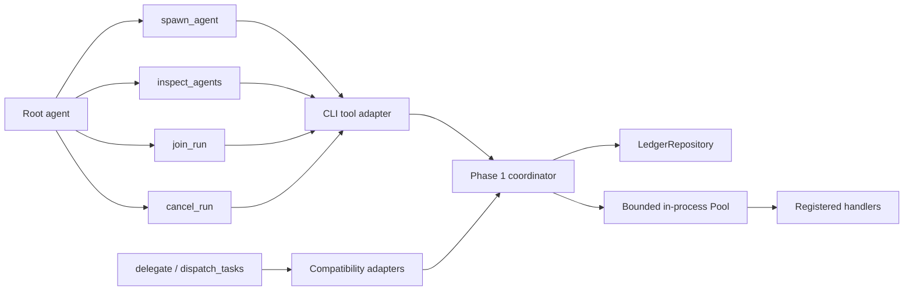
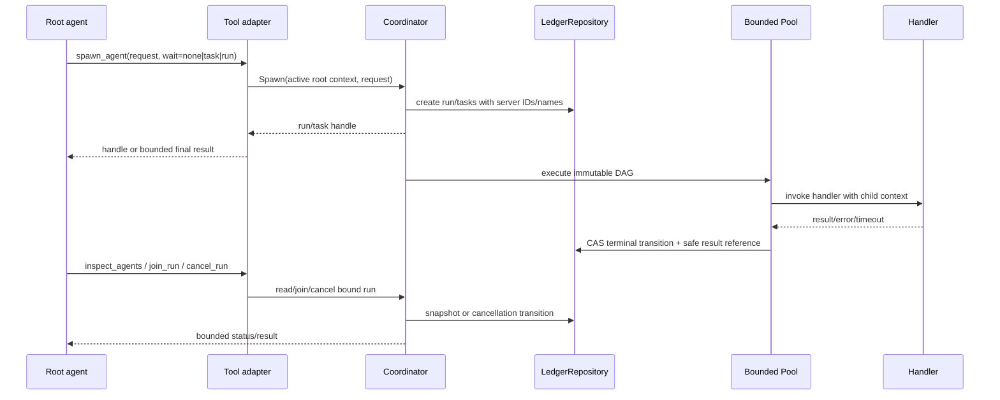

# Phase 2 implementation plan: unified spawn tool and compatibility adapters

| Field | Value |
| --- | --- |
| Status | Draft - independent review blocked in current session |
| Current phase | Phase 2 - model-facing spawn and legacy adapter migration |
| Last verified | 2026-07-28 |
| Parent plan | `.ai/plans/subagent-orchestration-extensibility.md` |
| Prerequisite | Phase 1 ledger/coordinator implementation and its focused/race review must be complete |
| Next action | Dispatch independent plan reviews, reconcile confirmed findings, then implement only this phase |

## Goal

Expose one extensible `spawn_agent` model-facing tool over the Phase 1 coordinator. It must support one task and a validated immutable DAG, return a server-issued run/task identity, and offer bounded inspect/join/cancel operations. Existing `delegate` and `dispatch_tasks` remain available through compatibility adapters that use the same coordinator and preserve their current result shapes.

Phase 2 is a model-facing/API migration over the in-process coordinator. It does not add SQLite, restart recovery, leases, multi-process execution, MCP/REST endpoints, or new provider behavior.

## Source-truth evidence

- `internal/cli/delegate.go:24-140`: `delegateTool` parses one prompt, chooses `delegate` or `multi_step`, constructs a new pool, uses fixed task ID `d1`, and blocks on `pool.Run` before returning a model-visible result.
- `internal/cli/dispatch.go:22-165`: `dispatchTasksTool` parses a task array and dependencies, constructs a new pool, blocks on `pool.Run`, then encodes only completed batch results.
- `internal/cli/dispatch.go:189-223`: legacy tasks receive caller IDs, a generated invocation key, handler/permission, and `DependsOn`; no server run identity or parent binding is added.
- `internal/cli/dispatcher.go:27-54,113-131`: session wiring creates handlers and registers `delegate` and `dispatch_tasks` on both the runtime dispatcher and model-visible registry.
- `internal/subagents/subagents.go:20-49,224-257`: the pool validates fan-out/depth/budget, runs bounded in-process workers, handles dependency cycles/partial results, and returns synchronously.
- `internal/subagents/multi_step.go:195-204`: nested multi-step agents receive a copied registry with `delegate` and `dispatch_tasks` removed, preventing recursive delegation through those tools.
- `internal/runtime/dispatcher.go`: runtime invocation metadata and depth/budget policy exist, but they are not a live run/task query API; Phase 2 must use the Phase 1 coordinator/ledger for orchestration identity.
- `internal/tools/tools.go` and existing tool tests: model-facing tools expose `Name`, `Description`, `Parameters`, and `Execute`; schemas are runtime maps and must remain project/language-generic under `.ai/rules/60-tools-project-language-generic.md`.

## Design contract



`spawn_agent` is the canonical model-facing boundary. The coordinator owns run context, validated DAG submission, identity, parent binding, wait mode, cancellation, and ledger transitions. Legacy adapters translate their old request/result shapes into coordinator requests and must not instantiate a separate pool.

## Async sequence



## Scope

### In scope

- Add `spawn_agent` with one request shape for a single task or DAG.
- Add `inspect_agents`, `join_run`, and `cancel_run` as bounded root-orchestrator operations.
- Route `delegate` and `dispatch_tasks` through the Phase 1 coordinator while preserving their current JSON result contracts and default behavior.
- Bind child parentage to the active root run context; caller-supplied IDs are labels/reference data, not authorization.
- Preserve handler selection (`delegate`, `multi_step`, registered skills), timeout/budget/depth/fan-out policy, partial-result behavior, redaction, and in-process bounded execution.
- Keep tool descriptions and schemas project/language-generic.

### Forbidden scope

- No SQLite or other durable ledger adapter; no restart/resume, leases, recovery, or multi-process claims.
- No REST/MCP endpoint, TUI redesign, OpenTelemetry dependency, provider change, prompt redesign, or protected-action authorization change.
- No removal or silent semantic rewrite of `delegate` or `dispatch_tasks`.
- No recursive delegation path; `multi_step` must continue to receive a registry without delegation tools.
- No raw prompts, provider payloads, hidden reasoning, secrets, PII, or unbounded output in handles, status, ledger events, or tool results.
- No process-per-agent fan-out, `os/exec` orchestration, commit, push, or PR.

## Detailed implementation steps

1. **Revalidate Phase 1 seam.** Read the completed Phase 1 package and tests before touching `internal/cli`. Confirm the coordinator exposes dependency injection, root-context binding, `Spawn`, `Inspect`, `Join`, and `Cancel`; stop if it does not.
2. **Define canonical request/response types.** Add them beside the Phase 1 coordinator (new files marked `NEW:` only if Phase 1 chose another package). Request fields must include task/DAG definitions, optional caller label, handler/profile, dependencies, timeout/policy overrides, idempotency key, parent reference, and explicit `wait` mode. Response fields must carry only server-issued run/task IDs, generated display names, bounded status, safe output/error references, and optional bounded final results.
3. **Add root-context binding.** Extend the active session/tool execution context with an internal root-run identity and coordinator reference. Validate that child tasks belong to the active root run. Never treat a user/model-provided parent ID as authorization. Reject missing/closed/cross-run parentage with typed errors.
4. **Implement `spawn_agent`.** Validate JSON strictly, reject empty tasks, duplicate IDs, invalid/cyclic dependencies, unsupported wait modes, negative/over-limit policy overrides, and oversized inputs. Submit once to the coordinator using a server-generated idempotency scope. `wait=none` returns immediately; `wait=task` waits for the requested task; `wait=run` waits for the full run with the tool timeout as an upper bound.
5. **Implement read/control tools.** `inspect_agents` must return bounded snapshots for only the active root run or explicitly authorized run handles. `join_run` must block with context cancellation and return terminal status/results. `cancel_run` must be idempotent, record `cancel_requested`, cancel the per-run context, and return the final observed status without allowing stale completion to overwrite cancellation.
6. **Replace legacy pool construction.** Refactor `internal/cli/delegate.go:80-140` and `internal/cli/dispatch.go:119-165` to translate their current inputs to coordinator requests. Preserve fixed legacy result shapes, handler defaults, timeout calculation, skill permission lookup, partial-results behavior, and status strings. Their only orchestration dependency becomes the coordinator interface.
7. **Wire one coordinator per session.** Update `internal/cli/dispatcher.go:27-54,113-131` to construct/inject the explicit Phase 1 memory repository/coordinator and register canonical plus compatibility tools. Do not create a coordinator per tool call. Ensure session shutdown cancels or closes active in-process runs without claiming durable recovery.
8. **Preserve recursion and policy boundaries.** Update the restricted registry path only if required to remove the new canonical/control tools as well as the legacy tools from nested agents. Add tests proving a nested multi-step agent cannot invoke `spawn_agent`, `inspect_agents`, `join_run`, `cancel_run`, `delegate`, or `dispatch_tasks`.
9. **Add tests before broad verification.** Cover schema rejection, single task/DAG submission, all wait modes, generated name/ID propagation, idempotent duplicate spawn, root/cross-run parent rejection, inspect bounds, join timeout, cancellation races, dependency blocking, legacy shape compatibility, handler/skill selection, recursion blocking, and repository failure propagation. Use fake coordinator/repository injection where possible plus one session wiring integration test.
10. **Review and reconcile.** Run the independent code review lanes over the complete diff, validate every finding against source/tests, fix only confirmed issues, rerun focused/race/vet/diff checks, and update this plan's status only from evidence.

## Exact files likely to change

- `internal/cli/delegate.go` - translate legacy single-task calls to coordinator requests.
- `internal/cli/dispatch.go` - translate legacy DAG calls and preserve encoding.
- `internal/cli/dispatcher.go` - construct/inject one session coordinator and register tools.
- `internal/subagents/multi_step.go` - only if the restricted registry must explicitly exclude canonical control tools.
- `internal/cli/*_test.go` - tool schema, compatibility, and session wiring tests.
- `internal/subagents/*_test.go` - recursion/policy regression tests if the restricted registry test belongs there.
- `NEW: internal/<phase-1-package>/*` - canonical tool/coordinator contract tests only if Phase 1 placed the public seam there.

No change to `internal/storage/**` is expected in Phase 2.

## Acceptance criteria

- [ ] `spawn_agent` supports a single task and an immutable validated DAG through one strict, generic schema.
- [ ] Server-issued RunID/TaskID/AttemptID and generated human-readable names are returned; caller labels do not replace identity or authorization.
- [ ] `wait=none|task|run` has bounded, tested semantics; `inspect_agents`, `join_run`, and `cancel_run` operate only on bound/authorized runs.
- [ ] Duplicate spawn with the same idempotency key returns the existing run handle without duplicate execution.
- [ ] Legacy `delegate` and `dispatch_tasks` route through the same coordinator and preserve current result/status behavior.
- [ ] Cancellation, timeout, dependency blocking, stale completion, repository errors, and bounded redaction remain correct under race tests.
- [ ] Nested agents cannot reach canonical or legacy delegation/control tools.
- [ ] Tool descriptions remain project/language-generic and schemas reject unknown/invalid fields.
- [ ] No SQLite, durability, leases, MCP/API, provider, prompt, TUI, process-farm, commit, push, or unrelated refactor is introduced.

## Verification commands

```text
go test ./internal/ledger ./internal/coordinator ./internal/cli ./internal/subagents -count=1
go test -race ./internal/ledger ./internal/coordinator ./internal/cli ./internal/subagents -count=1
go vet ./internal/ledger ./internal/coordinator ./internal/cli ./internal/subagents
go test ./internal/tools -run 'Test.*Schema|Test.*Generic' -count=1
git diff --check
```

Adjust package paths after Phase 1 package selection. Also run the repository-required `make verify` only if the focused gates pass; report any unavailable or unrelated suites as `NOT_RUN`. Do not claim persistence/recovery or live MCP/API proof.

## Security, privacy, and concurrency gates

- Inputs and outputs crossing the model boundary must be bounded and redacted; error responses must not expose prompts, provider payloads, secrets, hidden reasoning, or PII.
- Root-run binding must be derived from trusted session context, not a caller-supplied parent ID. Add negative cross-run tests.
- All execution remains in-process and bounded by the existing worker/depth/fan-out/time/budget policy. Preserve context propagation and stale-attempt CAS behavior.
- Cancellation and join must not leak goroutines or leave handles waiting forever. Run the repository concurrency-review skill against the diff and record its `mivia-report/v1` result.

## Open questions / required human review

- Confirm the Phase 1 package name and exported coordinator contract before implementation; this plan intentionally uses `internal/<phase-1-package>` where that choice is not yet proven in the current checkout.
- Decide whether `inspect_agents` may accept a run handle supplied in a later model turn or only an active session-bound handle; default recommendation is active-session binding plus opaque server handle.
- Confirm whether `wait=task` is valid for a DAG request with multiple terminal tasks; default recommendation is reject ambiguity unless a specific task ID is supplied.
- Human review required for model-facing schema compatibility, root-run authorization semantics, and any change that changes what the model can invoke.

## External design references

- Temporal documentation describes crash-proof durable execution; that is a later durability concern, not a Phase 2 guarantee: https://docs.temporal.io/
- AWS Step Functions documents explicit `Retry`, `Catch`, timeout, and task-token/heartbeat semantics; Phase 2 adopts only explicit bounded wait/cancel/error categories, not a distributed workflow service: https://docs.aws.amazon.com/step-functions/latest/dg/concepts-error-handling.html
- LangGraph persistence/interrupt documentation separates live execution interaction from checkpoint-backed resume; Phase 2 remains live in-process and defers checkpoint/recovery: https://langchain-ai.github.io/langgraph/concepts/breakpoints/

## Review status

Independent subagent review: NOT_RUN. Four dispatch attempts were made through the Codex task surface after project discovery and plan creation; each returned `create_thread received invalid arguments`, so no subagent output is being represented as evidence.

Coordinator review completed against the current source:

- Confirmed that both legacy tools instantiate `subagents.Pool` inside `Execute`; the plan correctly makes the coordinator the only orchestration dependency.
- Confirmed that the current pool is synchronous and already provides dependency ordering, bounded workers, timeouts, partial results, and cycle detection; the plan preserves those policies instead of reimplementing them in tool adapters.
- Confirmed that current nested-agent protection removes only `delegate` and `dispatch_tasks`; the plan explicitly requires the canonical control tools to be excluded too, preventing a new recursion bypass.
- Confirmed that session registration is centralized in `internal/cli/dispatcher.go`; the plan places one coordinator/repository per session rather than per tool invocation.
- Confirmed that current model-facing tool descriptions contain no Go-specific instructions; the plan retains the generic-surface rule and adds schema rejection tests.
- Identified one implementation dependency that remains unverified: the Phase 1 package/export names. The implementation agent must stop and reconcile those names before editing CLI files.
- Identified one authorization decision requiring human review: whether a later `inspect_agents`/`join_run`/`cancel_run` call may use an opaque handle outside the immediate active context. The plan defaults to active-session binding and does not authorize arbitrary caller parent IDs.

Required next action: retry independent review when the task-dispatch handler is repaired, then reconcile only confirmed findings before implementation. No Phase 2 code was written in this turn.
