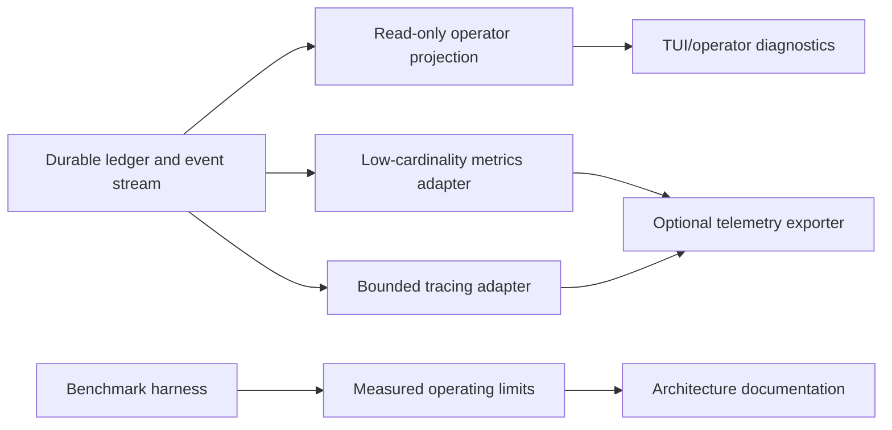
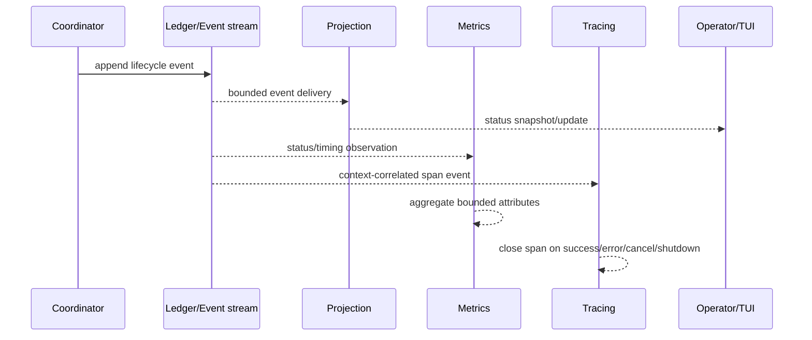

# Phase 4 implementation plan: observability and scale gates

| Field | Value |
| --- | --- |
| Status | Draft - independent validation blocked in current session |
| Current phase | Phase 4 - observability, operator visibility, and measured scale |
| Last verified | 2026-07-28 |
| Parent plan | `.ai/plans/subagent-orchestration-extensibility.md` |
| Prerequisite | Phase 1–3 implementation, focused tests, race review, durable contract, and recovery review complete |
| Next action | Run two independent validation rounds, reconcile confirmed findings, then implement only this phase |

## Goal

Expose bounded, privacy-safe operator visibility and measured capacity for the durable orchestration path. TUI/event consumers, metrics, traces, and benchmarks are projections/diagnostics only; the ledger and event stream remain the source of truth.

## Confirmed current constraints

- `internal/events/bus.go` is a synchronous in-process bus; `internal/events/event.go` defines subagent lifecycle kinds.
- `internal/agent/emit.go` publishes to both the legacy callback and optional EventBus; `internal/chat/session.go` already carries an optional EventBus.
- `internal/subagents/multi_step.go:90-98,152-173` runs a heartbeat goroutine with cancellation; long-running progress is already an operational contract.
- `internal/storage/queue.go:12-16,79` exposes queue counters and wait metrics, but no exported orchestration metrics or trace context.
- `internal/cli/subagent_progress.go` and the TUI bridge are transient consumers; neither is a durable source of truth.
- `.ai/rules/10-security-privacy.md` forbids PII, tokens, and secrets in traces, metrics, analytics, snapshots, and errors; `.ai/rules/70-long-running-heartbeat.md` requires bounded heartbeat/progress visibility.

## Architecture



The ledger/event stream remains authoritative. Operator views and telemetry subscribe or query bounded projections and must not mutate orchestration state. Telemetry is optional and lossy under backpressure; it cannot block correctness-critical execution.

## Sequence



## Scope

- Add operator-facing live status views over bounded snapshots/events, without adding a new ledger.
- Add low-cardinality counters/histograms for run/task status, queue wait, active children, retries, cancellation, ledger write latency, recovery duration, and dropped/blocked telemetry.
- Propagate correlation context explicitly; run/task IDs may be trace attributes or logs only where bounded and authorized, not metric labels.
- Add benchmark fixtures for fan-out, dependency depth, ledger reads/writes, recovery, and heartbeat/event load. Publish measured limits and test environment.
- Add backpressure/drop behavior for telemetry adapters so observability cannot stall orchestration.

## Forbidden scope

- No new ledger or alternate source of truth.
- No raw prompts, tool payloads, provider responses, hidden reasoning, secrets, or PII in telemetry, snapshots, logs, or fixtures.
- No unbounded run/task/user identifiers as metric labels.
- No mandatory telemetry dependency, network exporter requirement, or production capacity claim without executed benchmarks.
- No unrelated TUI redesign, provider change, MCP/API surface, persistence migration, or process-farm concurrency.

## Implementation sequence

1. **Freeze event/telemetry contract.** Define stable event fields, redaction rules, sampling, retention, metric names, allowed low-cardinality attributes, and trace/span lifetime. Do not include prompt text or raw tool payloads.
2. **Wire operator projection.** Make TUI/operator diagnostics read from the coordinator/ledger snapshot or event subscription. Keep the old callback during migration; do not allow a UI consumer to mutate orchestration state.
3. **Add metrics adapter.** Instrument coordinator transitions, queue wait, storage writes, retries, cancellations, recovery, and telemetry drops. Use bounded status/handler/error-class labels only. Provide no-op behavior when telemetry is not configured.
4. **Add tracing adapter only after context review.** Use standard Go context propagation and bounded attributes. Ensure spans close on success, error, timeout, cancellation, and process shutdown; never make tracing required for correctness.
5. **Add stress/benchmark harness.** Exercise configured worker/fan-out/depth limits, concurrent reads/writes, long-lived readers, WAL checkpoints, event-bus subscribers, telemetry overflow, and cancellation. Record p50/p95/p99, memory, goroutines, WAL growth, and dropped-event counts.
6. **Publish operational limits.** Update `docs/architecture/concurrency.md` and `docs/architecture/embedded-persistence.md` with measured results, known unsupported workloads, alert thresholds, retention/deletion behavior, and exact `NOT_RUN` gaps.

## Expected files

- `internal/events/*` — event/adapter contracts and bounded subscriber behavior, only where current bus semantics require extension.
- `internal/agent/emit.go`, `internal/chat/session.go`, `internal/cli/subagent_progress.go`, and TUI bridge files — projection wiring with legacy compatibility.
- `internal/runtime/*` and `internal/storage/queue.go` — correlation/queue instrumentation only.
- `NEW: internal/observability/*` — metrics/tracing adapters if no existing package is suitable; avoid a second event source.
- `internal/*_test.go` and `*_bench_test.go` — deterministic stress/benchmark and privacy/cardinality tests.
- `docs/architecture/concurrency.md`, `docs/architecture/embedded-persistence.md` — measured operating limits and source-of-truth boundaries.

## Acceptance criteria

- [ ] Operator views show live bounded status without becoming the ledger or leaking sensitive data.
- [ ] Metrics have bounded cardinality and no run/task/user/prompt identifiers as metric labels.
- [ ] Context/correlation propagates across root, child, handler, storage, and telemetry boundaries.
- [ ] Telemetry backpressure/drop behavior cannot block or cancel orchestration.
- [ ] Heartbeats are bounded, cancellable, and do not leak goroutines after run completion/cancel.
- [ ] Benchmarks provide measured p50/p95/p99 latency, throughput, memory, goroutines, WAL growth, and recovery time under named limits.
- [ ] Stress and race tests cover queue saturation, event subscriber behavior, cancellation, recovery, and telemetry overflow.
- [ ] Architecture docs distinguish measured results from recommendations and list unavailable live/MCP/distributed checks as `NOT_RUN`.

## Verification commands

```text
go test ./internal/events ./internal/agent ./internal/chat ./internal/cli ./internal/runtime ./internal/storage -count=1
go test -race ./internal/events ./internal/agent ./internal/chat ./internal/cli ./internal/runtime ./internal/storage -count=1
go test ./internal/... -run 'Test.*Redact|Test.*Cardinality|Test.*Heartbeat|Test.*Cancel' -count=1
go test ./internal/... -bench 'Benchmark.*(Ledger|Queue|Fanout|Recovery)' -benchmem -run '^$'
go vet ./internal/events ./internal/agent ./internal/chat ./internal/cli ./internal/runtime ./internal/storage
git diff --check
```

## Security, privacy, and concurrency gates

- Use `.ai/rules/10-security-privacy.md` as the hard boundary: no PII, tokens, secrets, raw prompts, hidden reasoning, or raw provider/tool payloads in telemetry.
- Use `.ai/rules/70-long-running-heartbeat.md` for heartbeat cadence, bounded detail, cancellation, and stalled-task visibility.
- Run `concurrency-review` against the complete diff. Verify subscriber backpressure, context propagation, span closure, and no goroutine leak.
- Verify metric cardinality with a deterministic test that attempts unique run/task IDs and confirms they are rejected, dropped, or kept out of metric labels.

## Stop conditions

Stop if telemetry can block the event bus/coordinator, metric labels are unbounded, tracing carries sensitive payloads, heartbeat goroutines outlive cancellation, or benchmark results are replaced with configuration-based capacity claims.

## Review protocol — two rounds

1. **Round 1 — architecture/source challenge:** independently verify EventBus, heartbeat, TUI, queue, and runtime anchors; challenge whether each proposed adapter has a single source of truth.
2. **Round 2 — adversarial implementation challenge:** independently check concurrency, privacy/redaction, cardinality, telemetry overflow, benchmark validity, and missing negative tests.
3. Coordinator validates every finding against current source or executed checks, rejects unsupported consensus, and updates this file.

## External references

- SQLite WAL concurrency/checkpoint constraints: https://www.sqlite.org/wal.html
- OpenTelemetry context propagation: https://opentelemetry.io/docs/specs/otel/context/
- OpenTelemetry metric cardinality limits: https://opentelemetry.io/docs/specs/otel/metrics/sdk/
- Existing local persistence recommendation: `docs/architecture/embedded-persistence.md`

## Validation status

- Round 1: NOT_RUN — task dispatch rejected with `create_thread received invalid arguments`
- Round 2: NOT_RUN — task dispatch rejected with `create_thread received invalid arguments`
- Coordinator reconciliation: COMPLETE — source review and `git diff --check` performed
