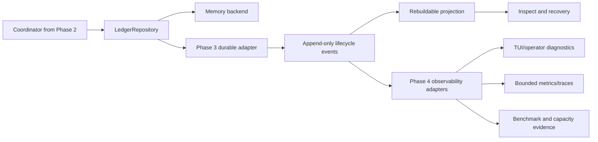

# Remaining orchestration phases: durable recovery and observability gates

| Field | Value |
| --- | --- |
| Status | Draft - independent validation blocked in current session |
| Current phase | Phase 3 after Phase 2; Phase 4 is maintained in a separate file |
| Last verified | 2026-07-28 |
| Parent plan | `.ai/plans/subagent-orchestration-extensibility.md` |
| Prerequisite | Phase 1 and Phase 2 implementation, focused tests, race review, and compatibility review complete |
| Next action | Validate each phase twice with independent reviewers, reconcile confirmed findings, then implement sequentially |

## Common boundary

Phase 3 is the first phase allowed to make the ledger durable. Phase 4 consumes the stable lifecycle/event contract for operator visibility and measured capacity. Neither phase may silently promote in-memory behavior to crash recovery, or observability output to a source of truth.



## Phase 3 — durable persistence and recovery

### Goal

Persist the Phase 2 ledger behind the existing `internal/storage.Store` seam, rebuild current state from append-only lifecycle events, and recover interrupted runs without false completion or duplicate durable side effects. The implementation must define exactly which task states are resumable, retriable, blocked, or terminally `interrupted_unrecoverable` after process loss.

### Confirmed current constraints

- `internal/storage/store.go:24-29` defines only append/read/count/close; `Memory` and `SQLite` implement it.
- `internal/storage/store.go:70-125` already configures SQLite WAL, foreign keys, busy timeout, explicit transactions, and a serialized write mutex.
- `internal/storage/store.go:89-93` currently stores only `id`, `run_id`, `sequence`, `kind`, payload, timestamp, and a unique `(run_id, sequence)` constraint; it is not yet a run/task/attempt schema.
- `internal/storage/queue.go:24-77` provides bounded serialized writes and queue metrics, but `Close` is not idempotent and `Submit` waits on the result channel without a second context select; these behaviors require review before durable orchestration relies on them.
- `docs/architecture/embedded-persistence.md:17-27,57-64` recommends versioned events, relational run/artifact metadata, redaction, retention/deletion, backup/restore, crash and disk-full tests, and measured SQLite workload gates. It explicitly says the recommendation is not a benchmark result.

### Scope

- Extend the existing storage seam or add a coordinator-owned adapter over it; do not introduce a second SQLite engine.
- Persist immutable run/task/attempt identities, lifecycle events, idempotency/effect keys, status/version transitions, bounded redacted result references, and recovery metadata.
- Rebuild a projection deterministically from events; projection rebuild must not execute providers, tools, or side effects.
- Add leases only if the approved deployment includes multiple processes or orphan recovery. For one-process local durability, use a startup reconciliation state that cannot claim ownership of a live attempt.
- Resume only at explicitly safe durable checkpoints/step boundaries. An interrupted provider/tool call without a durable effect record must be retried only when the operation is idempotent; otherwise mark it unrecoverable and require operator action.

### Implementation sequence

1. **Freeze durable contract.** Re-read the Phase 1/2 exported types and define schema version, event ordering, terminal/retryable status vocabulary, retention/deletion, and recovery decision table. Stop if the same event can produce different projections.
2. **Align memory and SQLite semantics.** Make duplicate event IDs, `(run_id, sequence)`, defensive copies, context cancellation, invalid transitions, and error categories behave identically. Add contract tests run against both adapters.
3. **Add schema/migration.** Extend the existing SQLite schema additively for runs, tasks, attempts, events, idempotency/effect keys, artifacts/references, and projection version. Use forward-only, transactional migrations with rollback-by-forward-fix notes. Do not store raw prompts, hidden reasoning, secrets, PII, or unbounded payloads.
4. **Implement atomic lifecycle writes.** Append event and update projection/version in one transaction. Enforce CAS terminal transitions and idempotency uniqueness in storage, not only in Go memory. Ensure duplicate retries return the prior result or an explicit conflict, never a second side effect.
5. **Implement startup recovery.** Load unfinished runs, inspect durable attempts/checkpoints, classify each as resumable, retryable, blocked, canceled, or `interrupted_unrecoverable`, and record the decision as an event. Never infer completion from a missing process or a hash alone.
6. **Add retention, delete, backup/restore, and disk-full handling.** Make deletion explicit and auditable; verify deleted payloads/artifact references are no longer queryable. Validate backups before declaring restore success.
7. **Integrate the coordinator only after storage contract tests pass.** Use dependency injection so memory remains the deterministic test backend. Add crash/restart integration tests with scripted handlers and failure injection at every commit boundary.

### Expected files

- `internal/storage/store.go` and `internal/storage/queue.go` — minimal seam/queue fixes only where contract tests prove them necessary.
- `internal/storage/*_test.go` — adapter contract, migration, ordering, crash, duplicate, disk-full, retention, and backup tests.
- `internal/<phase-1-package>/*` — durable adapter/recovery integration, exact package determined by Phase 1.
- `docs/architecture/embedded-persistence.md` — update only with measured results and final decisions.
- `NEW: internal/storage/migrations/*` — only if the existing migration convention requires a separate directory.

### Acceptance criteria

- [ ] Memory and SQLite pass the same repository contract suite for ordering, duplicates, CAS, defensive copies, and errors.
- [ ] Every lifecycle transition is durable before it is reported as completed; duplicate event/effect submission is idempotent.
- [ ] Process interruption tests prove which tasks resume, retry, block, cancel, or become `interrupted_unrecoverable`.
- [ ] Recovery never replays a non-idempotent tool/provider side effect without a durable effect record.
- [ ] Projection rebuild from events reproduces current run/task status deterministically.
- [ ] Retention, deletion, backup/restore, permissions, disk-full, and WAL checkpoint behavior are tested.
- [ ] Redaction/size/privacy tests prove no raw prompt, secret, hidden reasoning, provider payload, or PII enters durable records.
- [ ] No unsupported multi-process or crash-recovery guarantee is documented without executed failure-injection evidence.

### Verification

```text
go test ./internal/storage ./internal/<phase-1-package> -count=1
go test -race ./internal/storage ./internal/<phase-1-package> -count=1
go test ./internal/storage -run 'Test.*SQLite|Test.*Recovery|Test.*Backup|Test.*Retention' -count=1
go vet ./internal/storage ./internal/<phase-1-package>
go test ./internal/... -count=1
git diff --check
```

Required benchmark command(s) and exact workload must be added before implementation; report throughput, p95 write/read latency, WAL/database growth, and restart recovery time. `make verify`, `make test`, and `make race` are broader gates and remain `NOT_RUN` until executed.

### Stop conditions

Stop if the storage adapter diverges from the memory contract, recovery infers completion without a durable result/effect record, event/projection writes are not atomic, deletion cannot be verified, or any test fixture requires sensitive raw content.

Phase 4 is maintained separately in `.ai/plans/subagent-orchestration-phase-4-implementation.md`.

## Review protocol — two rounds for Phase 3

For Phase 3 independently:

1. **Round 1 — architecture/source challenge:** one reviewer checks source anchors, package boundaries, persistence/recovery semantics, and phase scope.
2. **Round 2 — adversarial implementation challenge:** a different reviewer checks concurrency, privacy/redaction, failure injection, tests, operational limits, and unsupported claims.
3. Coordinator validates every finding against current source or executed checks, rejects unsupported consensus, updates this file, and records `NOT_RUN` when dispatch or live evidence is unavailable.

No phase is implementation-ready until both rounds are complete or explicitly recorded as blocked by tooling, with a human review decision for the gap.

## External references

- SQLite WAL concurrency/checkpoint constraints: https://www.sqlite.org/wal.html
- Existing local persistence recommendation: `docs/architecture/embedded-persistence.md`

## Coordinator reconciliation

Source-grounded checks completed after the failed dispatch attempts:

- Phase 3 correctly reuses `internal/storage.Store` and `QueuedWriter`; current SQLite is an event-only store, so the plan does not treat it as an existing ledger implementation.
- The plan correctly calls out `QueuedWriter.Close` and `Submit` as contract risks: current `Close` closes the queue directly, and current `Submit` waits on `req.result` after enqueue without selecting on caller cancellation.
- Recovery claims are intentionally gated on durable effect records, explicit checkpoints, atomic event/projection writes, and failure-injection evidence; no restart guarantee is implied by the current source.
- The `<phase-1-package>` paths are deliberately unresolved because the current checkout has no implemented Phase 1 package. They are marked as a prerequisite/open dependency and must be replaced before implementation commands are run.

## Validation status

- Phase 3 Round 1: NOT_RUN — task dispatch rejected with `create_thread received invalid arguments`
- Phase 3 Round 2: NOT_RUN — task dispatch rejected with `create_thread received invalid arguments`
- Coordinator reconciliation: COMPLETE — source review and `git diff --check` performed
