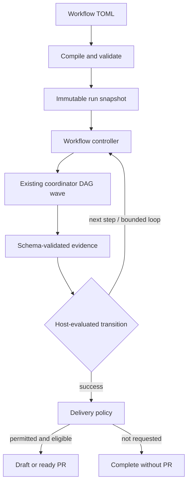

# Mivia Agent Workflows v1 — Implementation Plan

**Repository:** `MiviaLabs/mivia-agent`
**Status:** in-progress — Phase 0 ✅ Phase 1 ✅ Phase 2 ✅ Phase 3 ✅ Phase 4 ✅ Phase 5 ✅ Phase 6 remaining Phase 7 ✅
**Scope:** local harness only; no cloud control plane or workflow-level parallelism in v1.

---

## Implementation Status Summary

| Phase | Description | Status |
|-------|-------------|--------|
| Phase 0 | Design fixtures and contracts | ✅ Complete |
| Phase 1 | Discovery, strict parsing, compiler | ✅ Complete |
| Phase 2 | Ledger, isolated worktree, lifecycle | ✅ Complete — durable ledger + recovery rules shipped (commit `f17969e`); worktree infra stayed as shipped, no new worktree code (owner scope) |
| Phase 3 | Agent step adapter | ✅ Complete |
| Phase 4 | Transitions, loops, gates | ✅ Complete |
| Phase 5 | PR delivery | ✅ Complete |
| Phase 6 | Hardening and documentation | ⬜ Not started |
| Phase 7 | Agent-facing workflow tools (parallel runs, deep observability) | ✅ Complete |

### What is shipped (Phases 0–1)

**4 of 10 planned packages are fully implemented:**

| Package | Status | Key Deliverables |
|---------|--------|-----------------|
| `internal/workflows/definition/` | ✅ Complete | TOML type model (`types.go`), strict decode with `DisallowUnknownFields()` (`decode.go`), safe file discovery with TOCTOU/symlink/nlink protection (`discovery.go`), comprehensive validation |
| `internal/workflows/compiler/` | ✅ Complete | Semantic validation → immutable `CompiledWorkflow` with SHA-256 digest (`compiler.go`), graph reachability via BFS, transition overlap detection, loop constraints, context binding validation, verifier name format, delivery config, limits bounds (`graph.go`), external agent reference validation (`agentrefs.go`), external JSON schema reference validation (`schemarefs.go`) |
| `internal/workflows/template/` | ✅ Complete | Template loading with safety (symlink rejection, TOCTOU, 32KB cap) and reference existence checking (`loader.go`). **Note:** No template rendering engine yet — `{{ inputs.task }}` syntax has no expansion code |
| `internal/workflows/presentation/` | ✅ Complete | CLI view models: list catalog (`catalog.go`), detailed show (`show.go`), state-graph explain with loop caps/authority/references visualization (`explain.go`) |

**CLI fully wired:**
- `mivia workflows list` — discover and list `.mivia/workflows/*.toml`
- `mivia workflows show <name>` — detailed workflow view
- `mivia workflows validate [<name>]` — full parse + compile + reference resolution
- `mivia workflows explain <name>` — compiled state graph, loops, authority, references

**Test coverage:** 13 test files, 20 testdata fixtures (19 invalid + 1 valid), ~81K lines total. All tests passing.

**Schema contracts defined:**
- `.mivia/workflows/schemas/plan-v1.json`
- `.mivia/workflows/schemas/change-summary-v1.json`
- `.mivia/workflows/schemas/review-v1.json`
- `.mivia/workflows/schemas/verification-v1.json`

**Shipped workflow:** `.mivia/workflows/feature-delivery.toml` — a 9-step autonomous workflow (no human gate).

### What remains (Phases 2–6)

**1 of 10 planned packages is deferred (owner-scoped worktree infra); all others shipped with Phases 2–5:**

| Package | Purpose | Status |
|---------|---------|--------|
| `internal/workflows/matcher/` | Runtime structural transition matching | ✅ Complete |
| `internal/workflows/controller/` | Durable sequential state machine | ✅ Complete (Phase 3 linear + Phase 4 gates/loops) |
| `internal/workflows/ledger/` | Workflow-specific run state persistence (event-sourced projections over the shared `storage.Store`) | ✅ Complete |
| `internal/workflows/verifier/` | Registered deterministic verifier profiles (e.g. `go-default`) | ✅ Complete |
| `internal/workflows/workspace/` | Git worktree lifecycle (base commit, branch, cleanup) | ✅ Complete (Phase 5) — run-owned worktree wrapper (`Resolve`/`Ensure`) used by run, delivery, and cleanup |
| `internal/workflows/delivery/` | Git commit + GitHub PR publication | ✅ Complete (Phase 5) — pinned Git runner, GitHub CLI PR client, idempotency, refusal paths |

---

## 1. Decision

Ship workflows as a **first-class, declarative, durable state machine** layered on top of the existing subagent coordinator.

The existing coordinator remains responsible for executing one acyclic batch of agent tasks. A new workflow controller is responsible for deciding the next state after a step finishes: continue, take a bounded repair loop, pause for approval, fail, or deliver a PR.

This is intentionally **not** a generic graph/workflow runtime and it must not change `coordinator.runDAG` to permit cycles.

**Tightened v1 decisions (after challenge):**

- Every write-capable workflow runs only in a **run-owned Git worktree** created from a recorded base commit. It never runs in the caller's checkout.
- v1 uses a small, structural transition matcher—not CEL. The matcher supports equality against declared scalar/enum fields and has deterministic fallbacks; arbitrary expressions are deferred until there is a demonstrated need.
- A step can receive earlier evidence only through explicit, bounded `context` bindings. "Use the plan output" is not an implicit prompt convention.
- **Repair loops support unbounded iterations** (`max_iterations = -1`). This trusts the LLM convergence model rather than imposing an arbitrary cap; the global `max_step_attempts` and `max_duration_seconds` limits still enforce finite runs.



## 2. Why this fits the current codebase

| Existing seam | Evidence in the repository | Workflow use |
|---|---|---|
| TOML configuration | `internal/config/load.go` already parses TOML with `github.com/pelletier/go-toml/v2`; agent files are strict and presence-aware. | Add a separate strict workflow parser; do not overload global `config.File`. |
| Immutable agent authority | `internal/agents/agent.go` resolves cloned definitions and persists a stable `DefinitionDigest`. | Resolve a workflow's named agents at admission and persist their digests in the snapshot. |
| Schema-validated agent I/O | `ResolvedAgent` already carries input and output JSON schemas; `jsonschema/v6` is in `go.mod`. | Gates route only on validated typed fields, never reviewer prose. |
| Durable orchestration | `internal/coordinator` runs persisted task DAGs with retry, cancellation, recovery, lifecycle events, and worker caps. | Dispatch one workflow agent step as a normal coordinator run/wave. |
| DAG safety | `internal/coordinator/dag.go` emits `dependency cycle or unresolved dependency`; a failed dependency blocks downstream work. | Preserve this invariant. A repair loop creates a new workflow step attempt, not a DAG edge back to an earlier task. |
| SQLite event store | `internal/storage/sqlite.go` uses WAL, foreign keys, a bounded writer path and transactions. | Add workflow projections/tables through the Mivia-owned ledger/storage migration path, not a second database. |
| Workspace trust model | `internal/config/agents.go` explicitly distinguishes trusted user definitions from workspace-sourced definitions and protects provider routing. | Treat workflow files as repository input, never authority. |
| Safe execution posture | `docs/product/agent.md` documents explicit-argv command execution and allowlists. | Workflow TOML cannot contain arbitrary commands, shell fragments, URLs, credentials, or tool permissions. |

The current dependency set already contains the two parsers required for the contract: `go-toml/v2` and `jsonschema/v6`. **Add no workflow-engine or expression dependency in v1.** Do not introduce Temporal, `cschleiden/go-workflows`, `cel-go`, or a generic FSM package: each adds surface area without solving the safe TOML and local-durability boundary this feature needs.

## 3. v1 product contract

### Included

- Discovery of `.mivia/workflows/*.toml`.
- Explicit CLI invocation by workflow name and validated input values.
- Sequential state-machine execution.
- Agent steps, deterministic verifier gates, agent review gates, and human gates.
- Bounded repair loops (supports unbounded via `max_iterations = -1` with global limits as safety net).
- Immutable snapshots and crash-safe resume.
- Optional end-of-workflow PR delivery: `none`, `draft`, or `ready`.
- Isolated Git worktree execution for workflows that may modify files.
- Readable status, event, validation, and explanation surfaces.

### Explicitly deferred

- Workflow-level parallel branches and joins.
- Arbitrary shell/HTTP/plugin actions from TOML.
- Scheduled/automatic workflow triggers.
- GitLab, Gitea, Bitbucket, and cloud execution providers.
- A general expression language beyond the restricted structural transition matcher.
- Template rendering engine (placeholder syntax deferred to Phase 3+).

## 4. Non-negotiable safety and reliability rules

1. **Repository config selects; the host authorizes.** A workflow may refer only to a discovered agent and registered verifier profile. It cannot define a provider, model endpoint, tool list, skill permission, raw command, credential, or runtime grant.
2. **No prose routing.** The transition matcher sees only state status and fields validated by a declared JSON schema. A reviewer saying "looks good" has no effect unless it returns `{"verdict":"approved"}` under a strict schema.
3. **All loops are finite.** Every back-edge names a loop. With `max_iterations >= 0` the loop has an explicit cap; with `max_iterations = -1` the loop trusts the global `max_step_attempts` and `max_duration_seconds` to enforce termination. The compiler also enforces a global attempt and duration ceiling.
4. **A run is immutable once admitted.** Persist the compiled definition, input map, resolved-agent digests, schema digests, verifier version/digest, and delivery policy. Resume never re-reads a changed TOML file to alter an in-flight run.
5. **Delivery is host-owned.** An agent or workflow file cannot create a PR. The invocation must pass `--allow-publish`; a failed, cancelled, timed-out, approval-rejected, loop-exhausted, or no-diff run cannot publish.
6. **Human approval can only narrow.** It can approve a waiting transition, reject it, or stop the run. It never adds tools, changes target branch, elevates delivery mode, or enables a missing runtime grant.
7. **Preserve least privilege.** The review agent should normally have a read-only agent definition. The delivery code is separate from agent tool execution and uses a narrow, explicit host implementation.
8. **Execution is isolated.** A workflow that can write files runs in a run-owned worktree. The source checkout is an admission source only: no agent, verifier, or delivery operation may write to it.

## 5. Workflow file contract

Use a separate directory so workflows remain visible, composable, and independently parsed:

```text
.mivia/
  workflows/
    feature-delivery.toml
    repository-audit.toml
  agents/
  skills/
```

Do not add a `[workflows]` table to `.mivia/mivia.toml` in v1. The global config is the runtime/operator configuration; workflow files are repository-authored work definitions and need their own trust boundary.

### 5.1 Current shipped workflow: feature-delivery

The live workflow (`.mivia/workflows/feature-delivery.toml`) is **fully autonomous with no human gate**:

```text
plan → plan_review → plan_tests → test_plan_review → implement → review
     → test_validate → verify → code_validate → success
```

Three unbounded repair loops:
- `plan_review_repair`: plan_review → plan (verdict changes_requested)
- `test_plan_review_repair`: test_plan_review → plan_tests (verdict changes_requested)
- `review_repair`: review → implement (verdict changes_requested)

9 steps, 12 transitions, delivery mode = `draft`.

### 5.2 Contract choices

- `initial_step` must name exactly one step.
- Steps have no `needs` field in v1. The transition graph is the sole sequencing mechanism, eliminating ambiguous joins and re-entry behaviour.
- `success` and `failure` are reserved terminals, not normal steps.
- Every normal step declares `on_failure = "failure"` in v1, unless it is a gate with a structural failure outcome explicitly routed to a named terminal. An infrastructure, timeout, schema-validation, or agent failure never silently enters a repair loop.
- `match` is a closed structural matcher: status plus exact scalar/enum values at declared schema paths. It does not support expressions, regexes, arithmetic, negation, or dynamic map keys. The compiler rejects duplicate match cases and requires one `default = true` transition where output domains are not statically exhaustive; at runtime any zero- or multi-match condition fails closed with a diagnostic.
- Templates are files inside the workspace (relative to the workflow file), read safely and snapshotted. Their context is exactly the explicit `context` bindings on that step: validated inputs or declared output fields from steps proven to precede it. Each binding has a byte cap and is recorded as evidence selection; no raw transcript is implicitly injected.
- Output schemas are resolved relative to the workflow file, compiled before execution, and snapshotted by content digest.
- A `human_gate` has no prompt or agent; it enters `waiting_approval` and shows the evidence that caused the pause. (Not used in the shipped workflow.)
- Workflow files, templates, and schemas are read only for compilation from the source workspace, then captured in the immutable run snapshot. Agent execution receives rendered, bounded prompt context and a separate run worktree; it does not depend on those source paths continuing to exist.

## 6. Package and interface design

### 6.1 Package structure and implementation status

```text
internal/workflows/
  definition/       # ✅ DONE — TOML types, strict decode, safe discovery
  compiler/         # ✅ DONE — semantic validation and immutable compiled definition
  template/         # ✅ DONE — restricted loading and reference validation (no rendering yet)
  matcher/          # ✅ DONE — structural transition matching and decision explanation
  controller/       # ✅ DONE — durable sequential state machine (gates + loops)
  ledger/           # ✅ DONE — event-sourced repository, snapshots, recovery
  verifier/         # ✅ DONE — registered deterministic verifier profiles
  workspace/        # ✅ DONE — run-owned worktree wrapper (Resolve/Ensure); used by run/deliver/cleanup
  delivery/         # ✅ DONE — git + GitHub PR publication and idempotency
  presentation/     # ✅ DONE — CLI-safe status/event/explain view models
```

### 6.2 Key types (unchanged from original plan)

```go
// definition.WorkflowFile is decoded from one TOML file.
type WorkflowFile struct { /* version, inputs, limits, steps, transitions, delivery */ }

// compiler.CompiledWorkflow is validated and immutable.
type CompiledWorkflow struct {
    Digest string
    Definition WorkflowDefinitionSnapshot
    Agents map[string]ResolvedAgentSnapshot
    Schemas map[string]SchemaSnapshot
    Verifiers map[string]VerifierSnapshot
}

// controller.Controller moves one run through exactly one active step.
type Controller interface {
    Start(ctx context.Context, request StartRequest) (Run, error)
    Advance(ctx context.Context, runID string) (Run, error)
    Resume(ctx context.Context, runID string) (Run, error)
    Approve(ctx context.Context, runID, approvalID, actor string) error
    Reject(ctx context.Context, runID, approvalID, actor, reason string) error
    Cancel(ctx context.Context, runID string) error
}
```

The controller uses an adapter rather than modifying `coordinator.Coordinator`:

```go
type AgentStepRunner interface {
    RunStep(ctx context.Context, spec AgentStepRequest) (AgentStepResult, error)
}
```

The adapter creates a coordinator run containing a single `subagents.Task` for v1. This preserves task admission, routing, retries, heartbeat, cancellation, agent scope, output spooling, and recovery. The workflow attempt holds the child `coordinator` run ID and task ID for inspection.

Do not add workflow-only methods to the large existing `coordinator.Coordinator` interface unless the adapter truly needs data unavailable from its public run snapshot/result contract.

## 7. Persistence model

Place workflow projections in the same configured SQLite data root as the coordinator ledger. Add migrations through the existing storage/ledger migration convention; do not create a second file or an ORM.

| Table | Essential columns | Purpose |
|---|---|---|
| `workflow_runs` | `id`, `workflow_name`, `workflow_digest`, `snapshot_json`, `input_json`, `status`, `active_step_id`, `base_ref`, `base_commit`, `worktree_path`, `version`, `started_at`, `deadline_at`, `finished_at` | source of truth for one admitted run |
| `workflow_step_attempts` | `id`, `workflow_run_id`, `step_id`, `attempt_no`, `status`, `coordinator_run_id`, `task_id`, `output_ref`, `output_digest`, `started_at`, `finished_at` | numbered attempts; loops never overwrite history |
| `workflow_transitions` | `id`, `workflow_run_id`, `from_attempt_id`, `to_step_id`, `transition_index`, `match_digest`, `decision_json`, `created_at` | exact reason a route was selected |
| `workflow_loop_counters` | `workflow_run_id`, `loop_name`, `iterations` | atomic finite-loop enforcement |
| `workflow_approvals` | `id`, `workflow_run_id`, `step_id`, `status`, `actor`, `reason`, `evidence_json`, `created_at`, `resolved_at` | human-gate audit trail |
| `workflow_deliveries` | `workflow_run_id`, `idempotency_key`, `mode`, `base_ref`, `head_ref`, `commit_sha`, `provider`, `remote_id`, `url`, `status`, `error_ref` | retry-safe publish lifecycle |

All mutable state transitions use an optimistic `version` compare-and-set, matching the coordinator's stale-attempt fencing approach. A controller process claims a run before advancing it, just as the existing SQLite storage supports run claims. Completion events must be persisted in the same transaction as their state projection changes wherever the current ledger boundary makes that possible.

Workflow states:

```text
pending → running → waiting_approval → running → delivery_pending → succeeded
                 ↘ failed | cancelled | timed_out | delivery_failed
```

`delivery_pending` means the workflow's engineering work passed but runtime publication permission was absent. It is an honest terminal-like state that can later be delivered only through an explicit command with the original snapshot and a fresh `--allow-publish` grant.

## 8. Gate and transition model

### 8.1 Step kinds

| Kind | Executes | Valid success evidence |
|---|---|---|
| `agent` | Existing scoped agent through the coordinator | Declared output schema and successful task result |
| `agent_gate` | Independent scoped agent, usually read-only | Required structured decision, e.g. `approved` / `changes_requested` |
| `evidence_gate` | Registered host verifier profile | Host-produced schema-valid verification record |
| `human_gate` | No model or command | Explicit user approval/rejection persisted in ledger |

### 8.2 Structural transition matcher

Do **not** add `cel-go` in v1. CEL is a good option if Mivia later needs a deliberately versioned policy-expression surface, but its presence here would make coverage, overlap, and schema-path safety much harder to prove while providing little value for the first delivery loops.

For v1 a transition matches only the current attempt's closed status plus an exact-value object over fields declared by that step's output schema:

```toml
match = { status = "succeeded", output = { verdict = "approved" } }
```

Only scalar values or schema enums are legal leaves. Fields must be explicit in the declared object schema; arrays, additional properties, maps, regexes, and unbounded traversal are rejected. This makes compilation and decision traces deterministic: persist the transition index, match object digest, selected field values, and outcome. If richer logic becomes necessary, introduce a new versioned predicate contract after security and determinism review—do not smuggle CEL in through a permissive matcher.

## 9. Execution workspace and base commit

Workflows that can modify files must not run in the checkout from which the user invoked Mivia. At admission the host:

1. resolves a permitted base ref from trusted runtime policy (normally the repository default branch; the workflow may request but cannot widen it);
2. records the immutable resolved base commit before any agent runs;
3. creates a per-run branch and worktree at a Mivia-owned location; and
4. passes only that worktree as the agent/verifier workspace.

**Implementation note (v1):** The TUI and agent process already support worktree switching via `internal/vcs/`. The `/worktrees` dialog creates worktrees under `.mivia/worktrees/` and the user (or workflow controller) can `os.Chdir` into them. The `internal/workflows/workspace/` package wraps this with workflow-specific semantics: per-run branch names (e.g. `wf/<workflow>/<run-id>`), recorded base commit, and cleanup lifecycle.

The parent checkout may be dirty; it is never cleaned, switched, committed, or otherwise modified. A run starts from the recorded base, not from uncommitted caller state. The CLI must display the resolved base commit before work begins. If a repository cannot create a worktree or the requested base is not allowed/resolvable, admission fails before an LLM call.

The worktree and branch are retained across interruptions so resume is exact. Terminal-run cleanup is a separate, explicit `mivia workflow cleanup <run-id>` operation after checking that delivery/evidence has completed; it is not an automatic side effect in v1.

## 10. Delivery policy and PR semantics

PR creation is a terminal **delivery policy**, not a workflow step and not a tool callable by an agent.

### 10.1 Invocation

```bash
mivia workflow run feature-delivery \
  --input task="add transport retries" \
  --allow-publish
```

Without `--allow-publish`, a workflow configured for PR delivery may execute and collect evidence but must finish as `delivery_pending` rather than touching Git or a remote provider.

### 10.2 Delivery eligibility

All checks are host enforced:

- workflow reached the configured success terminal;
- the run still holds the immutable `pull_request` delivery policy;
- invocation has explicit publication permission;
- the recorded run-owned worktree still points to the admitted base ancestry;
- a non-empty intended diff exists;
- branch, commit, push, and provider response each succeed;
- no previous successful delivery exists for the run idempotency key.

`mode = "none"` means no branch creation, commit, push, or PR. `draft` opens a draft PR. `ready` opens a normal PR, but the shipped `feature-delivery` workflow defaults to `draft`.

### 10.3 Delivery implementation

Start with a `GitHubDeliveryProvider` using the operator's existing GitHub CLI authentication and a strict fixed-argv host adapter. It may run only the exact Git and `gh` operations required for: inspect the run worktree/remotes, commit the pre-created Mivia branch, push that branch, and create/find the PR. It must not invoke a shell or accept command text from TOML/templates/agents.

Before running delivery commands, inspect the run worktree and snapshot the intended diff/base/head. Refuse an unexpected head branch, base ancestry mismatch, nested worktree, Git hooks, or a changed base target. Persist an idempotency key derived from `workflow_run_id + workflow_digest + delivery policy digest`; on resume, find the existing remote PR before attempting to create another.

Keep an internal `DeliveryProvider` interface so a future GitHub API client, Gitea, GitLab, and cloud service can be added without changing workflow semantics. Do not add a Go GitHub SDK in phase one unless it removes a demonstrated `gh` limitation; it increases auth and token-storage scope that the harness does not yet own.

### 10.4 Shipped (Phase 5)

- Eligibility is host-enforced: success terminal reached, immutable `pull_request` policy still active, explicit `--allow-publish` on the invoking command, run worktree still at the admitted base ancestry, non-empty diff, and no prior successful delivery for the run's idempotency key. Every refusal settles the run to `delivery_failed` with a durable error record instead of touching Git or the provider.
- The provider is a `GitHubCLI` PR client (find-before-create with an owner-scoped repo pattern) plus a pinned `RealGit` runner (fixed argv, `GIT_*` and identity env stripped, `GIT_DIR`/`GIT_WORK_TREE` forced, no shell).
- The delivery record (`workflow_deliveries`) is the retry-safe lifecycle: a resumed `workflow deliver` locates the original PR before creating anything, so a crash after push or PR creation never duplicates.
- Delivery-pending runs are the only runs that may still publish; succeeded runs replay their durable outcome without touching the provider.

## 11. CLI and user-facing surfaces

### 11.1 Shipped (Phase 1)

```text
mivia workflows list          ✅
mivia workflows show <name>   ✅
mivia workflows validate      ✅
mivia workflows explain <name> ✅
```

### 11.2 Shipped (Phases 2–5)

```text
mivia workflow run <name> --input key=value [--allow-publish]   ✅
mivia workflow status <run-id>                                  ✅
mivia workflow events <run-id> [--limit N] [--offset N]         ✅
mivia workflow resume <run-id> [--force]                        ✅
mivia workflow approve <run-id> <approval-id> [--actor]         ✅
mivia workflow reject <run-id> <approval-id> [--actor] [--reason text] ✅
mivia workflow cancel <run-id>                                  ✅
mivia workflow deliver <run-id> --allow-publish                 ✅
mivia workflow cleanup <run-id>                                 ✅
```

All nine operator commands shipped with Phases 3–5; every delivery-capable path requires explicit `--allow-publish`.

`validate` performs discovery, strict parsing, semantic compilation, agent/schema/template/verifier resolution, and diagnostics without contacting a provider or changing the workspace. `explain` shows the compiled state graph, loop caps, declared authority, delivery policy, and resolved references, with no secret values.

`status` and `events` must explain each transition in operator language: attempt identity, selected condition, gate output summary, loop counter, and delivery state. Keep raw prompt/provider payloads out of default output; use the existing content-reference/redaction model for detailed evidence access.

## 12. Implementation sequence

### Phase 0 — design fixtures and contracts ✅ DONE

- Created `docs/product/workflows.md` as the normative user contract and `docs/architecture/workflows.md` as the system design.
- Added a valid feature-delivery fixture plus invalid fixtures for unknown fields, bad ids, unbounded loops, unreachable nodes, overlapping transitions, missing terminal paths, missing agents, and unsafe references.
- Defined the review and verification JSON schemas before controller code.

**Exit:** parser/contract tests describe the product before any runtime execution is exposed. ✅

### Phase 1 — discovery, strict parsing, compiler ✅ DONE

- ✅ Implemented safe `.mivia/workflows` discovery modeled on the defensive workspace-file handling in `internal/config/agents.go`: bounded files, regular files only, no path escape/symlink races, normalized names, deterministic ordering.
- ✅ Implemented strict TOML decode with an explicit closed key set at every level; reject unknown or deprecated fields.
- ✅ Resolve and snapshot templates, schemas, agents, verifier profiles and delivery configuration.
- ✅ Implemented graph checks: single initial state, known references, valid terminals, reachability, no implicit cycles, finite named loops, global bounds, deterministic transition coverage/non-overlap.
- ✅ Wired `workflows list/show/validate/explain` into `internal/cli`.
- ✅ Added `plan_review` and `test_plan_review` gates, reordered `plan_tests` before `implement`, removed `human_gate` from shipped workflow.

**Exit:** `mivia workflows validate` can reject unsafe/ambiguous workflows and explain a valid compiled one without LLM calls. ✅

### Phase 2 — ledger, isolated worktree, and lifecycle ✅ Complete

**Worktree infrastructure (done, leverages `internal/vcs/`):**
- `vcs.Create()` creates run-owned worktrees under `.mivia/worktrees/` with isolated branches (`wt/<name>`)
- `vcs.Remove()` deletes worktrees and prunes stale references
- `vcs.List()` enumerates mivia-managed worktrees
- `vcs.DetectBranch()` / `vcs.DetectWorktreeName()` detect current git context at runtime
- TUI `/worktrees` dialog with create, delete, and **switch** (chdir into worktree)
- Status bar shows `⊞ <worktree-name> · <branch>` when inside a worktree, plain branch in main tree
- `internal/workflows/workspace/` builds on this; does NOT duplicate the vcs layer

**Agent-facing worktree isolation (done):**
- `GIT_DIR` and `GIT_WORK_TREE` are blocked from `run_command` child-process env via `env_blocklist` in `.mivia/mivia.toml`, preventing agents from redirecting git operations away from the current worktree. This applies to both interactive agent sessions and workflow step execution — agents cannot reinvent their own worktree mechanism or bypass branch isolation.
- `run_command` env filtering uses a three-set model (`envExact`, `envPrefix`, `envBlockedExact`) so that prefix rules like `GIT_*` remain useful for safe vars (`GIT_SSH_COMMAND`, `GIT_PAGER`) while blocking specific isolation-busting vars.
- Pre-push hooks detect `wt/*` branches and compute merge-base via first-parent walk when no upstream tracking ref exists.
- Hook installation resolves to the main repo `.githooks` directory from within worktrees using absolute `core.hooksPath`.

**Delivered (commit `f17969e`, `feat(agent): durable workflow run ledger with crash-safe resume`):**
- `internal/workflows/ledger/` — a self-contained, event-sourced workflow run repository over the existing shared `storage.Store` (same SQLite file as the coordinator ledger; non-owning; no new tables, DB handles, or migrations; **no existing file outside the package was modified**):
  - Run/attempt status machines and CAS-versioned snapshots with defensive copies; `pending → running → waiting_approval → delivery_pending → succeeded/failed/canceled/timed_out/delivery_failed`; `pending → running → succeeded/failed/timed_out/canceled/interrupted`.
  - Immutable admission snapshot: raw workflow TOML bytes + compiler digest + validated inputs + resolved agent/schema/template/verifier refs; canonical JSON + SHA-256 content hash, byte-stable across rebuilds.
  - Deterministic event IDs (`wfe:<hex(run)>:<kind>:<hex(parts)>`) make the store's `id` PRIMARY KEY the DB-level uniqueness backstop: the `(run, step, attempt_no)` triple cannot be dispatched twice, even across processes. Namespaces are disjoint from the coordinator (`wfr-` run IDs, `wf_*` kinds), so the coordinator's projections and `DeleteRun` can never touch workflow state.
  - One event per mutation (the attempt-completion event carries status + output evidence + route decision); the ordered event log is the single audit trail. Timestamps are persisted in payloads; loop counters and the active step are derived state.
  - Concurrency: per-run mutex + caller-held execution claim on every write path; mem-first mutate → append → rollback + catch-up; `ErrDuplicate` resolves to idempotent-nil or `ErrConflict` by byte comparison.
  - `Recover` classifies runs and clears stale claims only on terminal runs (including a derived route to `success`/`failure` without a status CAS); `PlanResume` is a pure recovery-plan encoding: join stored coordinator runs (`CoordinatorRunID`/`TaskID` on attempts), next attempt = max+1, terminal detection.
  - 25 files (7 production + 18 test) covering memory + SQLite backends; race-clean; repo structure policy and semgrep clean.
- **Exit criterion proven** (`TestIntegrationInterruptedWorkflowResumes`): an interrupted synthetic workflow resumes on a fresh repository with a byte-identical snapshot, attempt #2 = max+1, exactly one audit trail (7 events, sequences 1..7), and re-dispatch of a recorded attempt is refused.
- **Hostile audit (4 agents + performance):** 4 confirmed defects fixed and pinned by regression tests (in-place ActiveStepID replay parity, `StartedAt` rebuild parity, delivery-upsert cross-instance idempotency, foreign-run catch-up cost on the shared file).
- **Scope note (owner):** worktree infrastructure (`internal/vcs`, `/worktrees` TUI, `GIT_*` env isolation, hooks) and the DB layer (`internal/storage`, `internal/ledger`) are frozen as shipped. `internal/workflows/workspace/` was therefore NOT built; base-ref/base-commit recording remains a Phase 3 admission concern (read-only resolution, no worktree creation).

**Exit:** an interrupted synthetic workflow can resume with the same snapshot and one complete audit trail. ✅

### Phase 3 — agent step adapter ✅ Complete

- Implement `AgentStepRunner` on top of the existing coordinator and its `subagents.Task` routing.
- Build bounded prompt context from validated inputs and selected evidence references; record evidence selection in the attempt.
- Validate the final task output against the step output schema; represent schema failure as a typed failed gate/step result, not a text parse fallback.
- Carry existing timeouts, budgets, cancellation, retry behavior, agent scope and definition digests through unchanged.
- Implement template rendering for prompt context expansion.

**Exit:** a linear two-step workflow runs with `mivia workflow run`, survives an interruption, and records individual coordinator child-run references.

### Phase 4 — transitions, loops, and gates ✅ Complete

- ✅ Structural transition matcher (`internal/workflows/matcher`) with fail-closed zero/multi match and durable decision digests.
- ✅ `agent_gate`, `evidence_gate`, and `human_gate` on `LinearController` (Approve/Reject for human gates).
- ✅ Host verifier catalogue with `go-default` fixed host logic; unknown verifiers fail closed.
- ✅ Per-loop caps (`max_iterations`, including `-1`) and global `max_step_attempts` before back-edge / new attempt dispatch; transition decisions persisted on attempts.
- ✅ Repair-loop history test: `implement#2` / `review#2` after `changes_requested`, terminates within limits; infra failures use `on_failure` only.
- ✅ Unbounded-cycle admission guard: the compiler rejects a workflow whose graph contains a cycle with no finite-capped loop edge (`max_iterations > 0`) when both `max_step_attempts` and `max_duration_seconds` are 0. Unlimited loops (`max_iterations = -1`) and unlimited `max_step_attempts` (0) remain legal whenever at least one global limit is set. `CompileForResume` skips the admission check so an in-flight run admitted under an earlier policy still resumes; other validators still run.

**Exit:** the feature-delivery repair loop produces `implement#2` / `review#2` history and terminates within global limits. ✅

### Phase 5 — PR delivery ✅ Complete

- ✅ `internal/workflows/delivery/`: eligibility checks and refusal paths (`RefusalError`), pinned fixed-argv Git runner (`RealGit` strips all `GIT_*`/identity env and forces `GIT_DIR`/`GIT_WORK_TREE`, no shell), GitHub CLI PR client (`GitHubCLI`: find-before-create, draft flag, owner-scoped reuse), idempotency keys derived from run + workflow digest, and durable `workflow_deliveries` records with no-diff handling.
- ✅ CLI: `workflow run --allow-publish`, `delivery_pending` settlement with clear non-publication explanations, and `workflow deliver <run-id> --allow-publish` under the workflow execution file lock with a run claim and a bounded delivery timeout.
- ✅ Operator surfaces: `workflow status`, `workflow events` (paged audit trail), `workflow approve`/`reject` (human gates with recorded actor/reason), `workflow cancel` (idempotent `CancelRun`; refuses `delivery_pending`), and `workflow cleanup` (removes the run worktree and its `wf/` branch, idempotent).
- ✅ Exercised `draft`, no-diff, base mismatch, missing permission, non-write-capable, and duplicate-resume scenarios in isolated test repositories.

**Exit:** a successful approved fixture opens exactly one draft PR; every unsuccessful/no-permission path opens zero. ✅

### Phase 6 — hardening and documentation ⬜ TODO

- Add race tests for controller/approval/cancel/resume interactions and failure-injection tests for SQLite, process interruption, and Git/GitHub partial failures.
- Add property/fuzz tests for parser/compiler graphs, matcher totality, and evidence-binding shaping.
- Document the trust model, delivery permission model, recovery semantics, evidence retention/redaction and a complete sample workflow.
- Keep workflow parallelism design in Phase 7.

**Exit:** full test suite, race suite and the workflow test matrix pass; docs are sufficient for a repository owner to author a safe workflow.

### Phase 7 — agent-facing workflow tools ✅ Complete

**Problem.** Today the orchestrator agent has no first-class workflow tools. To run a workflow it must shell out to `mivia workflow run ...` via `run_command` as a separate process. This blocks the agent loop, prevents parallel runs, gives no step-level visibility, and makes cancellation and delivery clumsy. The workflow engine, coordinator, verifier, and delivery packages are all in-process Go code — but none of them are exposed as agent tools.

**Goal.** Register workflow tools in the agent tool surface so the orchestrator can start, observe, cancel, and deliver workflow runs entirely from inside the chat session — in parallel, with full observability, with no separate process.

#### 7.1 Tool surface

Seven tools, all project/language-generic (rule 60). No tool bakes in Go, `cmd/mivia`, or any project-specific concept.

| Tool | Purpose | Blocking |
|------|---------|----------|
| `workflow_run` | Admit and start a workflow run. Returns the run ID immediately. The controller runs in a background goroutine. | Non-blocking |
| `workflow_status` | Deep status of one run: state, active step, every attempt with its output digest and route, loop counters, gate results, delivery state. | Non-blocking |
| `workflow_events` | Paged audit trail: ordered events with kind, step, attempt, timestamp, and detail. | Non-blocking |
| `workflow_inspect` | Drill into one step attempt: load its validated output JSON, evidence selection, transition decision, and coordinator run/task references for tool-call tracing. | Non-blocking |
| `workflow_list_runs` | List all runs (active and historical) with state, workflow name, and age. | Non-blocking |
| `workflow_deliver` | Perform delivery for a `delivery_pending` run. Requires explicit `allow_publish`. | Blocking (delivery timeout) |
| `workflow_cancel` | Cancel a running or waiting run. Idempotent. | Non-blocking |

#### 7.2 Parallel execution model

The orchestrator calls `workflow_run` N times. Each call:

1. Discovers and compiles the named workflow from `.mivia/workflows/`.
2. Validates inputs against the workflow's declared input contract.
3. Resolves agents, skills, schemas, templates, and verifier profiles (same admission path as the CLI).
4. Creates a run-owned Git worktree at the recorded base commit (write-capable workflows only).
5. Opens the shared SQLite store, admits the run with an immutable snapshot, and acquires the per-run claim.
6. Launches the controller's `Run()` in a **background goroutine** with a context that respects the workflow's deadline.
7. Returns the run ID immediately.

Each goroutine runs independently. The orchestrator polls `workflow_status` and `workflow_events` to track all active runs. It can interleave work, give the user progress updates, cancel a stuck run, and deliver a finished one — all without blocking.

**Concurrency safety:**

- Each run holds an exclusive claim (`ClaimRun`/`ReleaseRun`) on the shared SQLite store for the duration of each `Advance()` call. The claim is released between steps, so parallel runs do not block each other at the store level — they only contend on the per-run mutex inside their own controller.
- The workflow execution file lock (`.mivia-workflow-locks/`) is keyed per run ID, so parallel runs do not serialize.
- Each run gets its own isolated worktree and branch. No two runs share a worktree.
- Each run's agent steps dispatch through their own coordinator dispatcher (created at admission, same as the CLI path). Model API calls are independent.
- A global concurrency cap (`[workflows] max_concurrent_runs`, default 0 = unlimited) can bound the number of simultaneously active goroutines. When the cap is reached, `workflow_run` queues the run (status `pending`) and the orchestrator can poll until a slot frees.

**Crash recovery:**

- If the process crashes, all active runs are left in `interrupted` state in the SQLite store.
- On restart, `Recover` classifies interrupted runs. The orchestrator can call `workflow_run` with a `resume` flag to resume an interrupted run, or `workflow_cancel` to abandon it.
- The immutable snapshot guarantees that resume re-dispatches exactly the same agents, schemas, and inputs — no drift.

#### 7.3 Deep observability

The orchestrator must see everything about a run — not just a status string. The tools expose structured data at three levels:

**Level 1 — Run overview (`workflow_status`):**

```json
{
  "run_id": "wfr-ABC123",
  "workflow": "feature-delivery",
  "status": "running",
  "active_step": "implement",
  "version": 7,
  "started_at": "2026-08-06T12:00:00Z",
  "deadline_at": "2026-08-06T15:00:00Z",
  "base_commit": "abc123",
  "worktree": "workflow-wfr-abc123",
  "attempts": [
    {"step": "plan", "attempt": 1, "status": "succeeded", "to_step": "plan_review", "output_digest": "sha256:..."},
    {"step": "plan_review", "attempt": 1, "status": "succeeded", "to_step": "plan_tests", "verdict": "approved"},
    {"step": "plan_tests", "attempt": 1, "status": "succeeded", "to_step": "test_plan_review"},
    {"step": "test_plan_review", "attempt": 1, "status": "succeeded", "to_step": "implement", "verdict": "approved"}
  ],
  "loops": [
    {"name": "plan_review_repair", "iterations": 0},
    {"name": "test_plan_review_repair", "iterations": 0}
  ],
  "delivery": null
}
```

**Level 2 — Step attempt detail (`workflow_inspect`):**

```json
{
  "run_id": "wfr-ABC123",
  "step": "implement",
  "attempt": 1,
  "status": "succeeded",
  "coordinator_run_id": "run-XYZ",
  "task_id": "task-DEF",
  "output": {"summary": "...", "files_changed": ["internal/foo.go"], "inspected": ["internal/foo.go"]},
  "evidence_selection": [{"name": "task", "source": "input", "bytes": 42, "digest": "sha256:..."}],
  "transition": {"index": 6, "to_step": "review", "match_digest": "abc", "selected": {"status": "succeeded"}}
}
```

**Level 3 — Audit trail (`workflow_events`):**

```json
[
  {"seq": 1, "timestamp": "...", "kind": "wf_run_created", "detail": "run created: workflow \"feature-delivery\""},
  {"seq": 2, "timestamp": "...", "kind": "wf_attempt_started", "detail": "step \"plan\" attempt 1"},
  {"seq": 3, "timestamp": "...", "kind": "wf_attempt_completed", "detail": "succeeded -> plan_review"},
  ...
]
```

**Tool-call tracing:** each attempt records its `coordinator_run_id` and `task_id`. The orchestrator can use the existing `list_run_events` and `ledger_read` tools to trace what tools the workflow's agent called during that step — the same inspection path it uses for its own spawned agents. This gives full transparency: the orchestrator sees not just what the workflow decided, but what the agent read, wrote, and searched to get there.

**Evidence gate results:** the `workflow_status` output includes evidence gate attempts with their verifier check results (name, status, class, detail). The orchestrator sees which gates passed, which failed, and why — without reading a separate log file.

#### 7.4 Implementation approach

**New package: `internal/workflows/agenttools/`**

A self-contained package that registers the seven tools with the tool registry. It holds a reference to:

- The workspace root (for workflow discovery).
- The resolved config (for provider, store path, tool policy).
- The shared SQLite store (for the ledger repository).

Each tool is a standard `tools.Tool` implementation with `Description()`, schema, and `Execute()`. The tools are registered in the default registry only when the workspace has `.mivia/workflows/` (conditional registration, like code intelligence tools).

**`workflow_run` execution path:**

```text
workflow_run(workflow, inputs, allow_publish)
  → discover + compile workflow (same as CLI)
  → validate inputs
  → resolve agents, schemas, templates, verifiers
  → create worktree (write-capable) or read-only identity
  → open SQLite store + ledger repository
  → build controller (same wiring as CLI: dispatcher, verifiers, baseline)
  → controller.Start() (admit)
  → go func() { controller.Run(ctx) }() (background)
  → return {run_id, status: "running"}
```

The controller's `Run()` goroutine handles all step advancement, model dispatch, evidence gates, and loop routing. When it reaches a terminal or `delivery_pending`, the goroutine exits and the run's status is durable in the store.

**`workflow_status` execution path:**

```text
workflow_status(run_id)
  → open ledger repository (read-only)
  → GetRun + ListStepAttempts + GetLoopCounters + ListApprovals + ListDeliveries
  → assemble structured status JSON
  → return
```

No controller needed — pure ledger reads. Safe to call concurrently with a running workflow.

**`workflow_deliver` execution path:**

```text
workflow_deliver(run_id, allow_publish=true)
  → acquire workflow execution file lock (per run ID)
  → open ledger repository
  → verify run is delivery_pending
  → resolve worktree identity
  → delivery.Deliver() (same path as CLI)
  → settle run status
  → return {run_id, status, pr_url}
```

**No duplication of CLI logic.** The tools call the same Go packages (`controller`, `ledger`, `delivery`, `workspace`, `verifier`) that the CLI uses. The only difference is the entry point: a tool `Execute()` instead of a CLI command handler.

#### 7.5 Safety rules (extend section 4 non-negotiables)

9. **`allow_publish` is explicit, never defaulted.** The `workflow_run` and `workflow_deliver` tools accept an `allow_publish` boolean parameter that defaults to `false`. Without it, a delivery-capable workflow settles at `delivery_pending` and never touches Git or a remote provider.

10. **Tools are read-only unless explicitly mutating.** `workflow_status`, `workflow_events`, `workflow_inspect`, and `workflow_list_runs` perform only ledger reads. They never mutate run state, dispatch agents, or touch the filesystem outside the store.

11. **Parallel runs are isolated.** Each run gets its own worktree, branch, controller, and coordinator dispatcher. No two runs share mutable state. The shared SQLite store uses per-run claims and CAS versioning to prevent conflicts.

12. **The orchestrator cannot widen workflow authority.** The tools discover and compile workflows from `.mivia/workflows/` using the same strict parser and compiler. They cannot inject agents, tools, providers, or commands that the workflow file does not declare. The resolved agent definitions, schemas, and templates are snapshotted at admission and never re-read from disk.

13. **Cancellation is safe and immediate.** `workflow_cancel` cancels the run's context, which propagates to the controller's `Run()` goroutine and any in-flight coordinator child runs. The run settles to `canceled` with a durable attempt record. Idempotent: canceling an already-terminal run is a no-op.

#### 7.6 Robustness requirements

| Requirement | Mechanism |
|-------------|-----------|
| Parallel runs do not corrupt each other | Per-run SQLite claim + CAS versioning + per-run worktree |
| A stuck run does not block the orchestrator | Background goroutine; `workflow_status` is non-blocking |
| A crashed run is recoverable | Durable ledger; `Recover` on restart; `workflow_run` with `resume` flag |
| Delivery never creates duplicate PRs | Idempotency key + find-before-create (Phase 5, unchanged) |
| Evidence gates run in the sandbox | Same Bubblewrap sandbox as CLI (Phase 5, unchanged) |
| Tool output is bounded | Each tool declares `ResultBudgetBytes()` (INV-AG-25) |
| No secret leakage | Output schemas, evidence selections, and event details exclude raw prompts and credentials (same redaction model) |
| Race-free | `go test -race` covers concurrent `workflow_run` + `workflow_status` + `workflow_cancel` |

#### 7.7 Test plan

- **Unit:** each tool's `Execute()` with a mock ledger/controller — validates input parsing, output shaping, and error paths.
- **Integration:** `workflow_run` → poll `workflow_status` → `workflow_deliver` end-to-end with a real (scripted) workflow in a test repository.
- **Parallel:** launch 3+ `workflow_run` calls concurrently; verify all runs complete independently; verify `workflow_status` reports correct state for each; verify no SQLite contention errors.
- **Cancellation:** `workflow_run` then immediately `workflow_cancel`; verify the goroutine exits and the run settles to `canceled`.
- **Crash recovery:** `workflow_run` then kill the controller goroutine; verify `workflow_status` shows `interrupted`; verify `workflow_run` with `resume` resumes correctly.
- **Observability:** `workflow_inspect` on a completed step returns the validated output JSON, evidence selection, and transition decision; `workflow_events` returns the full ordered audit trail.

**Exit:** the orchestrator can start multiple workflows in parallel, observe each one's state, gates, and step outputs in real time, cancel or deliver any run, and recover from crashes — all from inside the chat session with no separate process.

## 13. Verification matrix

| Area | Required proof | Status |
|---|---|---|
| Parsing | Unknown TOML fields, duplicate IDs, invalid names/path escapes and oversized files fail before execution. | ✅ Tested |
| Compilation | All routes resolve; structural match cases are deterministic or have an explicit fallback; every cycle is self-bounded (contains a loop with `max_iterations > 0`) or a global limit exists. | ✅ Tested |
| Authority | A workspace workflow cannot alter agent tool/model/provider authority or invoke raw commands. | ✅ Enforced by design (no runtime yet) |
| Evidence | A review cannot route on free-form prose; invalid schema output is not accepted as approval. | ✅ Matcher + agent_gate route on schema fields only |
| Loops | Back-edge creates a fresh numbered attempt; per-loop caps or global caps terminate deterministically. Compiler rejects uncapped cycles with no global limit. | ✅ Runtime loop counters + global max_step_attempts + validateCycles |
| Persistence | Crash before/after every state write resumes without duplicate agent dispatch or duplicate transition. | ✅ Ledger (Phase 2); controller uses claim + CAS |
| Cancellation | Cancel wins safely against an in-flight child/approval/delivery attempt and leaves explainable status. | ✅ Partial — cancel/timeout attempt statuses; Phase 6 race matrix remains |
| Delivery | Missing `--allow-publish`, no diff, failed gate, or exhausted loop creates no PR. | ✅ Tested (Phase 5) — CLI + delivery refusal paths |
| Idempotency | Crash/retry after push or remote PR creation locates the original PR and never duplicates it. | ✅ Tested (Phase 5) — find-before-create + delivery records |
| Isolation | A dirty caller checkout remains byte-for-byte unchanged; agents, verifiers, and delivery operate only in the run-owned worktree. | ✅ Tested (Phase 5) — worktree run + cleanup tests |
| Concurrency | `go test -race` covers controller claims, approval, cancel, resume and transition CAS contention. | ⬜ Needs controller implementation |
| Agent tools | `workflow_run` starts a run in-process and returns immediately; `workflow_status` reports state, attempts, loops, gates; `workflow_inspect` loads step output and evidence; parallel runs complete independently. | ✅ Phase 7 — `internal/workflows/agenttools` + `localengine` integration tests |
| Parallel safety | N concurrent `workflow_run` calls do not corrupt each other; each run's worktree, claim, and dispatcher are isolated. | ✅ Phase 7 — concurrent tool + race tests |
| Tool-call tracing | Each step attempt's `coordinator_run_id` resolves through `list_run_events` to the tools the workflow agent called. | ✅ Phase 7 — inspect returns coordinator_run_id/task_id; list_run_events is existing path |

## 14. First workflow to ship

The reference workflow has been shipped and evolved beyond the original plan:

**Original plan:**
```text
plan → implement → independent review → repair loop (max 3)
     → deterministic verification → human approval → draft PR
```

**Current shipped workflow (autonomous, no human gate):**
```text
plan → plan_review → plan_tests → test_plan_review → implement → review
     → test_validate → verify → code_validate → success (draft PR)
```

Key differences from the original plan:
- **No human gate:** the workflow is fully autonomous — no `human_gate` step. All routing is via agent gates and evidence gates.
- **Three repair loops:** plan_review, test_plan_review, and review — all unbounded (`max_iterations = -1`).
- **Three evidence gates:** test_validate, verify, code_validate — all using `go-default` verifier.
- **9 steps, 12 transitions** (originally 5 steps, 13 transitions with human gate).

## 15. Source anchors

- `internal/coordinator/dag.go` — acyclic scheduling, dependency failure behaviour, retry queue and task status transitions.
- `internal/coordinator/types.go` — coordinator run lifecycle, recovery/messaging interfaces, concurrency boundaries.
- `internal/agents/agent.go` — immutable resolved agents and `DefinitionDigest` persistence identity.
- `internal/config/agents.go` — workspace-vs-user authority, defensive discovery and provider-routing protection.
- `internal/config/load.go` — TOML loading and resolved runtime configuration.
- `internal/storage/sqlite.go` and `docs/architecture/embedded-persistence.md` — SQLite/WAL/transaction and persistence constraints.
- `docs/product/agent.md` — explicit-argv command safety, named-agent binding, output schemas and orchestration surface.
- `docs/architecture/concurrency.md` — coordinator DAG/retry/cancellation requirements.
- `internal/workflows/` — all shipped workflow packages (definition, compiler, template, presentation, controller, ledger, matcher, verifier, workspace, delivery).
- `internal/tools/tools.go` — default tool registry; Phase 7 tools register here (conditional on `.mivia/workflows/` presence).
- `internal/cli/workflow_run.go` — CLI workflow wiring (controller, dispatcher, verifiers, delivery); Phase 7 tools reuse the same packages.
