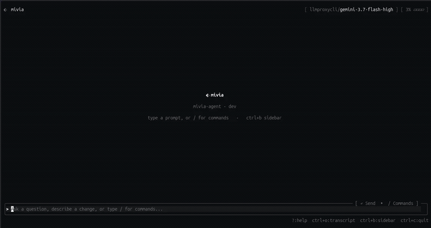
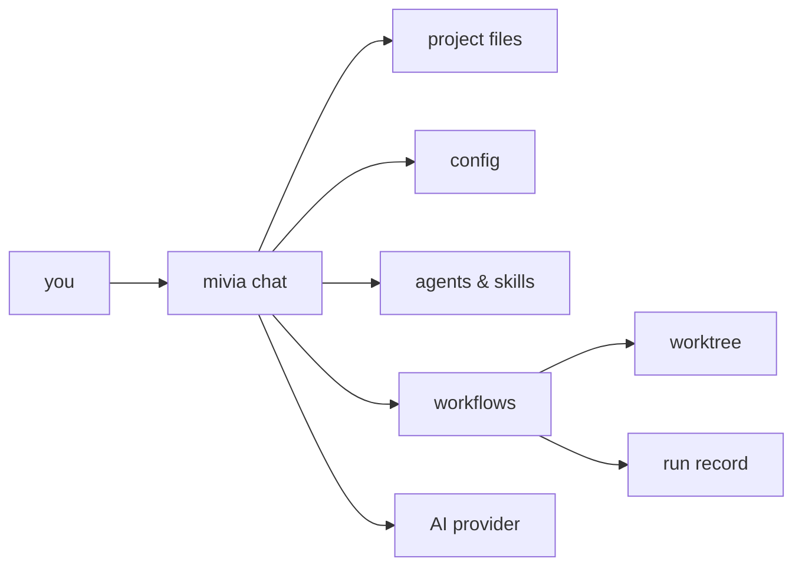

<p align="center">
  
</p>

<h1 align="center">mivia</h1>

<p align="center">A local CLI coding agent. Chat, tools, workflows, and multi-agent orchestration, in your terminal.</p>

<p align="center">
  <a href="https://github.com/MiviaLabs/mivia-agent/actions/workflows/ci.yml"></a>
  <a href="LICENSE"></a>
  
</p>

mivia reads, searches, and edits files in your project. It runs commands, such as your test suite. It can also run multi-step workflows in an isolated worktree, with a durable run record for every step.

Your files stay on your machine by default. mivia sends prompts and selected context to the AI provider you configure. Web search, configured MCP servers, lifecycle hooks, and workflow delivery can also contact external services or run configured local programs. Review those settings before use. See [Integrations](docs/product/integrations.md) for the full list.

<p align="center">
  
</p>

## Quick start

Requires Go 1.25+ to build from source, or use a prebuilt binary. You also need an API key for a supported provider. See [Supported providers](#supported-providers) below.

### Install

Tagged [GitHub Releases](https://github.com/MiviaLabs/mivia-agent/releases) provide archives for Linux, macOS, and Windows. Each release supports amd64 and arm64. See the [release guide](docs/development/release.md) for release checks and pinned installs.

Piping a script into `bash` runs it with your shell's privileges. Inspect it first, or pin an exact tag, with:

```bash
curl -fsSL https://raw.githubusercontent.com/MiviaLabs/mivia-agent/v0.1.0/scripts/install.sh -o /tmp/mivia-install.sh
sed -n '1,240p' /tmp/mivia-install.sh
sh /tmp/mivia-install.sh v0.1.0
```

Install the latest stable release on Linux or macOS:

```bash
curl -fsSL https://raw.githubusercontent.com/MiviaLabs/mivia-agent/main/scripts/install.sh | bash
```

Open a new shell, or source the profile that the installer reports. Then run `mivia --version`.

Install the latest stable release in Windows PowerShell:

```powershell
irm https://raw.githubusercontent.com/MiviaLabs/mivia-agent/main/scripts/install.ps1 | iex
mivia --version
```

The installers verify the archive checksum before extraction. They use a user-owned directory and do not require administrator rights. Unix installs update a shell profile. A child `bash` process cannot update the parent shell, so open a new shell or source the reported profile. PowerShell also updates the current process when it can.

Use `MIVIA_NO_PATH_UPDATE=1` on Unix or `-NoPathUpdate` in PowerShell to skip PATH changes. Latest installation requires at least one published stable release. Pre-release tags require an explicit version.

From source with Go 1.25+:

```bash
go install github.com/MiviaLabs/mivia-agent/cmd/mivia@latest
```

This method requires a published semantic version tag. Use a release archive when Go is not installed.

Or build the latest source:

```bash
git clone https://github.com/MiviaLabs/mivia-agent.git
cd mivia-agent
make build              # produces ./mivia
```

### First run

```bash
mivia chat
```

`mivia chat` configures itself on first use: it writes a minimal config to
`~/.mivia/mivia.toml` (the shipped default provider, openrouter) and, if no
API key is set yet, prompts for one once and writes it to `~/.mivia/.env`
(0600). Answer the prompt and you land in a working chat session - no other
command needed.

For scripted or non-interactive setup (CI, no TTY), run `mivia setup` first
so `mivia chat` finds a key already in place:

```bash
mivia setup             # writes your provider API key to ~/.mivia/.env (0600)
mivia doctor            # verify the key is visible; never prints it
mivia chat
```

`mivia setup` writes the key to an env file with owner-only permissions. It never prints the key value. For scripting, set the key as an environment variable and pass `--provider`. Avoid `--key` because shell history and process inspection can expose command arguments.

One-shot mode:

```bash
./mivia chat -p "what does this project do?"
```

Shell completions: `mivia completion bash|zsh|fish` prints a completion script for your shell.

## Supported providers

mivia is a local-first agent: prompts and selected context go to exactly one
configured AI provider. Eight providers are built in:

| Provider | Default model | Default API base URL |
|----------|---------------|-----------------------|
| OpenRouter (default) | `openai/gpt-5.6-luna` | `https://openrouter.ai/api/v1` |
| Anthropic | `claude-sonnet-5` | `https://api.anthropic.com/v1` |
| DeepSeek | `deepseek-v4-flash` | `https://api.deepseek.com/v1` |
| ZAI (z.ai) | `glm-5.2` | `https://api.z.ai/api/paas/v4` |
| Ollama | `gpt-oss:120b` | `https://ollama.com/v1` |
| LLM Gateway | `deepseek-v4-pro` | `https://api.llmgateway.io/v1` |
| LLM Proxy CLI | `claude-sonnet-5` | `http://127.0.0.1:8317/v1` |
| MiniMax | `MiniMax-M3` | `https://api.minimax.io/v1` |

mivia does not accept an arbitrary OpenAI-compatible provider name: the
provider registry rejects names it does not support, and every provider must
declare its model catalog in the settings file (there is no remote model
discovery). Configure a provider and its API key under
[Configuration](docs/product/config.md#provider-support); see
[Integrations](docs/product/integrations.md) for the external-service picture.
Default provider: OpenRouter, model `openai/gpt-5.6-luna`; switch with
`--provider` or in `[provider] name = ...`.

Full dev setup (hooks, tests, verify gates): see [Contributing](docs/contributing.md). Provider and config options: see [Configuration](docs/product/config.md).
Successful workflow runs stop at `delivery_pending` until you pass the explicit `--allow-publish` flag. See the [Workflow guide](docs/product/workflows-guide.md).

## What it does

- Chat with tool access: read, search, edit files; run allowed commands.
- Web search.
- Durable project and organization memory, with an optional SQLite file that you can commit with the project.
- Configurable MCP servers over stdio and Streamable HTTP, scoped per agent.
- Workflows: durable, multi-step processes with retries and evidence gates.
- Worktrees: isolated checkouts for a workflow run, so your working tree stays clean.
- Agents and skills: named specialists you can route work to.
- Lifecycle hooks: your own scripts run on `PreToolUse`, `PostToolUse`, and
  `Stop` - gate, format, or log every tool call, deterministically.

## Architecture



Most work under `mivia chat` runs locally; the provider, web search, MCP, hooks, and delivery paths above are the exceptions.

## Docs

| Guide | Covers |
|-------|--------|
| [Product overview](docs/product/overview.md) | What mivia is, plain-language walkthrough |
| [Configuration](docs/product/config.md) | Providers, keys, settings, and MCP servers |
| [Integrations](docs/product/integrations.md) | External services mivia can talk to |
| [Coding agent mode](docs/product/agent.md) | Chat, tools, agents, skills |
| [Memory](docs/product/memory.md) | Durable project and organization memory |
| [Workflows](docs/product/workflows.md) | Step-by-step processes |
| [Workflow guide](docs/product/workflows-guide.md) | Workflow commands, the built-in workflow |
| [Security and privacy](docs/security/overview.md) | Data handling |
| [Lifecycle hooks](docs/development/lifecycle-hooks.md) | Your own scripts on tool-call events |
| [Architecture](docs/architecture/overview.md) | System design |
| [Contributing](docs/contributing.md) | Build, test, and PR process |

## License

[GNU AGPL-3.0](LICENSE)
