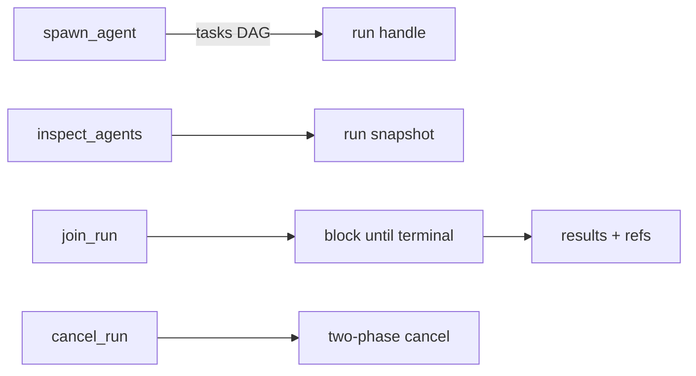

<p align="center">
  
  
</p>

<h1 align="center">mivia</h1>

<p align="center">
  <strong>A terminal AI agent that actually works on your codebase.</strong><br>
  No cloud workspace. No IDE plugin. No vendor lock-in.<br>
  <code>mivia</code> is one binary that reads, edits, tests, and runs commands in your local repo.
</p>

<p align="center">
  <a href="#quick-start">Quick start</a> · <a href="#why-not-just-use-cursor--copilot--etc">Why mivia</a> · <a href="#features">Features</a> · <a href="docs/product/config.md">Configuration</a>
</p>

---

## What it looks like

```text
$ mivia chat -p "why is TestAuthService failing?"

→ reads internal/auth/service_test.go
→ traces AuthService.Setup into internal/auth/service.go
→ finds the mock is not returning the expected error shape
→ applies the fix
→ runs go test ./internal/auth/ -count=1
→ PASS

$ mivia chat
→ interactive REPL — type naturally, agent calls tools
→ /agent reviewer — switch to a read-only specialist mid-session
→ /resume — pick up an interrupted subagent run
```

## Quick start

```bash
# Build (Go 1.25+)
git clone https://github.com/MiviaLabs/mivia-agent.git && cd mivia-agent
make build

# One config step — your provider key
export DEEPSEEK_API_KEY=sk-...

# Go
mivia doctor          # verify everything is wired up
mivia chat -p "walk me through the auth middleware"
mivia chat            # interactive REPL
```

Works with **DeepSeek**, **OpenRouter**, **ZAI**, or any OpenAI-compatible provider.
Credentials live in an env file — mivia never phones home.

## Why not just use Cursor / Copilot / etc.

| | mivia | IDE agents | Cloud agents |
|---|---|---|---|
| Runs where | Your terminal, your machine | Hosted IDE | Someone else's server |
| Accesses | Your real filesystem, your real tools | Sandbox or remote FS | Cloud workspace copy |
| Provider lock-in | None — bring your own API key | Vendor model | Vendor model |
| Costs | Your API key, your rate limits | Subscription | Subscription + API |
| Extensible | TOML agents, Markdown skills, TOML config | Proprietary | Proprietary |
| Works offline | Yes (local LLM via any compatible endpoint) | Usually no | No |
| Open source | Fully | Usually not | No |

mivia is for developers who want agent-assisted coding **without giving up control of their workspace, their credentials, or their provider choice**.

## Features

### File tools — read, search, edit, navigate

| Tool | What it does |
|------|-------------|
| `read_file` | Read files with line-range support |
| `write_file` / `search_replace` | Create, overwrite, or surgically edit files |
| `grep` / `glob` | Search by regex or filename pattern |
| `find_references` | Resolve symbol references — callers, implementations, return sites |
| `run_command` | Execute allowlisted programs (explicit argv, no shell injection) |

### Web research — search and extract

| Tool | What it does |
|------|-------------|
| `search` | Web search (Tavily or free engines) |
| `fetch_url` / `extract` | Fetch and structure web content |

### Named agents — specialists, not one-size-fits-all

Define agents as TOML files. One per agent, one file per definition.

```toml
# .mivia/agents/reviewer.toml — read-only code reviewer
name = "reviewer"
description = "Reviews proposed changes with read-only tools."
tools = ["read_file", "grep", "glob"]

# .mivia/agents/go-engineer.toml — Go specialist with scoped skills
name = "go-engineer"
skills = ["bug-audit", "verify-change", "architecture-review", "secure-change"]
```

```bash
mivia chat --agent reviewer -p "review the last commit"
mivia chat --agent go-engineer -p "add retry with exponential backoff"
```

- **Workspace agents** (`.mivia/agents/`) — committed to the repo, project-specific.
- **User agents** (`~/.mivia/agents/`) — personal, portable across all repos.
- Inherit tool lists, add deltas, restrict skills, bind models per agent.

### Skills — reusable task templates

Pre-built skills for common engineering workflows:

| Skill | Purpose |
|-------|---------|
| `bug-audit` | Find confirmed bugs — hard anti-false-positive rules |
| `verify-code-change` | Blast-radius verification ladder after edits |
| `architecture-review` | Boundary, dependency, and abstraction cost review |
| `secure-change` | Secrets, authz, network, and tool isolation audit |
| `docs-update` | OWNERS-safe documentation edits |
| `concurrency-review` | Subagent caps, race conditions, cancel safety |
| `feature-delivery` | Bounded feature slice with verification |

Write your own in `~/.mivia/skills/` or `.mivia/skills/` — just a `SKILL.md` with optional YAML frontmatter.

### Concurrent subagents — real parallelism, not sequential turns

Spawn multiple agents as a directed acyclic graph:



- Tasks declare `depends_on` for ordering.
- One result per task — one failure never costs you the others.
- Runs persist to SQLite — survives crashes, resumeable on restart.
- `dispatch_tasks` for parallel work, `spawn_agent` for sequential waves.

### Transparent security

- **All tools are allowlisted.** `run_command` runs explicit argv from a configured list — no shell access, no wildcard exec.
- **Config is the only authority.** No compiled credential lists, no hardcoded patterns. With nothing configured, nothing is filtered and nothing is redacted.
- **Secret scanning** is hook-enforced on every commit.
- **Workspace agents load unconditionally** — treat unfamiliar repos like untrusted code.

## Project structure

```
cmd/mivia/              CLI entrypoint (binary: mivia)
internal/               Agent loop, tools, providers, orchestration
.mivia/agents/          Workspace agent definitions (TOML)
.mivia/skills/          Workspace skill definitions
docs/                   User-facing documentation
scripts/                Hooks, scans, verification gates
```

## Documentation

| Guide | Content |
|-------|---------|
| [Configuration](docs/product/config.md) | Providers, credentials, tool allowlists, privacy |
| [Coding agent mode](docs/product/agent.md) | Tools, agents, orchestration, safety |
| [Security and privacy](docs/security/overview.md) | Risk model, trust boundaries, redaction |
| [Architecture](docs/architecture/overview.md) | Layers, agent pipeline, orchestration design |
| [Concurrency](docs/architecture/concurrency.md) | Subagent model, resource caps, retry |
| [Skills](docs/architecture/skills.md) | Discovery, activation, resource scoping |
| [Contributing](docs/contributing.md) | Setup, commit format, workflow |

## License

[MIT](LICENSE)
