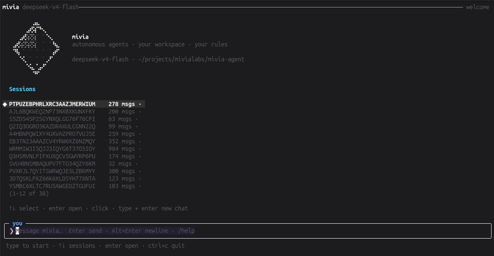
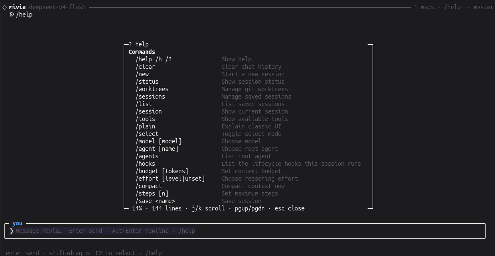
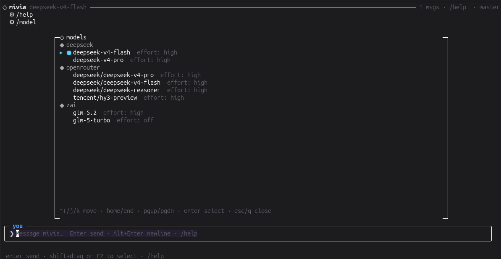

<p align="center">
  
</p>

<h1 align="center">mivia</h1>

<p align="center">A local CLI coding agent. Chat, tools, workflows, and multi-agent orchestration, in your terminal.</p>

<p align="center">
  <a href="https://github.com/MiviaLabs/mivia-agent/actions/workflows/ci.yml"></a>
  <a href="LICENSE"></a>
  
</p>

mivia reads, searches, and edits files in your project. It runs commands, such as your test suite. It can also run multi-step workflows in an isolated worktree, with a durable run record for every step.

Your files stay on your machine. mivia sends your prompts and the context it selects to the AI provider you configure; nothing else leaves your machine.

## Quick start

Requires Go 1.25+ and an API key for a supported provider (DeepSeek by default). mivia ships as source; there is no prebuilt binary yet.

```bash
git clone https://github.com/MiviaLabs/mivia-agent.git
cd mivia-agent
make build              # produces ./mivia

export DEEPSEEK_API_KEY=sk-...
./mivia doctor          # verify the key is visible; never prints it
./mivia chat
```

One-shot mode:

```bash
./mivia chat -p "what does this project do?"
```

Full dev setup (hooks, tests, verify gates): see [Contributing](docs/contributing.md). Provider and config options: see [Configuration](docs/product/config.md).

<p align="center">
  
  
  
</p>

## What it does

- Chat with tool access: read, search, edit files; run allowed commands.
- Web search.
- Workflows: durable, multi-step processes with retries and evidence gates.
- Worktrees: isolated checkouts for a workflow run, so your working tree stays clean.
- Agents and skills: named specialists you can route work to.

## Architecture


Everything under `mivia chat` runs locally except the `AI provider` edge, which carries only your prompt and selected context.

## Docs

| Guide | Covers |
|-------|--------|
| [Product overview](docs/product/overview.md) | What mivia is, plain-language walkthrough |
| [Configuration](docs/product/config.md) | Providers, keys, settings |
| [Coding agent mode](docs/product/agent.md) | Chat, tools, agents, skills |
| [Workflows](docs/product/workflows.md) | Step-by-step processes |
| [Workflow guide](docs/product/workflows-guide.md) | Workflow commands, the built-in workflow |
| [Security and privacy](docs/security/overview.md) | Data handling |
| [Architecture](docs/architecture/overview.md) | System design |
| [Contributing](docs/contributing.md) | Build, test, and PR process |

## License

[MIT](LICENSE)
