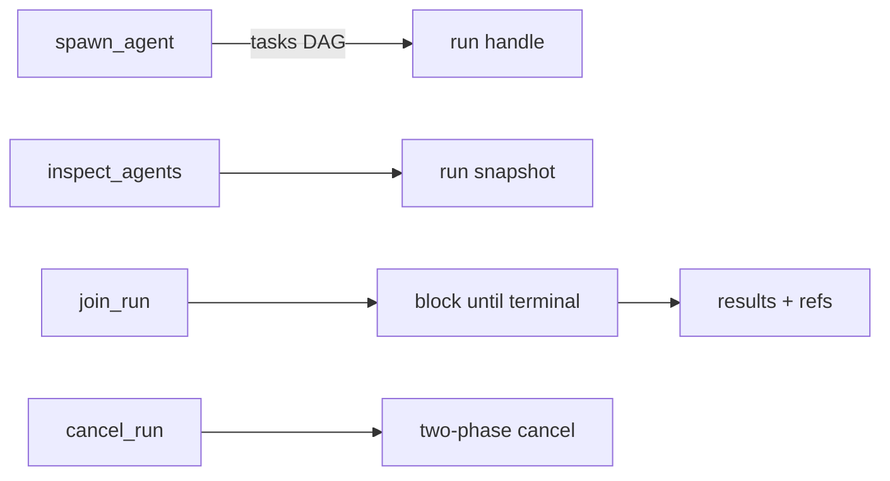

<p align="center">
  
  
</p>

<h1 align="center">mivia</h1>

<p align="center">
  <strong>A terminal AI agent that actually works on your codebase.</strong><br>
  Local-first, provider-agnostic, and built for real engineering work.<br>
  <code>mivia</code> is one binary that reads, edits, tests, and runs commands in your local repo.
</p>

<p align="center">
  <a href="#quick-start">Quick start</a> · <a href="#features">Features</a> · <a href="#providers">Providers</a> · <a href="docs/product/config.md">Configuration</a>
</p>

---

## What it looks like

```text
$ mivia chat -p "why is TestAuthService failing?"

→ reads internal/auth/service_test.go
→ traces AuthService.Setup into internal/auth/service.go
→ finds the mock is not returning the expected error shape
→ applies the fix
→ runs go test ./internal/auth/ -count=1
→ PASS

$ mivia chat
→ interactive REPL - type naturally, agent calls tools
→ /agent reviewer - switch to a read-only specialist mid-session
→ /resume - pick up an interrupted subagent run
```

## Quick start

```bash
# Build (Go 1.25+)
git clone https://github.com/MiviaLabs/mivia-agent.git && cd mivia-agent
make build

# One config step - your provider key
export DEEPSEEK_API_KEY=sk-...

# Go
mivia doctor          # verify everything is wired up
mivia chat -p "walk me through the auth middleware"
mivia chat            # interactive REPL
```

## Features

### Lifecycle hooks - deterministic control at every step

Hooks let you run scripts and enforce policies at deterministic points in the
agent's execution. Unlike skill triggers (which are probabilistic hints to the
model), hooks fire every time - they are part of the runtime.

| Event | Fires | Can block? |
|-------|-------|------------|
| `PreToolUse` | After authorization, before the tool executes | **Yes** - exit 2 or `permissionDecision: "deny"` blocks the call and feeds the reason to the model |
| `PostToolUse` | After the tool returns | No - reactive (format-on-save, lint, run tests) |
| `Stop` | After a turn ends | No - continuation prompt or cleanup |

```toml
# ~/.mivia/mivia.toml
[[hooks]]
event   = "PreToolUse"
matcher = "run_command"          # regex on tool name; empty = match all

  [[hooks.handlers]]
  type       = "command"
  argv       = ["./hooks/block-no-verify.sh"]
  timeout    = 10                # seconds
  on_timeout = "block"           # fail closed for PreToolUse

[[hooks]]
event   = "PostToolUse"
matcher = "write_file|search_replace"

  [[hooks.handlers]]
  type = "command"
  argv = ["./hooks/gofmt-changed.sh"]
```

Hooks receive a JSON payload on stdin (tool name, input, session id) and
communicate via exit code. Context reaches the hook via environment variables
(`MIVIA_HOOK_EVENT`, `MIVIA_TOOL`, `MIVIA_FILE`, `MIVIA_SESSION_ID`) - never
through shell interpolation.

- **Command-only handlers.** `type = "command"` executes explicit argv. No
  shell, no `PATH` lookup, no interpolation of tool-derived values.
- **Trust-gated.** A fresh install runs zero hooks until confirmed via `/hooks`.
  Trust is keyed on the hook definition's content hash - editing a confirmed
  hook revokes its trust automatically. Headless runs (`-p`) execute zero
  non-managed hooks unless `--bypass-hook-trust` is passed.
- **Subagent-safe.** Hook functions propagate to scoped subagent dispatchers,
  so a spawned agent cannot escape a `PreToolUse` gate.

### File tools - read, search, edit, navigate

| Tool | What it does |
|------|-------------|
| `read_file` | Read files with line-range support |
| `write_file` / `search_replace` | Create, overwrite, or surgically edit files |
| `grep` / `glob` | Search by regex or filename pattern |
| `find_references` | Resolve symbol references - callers, implementations, return sites |
| `run_command` | Execute allowlisted programs (explicit argv, no shell injection) |

### Web research - search and extract

| Tool | What it does |
|------|-------------|
| `search` | Web search (Tavily or free engines) |
| `fetch_url` / `extract` | Fetch and structure web content |

### Named agents - specialists, not one-size-fits-all

Define agents as TOML files. One per agent, one file per definition.

```toml
# .mivia/agents/reviewer.toml - read-only code reviewer
name = "reviewer"
description = "Reviews proposed changes with read-only tools."
tools = ["read_file", "grep", "glob"]

# .mivia/agents/go-engineer.toml - Go specialist with scoped skills
name = "go-engineer"
skills = ["bug-audit", "verify-change", "architecture-review", "secure-change"]
```

```bash
mivia chat --agent reviewer -p "review the last commit"
mivia chat --agent go-engineer -p "add retry with exponential backoff"
```

- **Workspace agents** (`.mivia/agents/`) - committed to the repo, project-specific.
- **User agents** (`~/.mivia/agents/`) - personal, portable across all repos.
- Inherit tool lists, add deltas, restrict skills, bind models per agent.

### Skills - reusable task templates

Pre-built skills for common engineering workflows:

| Skill | Purpose |
|-------|---------|
| `bug-audit` | Find confirmed bugs - hard anti-false-positive rules |
| `verify-code-change` | Blast-radius verification ladder after edits |
| `architecture-review` | Boundary, dependency, and abstraction cost review |
| `secure-change` | Secrets, authz, network, and tool isolation audit |
| `docs-update` | OWNERS-safe documentation edits |
| `concurrency-review` | Subagent caps, race conditions, cancel safety |
| `feature-delivery` | Bounded feature slice with verification |

Write your own in `~/.mivia/skills/` or `.mivia/skills/` - just a `SKILL.md` with optional YAML frontmatter.

### Concurrent subagents - real parallelism, not sequential turns

Spawn multiple agents as a directed acyclic graph:



- Tasks declare `depends_on` for ordering.
- One result per task - one failure never costs you the others.
- Runs persist to SQLite - survives crashes, resumeable on restart.
- `dispatch_tasks` for parallel work, `spawn_agent` for sequential waves.

### Transparent security

- **All tools are allowlisted.** `run_command` runs explicit argv from a configured list - no shell access, no wildcard exec.
- **Config is the only authority.** No compiled credential lists, no hardcoded patterns. With nothing configured, nothing is filtered and nothing is redacted.
- **Secret scanning** is hook-enforced on every commit.
- **Workspace agents load unconditionally** - treat unfamiliar repos like untrusted code.

## Providers

mivia works with any OpenAI-compatible provider. Declare your catalog in TOML
and bring your own API key - mivia never phones home.

**Built-in providers:**

| Provider | Key env var | Default endpoint |
|----------|-------------|------------------|
| **DeepSeek** | `DEEPSEEK_API_KEY` | `https://api.deepseek.com/v1` |
| **OpenRouter** | `OPENROUTER_API_KEY` | `https://openrouter.ai/api/v1` |
| **ZAI** (GLM) | `ZAI_API_KEY` | `https://api.z.ai/api/paas/v4` |

**Configuring any OpenAI-compatible provider** (OpenAI, xAI/Grok, Kimi, local
LLMs, etc.) is a few lines of TOML:

```toml
[provider]
name = "openai"

[providers.openai]
models = [
  { name = "gpt-4o-mini", context_window_tokens = 128000 },
  { name = "gpt-4o", context_window_tokens = 128000 },
]
default_model = "gpt-4o-mini"
api_key_env = "OPENAI_API_KEY"
base_url = "https://api.openai.com/v1"
```

Same pattern for **xAI (Grok)**:

```toml
[providers.xai]
models = [{ name = "grok-code-fast-1", context_window_tokens = 256000 }]
default_model = "grok-code-fast-1"
api_key_env = "XAI_API_KEY"
base_url = "https://api.x.ai/v1"
```

And **Kimi (Moonshot AI)**:

```toml
[providers.kimi]
models = [{ name = "kimi-k3", context_window_tokens = 1048576 }]
default_model = "kimi-k3"
api_key_env = "MOONSHOT_API_KEY"
base_url = "https://api.moonshot.ai/v1"
```

Provider credentials stay in your env file or process environment - never in
the TOML, never in git. `mivia doctor` verifies presence without printing the
value.

See [configuration](docs/product/config.md) for the full provider reference.

## Project structure

```
cmd/mivia/              CLI entrypoint (binary: mivia)
internal/               Agent loop, tools, providers, orchestration
.mivia/agents/          Workspace agent definitions (TOML)
.mivia/skills/          Workspace skill definitions
docs/                   User-facing documentation
scripts/                Hooks, scans, verification gates
```

## Documentation

| Guide | Content |
|-------|---------|
| [Configuration](docs/product/config.md) | Providers, credentials, tool allowlists, privacy |
| [Coding agent mode](docs/product/agent.md) | Tools, agents, orchestration, safety |
| [Security and privacy](docs/security/overview.md) | Risk model, trust boundaries, redaction |
| [Architecture](docs/architecture/overview.md) | Layers, agent pipeline, orchestration design |
| [Concurrency](docs/architecture/concurrency.md) | Subagent model, resource caps, retry |
| [Skills](docs/architecture/skills.md) | Discovery, activation, resource scoping |
| [Contributing](docs/contributing.md) | Setup, commit format, workflow |

## License

[MIT](LICENSE)
