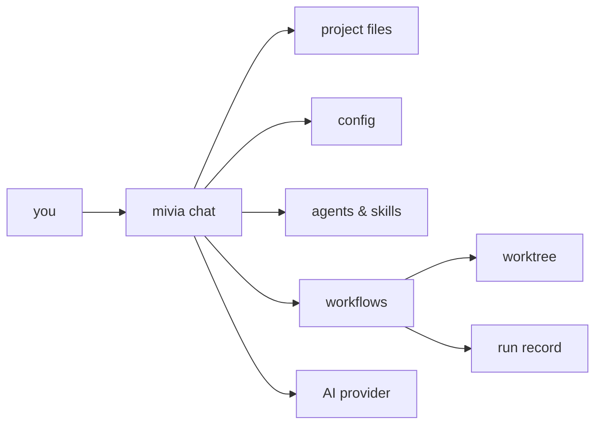

<p align="center">
  
</p>

<h1 align="center">mivia</h1>

<p align="center">A local CLI coding agent. Chat, tools, workflows, and multi-agent orchestration, in your terminal.</p>

<p align="center">
  <a href="https://github.com/MiviaLabs/mivia-agent/actions/workflows/ci.yml"></a>
  <a href="LICENSE"></a>
  
</p>

mivia reads, searches, and edits files in your project. It runs commands, such as your test suite. It can also run multi-step workflows in an isolated worktree, with a durable run record for every step.

Your files stay on your machine by default. mivia sends prompts and selected context to the AI provider you configure. Web search, configured MCP servers, lifecycle hooks, and workflow delivery can also contact external services or run configured local programs. Review those settings before use.

## Quick start

Requires Go 1.25+ to build from source, or use a prebuilt binary. You also need an API key for a supported provider (DeepSeek by default).

### Install

Tagged [GitHub Releases](https://github.com/MiviaLabs/mivia-agent/releases) provide archives for Linux, macOS, and Windows. Each release supports amd64 and arm64. See the [release guide](docs/development/release.md) for checksum verification and installers.

To install a pinned release on Linux or macOS, download the installer, inspect it, and run it with the release tag:

Replace `v0.1.0` with a published release tag. The example works after that release exists.

```bash
curl --fail --silent --show-error --location \
  https://raw.githubusercontent.com/MiviaLabs/mivia-agent/v0.1.0/scripts/install.sh \
  -o /tmp/mivia-install.sh
sed -n '1,240p' /tmp/mivia-install.sh
MIVIA_VERSION=v0.1.0 sh /tmp/mivia-install.sh
```

The installer uses a user-owned directory and verifies the archive checksum. It does not use an unpinned release.

From source with Go 1.25+:

```bash
go install github.com/MiviaLabs/mivia-agent/cmd/mivia@latest
```

This method requires a published semantic version tag. Use a release archive when Go is not installed.

Or build the latest source:

```bash
git clone https://github.com/MiviaLabs/mivia-agent.git
cd mivia-agent
make build              # produces ./mivia
```

### First run

```bash
mivia setup             # writes your provider API key to ~/.mivia/.env (0600)
mivia doctor            # verify the key is visible; never prints it
mivia chat
```

`mivia setup` writes the key to an env file with owner-only permissions. It never prints the key value. For scripting, set the key as an environment variable and pass `--provider`. Avoid `--key` because shell history and process inspection can expose command arguments.

One-shot mode:

```bash
./mivia chat -p "what does this project do?"
```

Shell completions: `mivia completion bash|zsh|fish` prints a completion script for your shell.

Full dev setup (hooks, tests, verify gates): see [Contributing](docs/contributing.md). Provider and config options: see [Configuration](docs/product/config.md).
Successful workflow runs stop at `delivery_pending` until you pass the explicit `--allow-publish` flag. See the [Workflow guide](docs/product/workflows-guide.md).

<p align="center">
  
  
  
</p>

## What it does

- Chat with tool access: read, search, edit files; run allowed commands.
- Web search.
- Durable project and organization memory, with an optional SQLite file that you can commit with the project.
- Configurable MCP servers over stdio and Streamable HTTP, scoped per agent.
- Workflows: durable, multi-step processes with retries and evidence gates.
- Worktrees: isolated checkouts for a workflow run, so your working tree stays clean.
- Agents and skills: named specialists you can route work to.
- Lifecycle hooks: your own scripts run on `PreToolUse`, `PostToolUse`, and
  `Stop` - gate, format, or log every tool call, deterministically.

## Architecture



Most work under `mivia chat` runs locally. The provider, web search, configured MCP servers, lifecycle hooks, and workflow delivery are separate data or execution paths. Review their settings before use.

## Docs

| Guide | Covers |
|-------|--------|
| [Product overview](docs/product/overview.md) | What mivia is, plain-language walkthrough |
| [Configuration](docs/product/config.md) | Providers, keys, settings, and MCP servers |
| [Coding agent mode](docs/product/agent.md) | Chat, tools, agents, skills |
| [Memory](docs/product/memory.md) | Durable project and organization memory |
| [Workflows](docs/product/workflows.md) | Step-by-step processes |
| [Workflow guide](docs/product/workflows-guide.md) | Workflow commands, the built-in workflow |
| [Security and privacy](docs/security/overview.md) | Data handling |
| [Lifecycle hooks](docs/development/lifecycle-hooks.md) | Your own scripts on tool-call events |
| [Architecture](docs/architecture/overview.md) | System design |
| [Contributing](docs/contributing.md) | Build, test, and PR process |

## License

[MIT](LICENSE)
