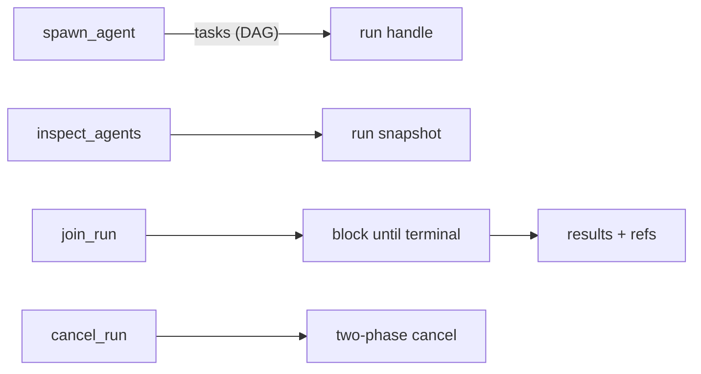

<p align="center">
  <strong>mivia</strong><br>
  local CLI AI agent for software engineering
</p>

<p align="center">
  <code>mivia chat -p "find and fix the failing test"</code>
</p>

## What is mivia

A terminal-based coding agent that reads, edits, searches, and runs commands
in your workspace — powered by any OpenAI-compatible provider. No cloud
account, no IDE plugin, no web UI. One binary, your repo, your provider key.

```
$ mivia chat -p "explain the auth middleware"
→ reads source, traces callers, writes a focused answer

$ mivia chat
→ interactive REPL with tools — edit, test, commit in one session

$ mivia chat --agent go-engineer -p "add retry with exponential backoff"
→ specialist agent: scoped skills, full tool access, dispatched work
```

## Why mivia

- **Workspace-native.** Operates on your local filesystem with real tools —
  not a sandbox or a cloud workspace. Paths stay under `--workspace`.
- **No lock-in.** Use DeepSeek, OpenRouter, ZAI, or any OpenAI-compatible
  provider. Credentials stay in your env file — mivia calls the API, nothing
  else.
- **Concurrent subagents.** Spawn multiple agents as a DAG, inspect progress,
  cancel, or block on results — all in-process, no extra processes or services.
- **Named agents.** Define specialists per repo (`.mivia/agents/`) or per
  user (`~/.mivia/agents/`) with scoped tool allowlists, skill policies, and
  model bindings.
- **Skills.** Reusable task templates (audit, review, verify, deliver) invoked
  by name or bound to agents. Write your own.
- **Transparent.** All config is TOML. All tools are named and allowlisted.
  No hidden capabilities, no compiled credential lists.

## Quick start

```bash
# Install (Go 1.25+)
git clone https://github.com/MiviaLabs/mivia-agent.git
cd mivia-agent
make build

# Configure a provider
export DEEPSEEK_API_KEY=sk-...
mivia doctor        # verify paths and key presence

# Go
mivia chat -p "explain the test failures in ./internal/..."
mivia chat           # interactive REPL
```

See [configuration](docs/product/config.md) for providers, env files, tool
allowlists, privacy controls, and all settings.

## Tools

The agent has a fixed, named tool catalogue — no hidden capabilities.

| Tool | Purpose |
|------|---------|
| `read_file` | Read files with optional offset/limit |
| `write_file` | Create or overwrite files |
| `search_replace` | Exact-string find-and-replace |
| `grep` / `glob` | Search by regex or file pattern |
| `find_references` | Resolve symbol references across the codebase |
| `run_command` | Execute allowlisted programs (argv, not shell) |
| `search` / `fetch_url` / `extract` | Web research (Tavily or free engines) |
| `read_skill_resource` | Read declared skill resources |

Plus orchestration tools for concurrent subagents (`spawn_agent`,
`dispatch_tasks`, `delegate`, `inspect`, `join`, `cancel`) and read-only
execution-history tools (`ledger_read`, `list_run_events`).

Tool names and schemas are project- and language-generic — mivia works on any
workspace regardless of stack.

## Agents

File-backed specialist definitions — one TOML file per agent:

```toml
# .mivia/agents/reviewer.toml
name = "reviewer"
description = "Reviews a proposed change with read-only tools."
tools = ["read_file", "grep"]
```

```bash
mivia chat --agent reviewer -p "review the last commit"
```

- **User agents** (`~/.mivia/agents/`) — personal, portable across repos.
- **Workspace agents** (`.mivia/agents/`) — project-scoped, committed to the repo.
- Inherit tool lists, add deltas, restrict skills, bind spawned-task models.

See [coding agent mode](docs/product/agent.md) for the full schema and trust model.

## Skills

Reusable task templates invoked by name or bound to agents:

| Skill | Purpose |
|-------|---------|
| `bug-audit` | Find confirmed bugs only — hard anti-false-positive rules |
| `verify-code-change` | Blast-radius verification ladder |
| `architecture-review` | Boundary and dependency review |
| `docs-update` | OWNERS-safe documentation edits |
| `secure-change` | Secrets, authz, network, tool isolation |
| `concurrency-review` | Subagent caps, races, cancel safety |
| `feature-delivery` | Bounded feature slice with verification |

Write custom skills in `~/.mivia/skills/` or `.mivia/skills/`.

See [skill system architecture](docs/architecture/skills.md) for discovery,
activation, and resource scoping.

## Orchestration

Spawn concurrent subagents as a directed acyclic graph:



- Tasks declare `depends_on` for ordering.
- One result per task — one failure never costs you the others.
- Runs persist to SQLite for crash recovery and resume.
- Idempotent spawns with caller-scoped keys.

## Security posture

- **Credentials never in git** — hook-enforced secret scanning.
- **All tools are allowlisted** — no shell access, no wildcard exec, no unlisted
  programs. `run_command` runs explicit argv from a configured allowlist.
- **Redaction is opt-in** — off by default for operator visibility. Configure
  `[privacy]` patterns when previews may be visible to others.
- **Workspace agents load unconditionally** — treat unfamiliar repos like
  untrusted code. Read `.mivia/agents/` before running `mivia chat`.
- **Config is the only authority** — no compiled credential lists, no hardcoded
  patterns. With nothing configured, nothing is filtered and nothing is redacted.

See [security overview](docs/security/overview.md) for the full risk model.

## Project structure

```
cmd/mivia/          CLI entrypoint
internal/           Agent loop, tools, providers, config, orchestration
.mivia/agents/      Workspace agent definitions (TOML)
.mivia/skills/      Workspace skill definitions
docs/               User-facing documentation
scripts/            Hooks, scans, verification gates
```

## Documentation

| Guide | Content |
|-------|---------|
| [Configuration](docs/product/config.md) | Providers, credentials, tool allowlists, privacy |
| [Coding agent mode](docs/product/agent.md) | Tools, agents, orchestration, safety |
| [Security and privacy](docs/security/overview.md) | Risk model, trust boundaries, redaction |
| [Architecture](docs/architecture/overview.md) | Layers, agent pipeline, orchestration design |
| [Concurrency](docs/architecture/concurrency.md) | Subagent model, resource caps, retry |
| [Skills](docs/architecture/skills.md) | Discovery, activation, resource scoping |
| [Contributing](docs/contributing.md) | Setup, commit format, workflow |

## License

See [LICENSE](LICENSE).
