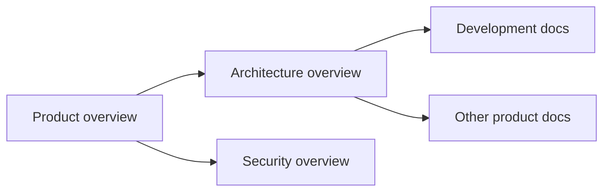

# Documentation Index

This is the map of `docs/`. For what mivia is and how to run it, start at the
[repository README](../README.md).

Each doc below has exactly one owner and one canonical path, tracked in
[`OWNERS.yaml`](OWNERS.yaml). Edit the owned path; do not create a second doc
for a topic that already has one. `scripts/check_docs_ownership.py` enforces
this in CI and pre-commit.

## Start here

New to the codebase? Read in this order:

1. [Product overview](product/overview.md) - what mivia is, no code required
2. [Architecture overview](architecture/overview.md) - package boundaries, how the pieces fit
3. [Contributing](contributing.md) - build, test, and the PR process

The arrows are a reading order, not a dependency graph: architecture assumes
you know what mivia does, and the development docs assume you know how it is
built.

## Product

What mivia does and how to configure it. Owner: `product`.

| Doc | Covers |
|-----|--------|
| [Product overview](product/overview.md) | Product vision and scope for the mivia CLI agent |
| [Configuration](product/config.md) | TOML config, env credentials, provider defaults, and MCP servers |
| [Coding agent mode](product/agent.md) | Coding agent tools, safety, and CLI modes |
| [Workflows](product/workflows.md) | Workflow model: plan, implement, review, and verify |
| [Workflow guide](product/workflows-guide.md) | CLI commands, agent tools, authoring, execution, and monitoring |
| [Agent memory](product/memory.md) | Durable agent memory: scopes, tools, entry format, configuration |

## Architecture

How mivia is built. Owner: `architecture`.

| Doc | Covers |
|-----|--------|
| [Architecture overview](architecture/overview.md) | System architecture and package boundaries |
| [Concurrency](architecture/concurrency.md) | Subagent concurrency model and resource caps |
| [Skills and resources](architecture/skills.md) | Skill discovery, activation, and scoped resource architecture |
| [Embedded persistence](architecture/embedded-persistence.md) | Embedded persistence recommendation for sessions, events, and context |
| [Workflows architecture](architecture/workflows.md) | Workflow contract schemas and templates architecture |

Architecture decisions live in these canonical docs, not in separate ADR
files. ADRs are not used in this repository.

## Development

How to work in this repository. Owner: `quality`.

| Doc | Covers |
|-----|--------|
| [Contributing](contributing.md) | Human contributor guide |
| [Git hooks](development/hooks.md) | Git hooks, make targets, and local gates |
| [Lifecycle hooks](development/lifecycle-hooks.md) | mivia's own PreToolUse/PostToolUse/Stop layer, its wire protocol and its trust model |
| [Agent workflow](development/agent-workflow.md) | How agents must work in this repository |
| [Agent self-prompt](development/agent-self-prompt.md) | Self-contained system prompt reference for agent rebuilds |
| [Terminal input](development/terminal-input.md) | Per-terminal manual verification for TUI keys, paste, mouse and clipboard |
| [Release](development/release.md) | Release archives, installers, package-manager status, and verification |

## Security

Owner: `security`.

| Doc | Covers |
|-----|--------|
| [Security overview](security/overview.md) | Security and privacy posture |

## Adding a new doc

1. Read [`OWNERS.yaml`](OWNERS.yaml) and search existing docs for the topic.
2. If a canonical doc already covers it, edit that file. Do not add a second one.
3. If it is a genuinely new topic, add an entry to `OWNERS.yaml` first, then
   create exactly one file at the registered path.
4. Add a row to the matching table above.

`.mivia/policy/docs-ownership.json` has the full rule set: no parallel trees
(`docs/guides`, `docs/wiki`, `docs/notes`), no duplicate H1 titles across
`docs/**`, `README.md`, and `AGENTS.md`, and no ADRs.
