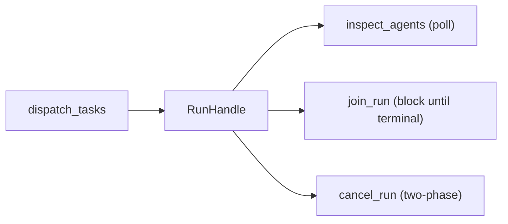

# Concurrency Model

## Constraint

"100 subagents" means 100 logical concurrent tasks with shared pools, not 100 OS processes.

## Defaults (laptop)

| Resource | Cap |
|----------|-----|
| Logical agents | 20–100 |
| In-flight LLM calls | 8–40 (provider quota) |
| Shell workers | 4–16 |

These ranges are design targets, not fixed constants read from a single config knob. The real, live concurrency knob is `[subagents] max_workers` (`internal/subagents/subagents.go`, `Pool.Workers`), which defaults to `0` (unlimited — one worker per task). Treat this table as a planning budget, not a promise that a `LogicalAgents`/`InFlight` setting exists with these exact bounds.

## Async orchestration model

Sub-agents are launched via `dispatch_tasks` as **DAG tasks** in an orchestration run.
The Coordinator manages the lifecycle asynchronously:

- The Coordinator returns a `RunHandle` immediately - the model can inspect progress, wait, or cancel
- Tasks within a run declare `depends_on` for DAG ordering
- Multiple runs can execute concurrently, each with its own task DAG and state machine
- Run handles are retained for 10 minutes after completion (configurable), then evicted

## Retry model

Failed or timed-out tasks can be retried automatically:

1. Task fails → CAS to `retry_pending`
2. Backoff timer fires → CAS to `queued`
3. DAG scheduler picks it up as ready → CAS to `running`
4. On retry exhaustion → task goes terminal as `failed`

Exponential backoff with jitter prevents thundering herd on retry.

Retries are gated by the provider's own transient-error classification (`provider.IsTransient`), not blanket retried: a task only re-enters `retry_pending` when the failure is a fault the provider layer marks transient (see [Provider transport retry](overview.md#provider-transport-retry)). Cancellation can race a pending retry — the DAG scheduler's `isCancelClaimed` check and the retry CAS both target the same task state, so a cancel that lands mid-retry-transition is resolved by whichever CAS wins, not by ordering.

Spawn requests carry an idempotency key so a duplicate `dispatch_tasks` call for the same logical run (a retried tool call, a resumed session) recovers the existing run instead of creating a second one (`recoverIdempotentWithRetry`, `ErrDuplicate` path in the coordinator). Run execution is additionally guarded by a fenced-lease claim (`ClaimRun`/`TakeoverExpiredRunClaim`), so only one executor drives a given run at a time; after a crash, `internal/coordinator/recovery_reclaim.go` reconciles runs left with a stale claim before the pool resumes them. See [Durable persistence & crash recovery](overview.md#durable-persistence--crash-recovery) for the full recovery sequence.

## Required mechanisms

- `context.Context` cancellation trees
- A generic tool-call concurrency limit, not distinct per-resource-class semaphores — `MaxConcurrentTools` (`internal/agent/options.go`) bounds parallel tool dispatch for one agent loop; there is no separate LLM-call semaphore and shell-worker semaphore
- Bounded mailboxes and tool output size
- Shared token/RPM budgets
- Race tests for concurrent packages (`make race`)
- **Heartbeat/progress events** for long-running tasks (periodic keep-alive signals emitted by active tasks so callers can detect stalls)
- **Compare-and-set version guards** for concurrent task state transitions (stale-attempt fencing)

## MCP clients

Each selected MCP server has one manager-owned client for a chat session or workflow. The manager discovers a server only when an allowed agent selects it. It serializes discovery and calls for that server. An unavailable server is memoized for the manager lifetime. Cleanup closes HTTP sessions and waits for stdio child processes.

## Forbidden default

Spawning one Python/Node/interpreter process per subagent as the primary fan-out model.

## See also

- Architecture: `docs/architecture/overview.md`
- Agent tools: `docs/product/agent.md`
- [Agent tools and safety](../product/agent.md#safety-and-limits)
