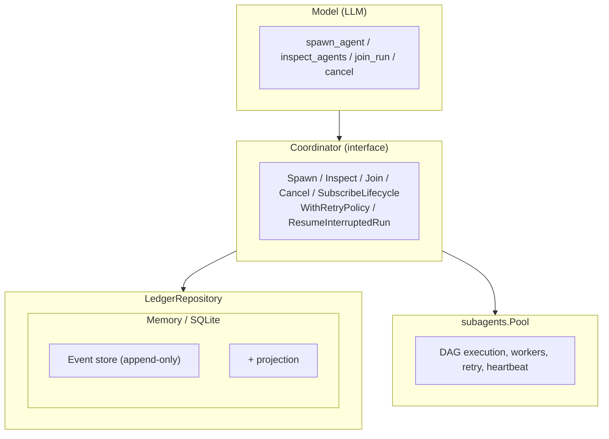

# Architecture Overview

## Host

- Language: Go
- Entrypoint: `cmd/mivia` -> binary `mivia`
- Libraries: `internal/`
- Module: `github.com/MiviaLabs/mivia-agent`

## Layers

1. **CLI** - chat REPL / one-shot; tool event tracing; TUI rendering
2. **Agent loop** - tool_calls until stop (`internal/agent`)
3. **Tool gateway** - read/search/edit/run under workspace policy (`internal/tools`)
4. **Workspace** - path confinement (`internal/workspace`)
5. **Providers** - OpenAI-compatible HTTP + tools (`internal/provider`)

The active provider and model come from the explicit provider-qualified model
catalog in TOML; there is no registry model fallback. The example config uses
`deepseek` with `deepseek-v4-flash` and declares its context capacity.
Config: TOML + env file for secrets. See `docs/product/config.md`.

## MCP client boundary

`internal/config` loads secret-free MCP server definitions from user and project configuration. A project server with the same ID replaces the complete user server definition. `internal/mcp` owns one lazy client per selected server. It discovers tools with `tools/list` and calls them with `tools/call`. `internal/agents` resolves server IDs. The CLI scopes discovered wrappers for root agents, child agents, and workflow agents. The manager closes every client and stdio process at session or workflow cleanup.

## Agents

Two distinct agent concepts, both covered below:

- **The root agent** is one file-backed definition (`.agents/agents/*.md`)
  selected for a session - system prompt, tool scope, model, skill allowlist.
  See [Agent definition pipeline](#agent-definition-pipeline).
- **Sub-agents** are concurrent DAG tasks the root agent spawns and manages
  through the coordinator - `spawn_agent`, `inspect_agents`, `join_run`,
  `cancel_run`. They run as in-process goroutines, not OS processes. See
  [Subagent Orchestration](#subagent-orchestration).

## Agent definition pipeline

File-backed agent configuration follows a bounded four-stage path:

1. The config layer reads the trusted user `[agents]` controls and parses one
   strict TOML definition per file from `~/.agents/agents/` and
   `<workspace>/.agents/agents/`.
2. Discovery attaches user/workspace provenance, gives same-name user files
   precedence, and always discovers workspace agent files. The user gate is
   applied later to workspace prompts and project skill handlers.
3. `internal/agents` validates tool and skill names, resolves same-origin
   inheritance and deltas, and publishes immutable snapshots.
4. The CLI selects a snapshot for the root session or for a required task
   agent, then builds the scoped dispatcher from that snapshot.

The compiled root fallback is private and is used only when no file-backed
`mivia` definition is selected; it is not a selectable agent definition.
Each chat invocation starts a fresh root session. Saved chat state does not
resume a root conversation or restore agent identity; orchestration task
resume is a separate, explicitly confirmed ledger operation.

Runtime lifecycle identity is intentionally narrow: definition name and source,
an opaque instance ID, and the session-local model generation. Paths, digests,
prompts, tool sets, and content stay outside that event identity.

## Provider transport retry

Every built-in provider (DeepSeek, OpenRouter, z.ai, Ollama, LLM Gateway, MiniMax) is an `OpenAICompat`
client, and all of them share one retry boundary: `retryRoundTripper` in
`internal/provider`. There is no retry logic in the CLI, session, agent loop, or
any provider factory, and retry is not user-configurable.

The budget is **five attempts per outbound transport exchange**: one request
plus four retries. It is scoped to a single `RoundTrip`. A stream fallback,
another agent-loop step, or any other follow-up is a separate request with its
own budget; nothing bounds a whole chat turn or agent run. This is distinct from
the coordinator's per-task retry policy described under
[Retry](#retry) below, which does not read provider HTTP responses.

Retryable exchanges are transport errors, 408, 429, 502, 503, 504, and other
5xx. Wrapped `context.Canceled` and `context.DeadlineExceeded` are never
retried, so a user cancel keeps its identity all the way up.

Backoff:

- A present, well-formed `Retry-After` is the server's own minimum and outranks
  the exponential schedule. Both RFC 9110 forms are accepted: non-negative
  delay-seconds, and any HTTP-date form `http.ParseTime` reads. A valid zero -
  including a date already in the past - means *retry now*, and is distinct from
  an absent header.
- Signed, fractional, non-numeric, and overflowing values carry no usable
  instruction and fall back to exponential jitter, as does an absent header.
- A valid `Retry-After` beyond `MaxDelay` ends the retries instead of retrying
  at the cap: every such attempt would land inside a window the server just
  closed.

Two exceptions to the shared policy:

- **z.ai classification.** z.ai reports both a transient rate limit and an
  exhausted plan as HTTP 429, so `zaiNonRetryable` reads the numeric code from
  the response body. Known quota and plan codes are permanent and make exactly
  one attempt, whatever `Retry-After` says. Transient codes (1302, 1305) and
  unrecognised bodies use the shared budget. The classifier reads static codes
  only and never forwards the provider's message.
- **Stream commitment.** An HTTP 429 arrives before any stream is committed, so
  the transport may replay it - on `ChatStream`'s direct SSE path and on the
  tool-capable `ChatTurn`/`chatTurnStream` path alike. An HTTP-200 in-band SSE
  error arrives after the reply is on the wire: it is surfaced once, with no
  transport retry and no empty-stream fallback.

A request that carries a body but no `GetBody` cannot be replayed. The
transport fails it with a controlled error before a second request goes out,
rather than calling a nil `GetBody` or sending an empty body.

### Two layers above the transport retry

`retryRoundTripper` only sees a request that never got a response, or got one
its status code marks retryable. A response that arrives with **status 200**
and an incomplete or truncated body is invisible to it - the transport calls
that a success and hands it up.

Two further layers catch what the transport cannot see:

- **`doJSON` retries an incomplete body.** `internal/provider/incomplete_body.go`
  repeats the call, up to twice, when decoding the response fails with a cut
  JSON body or a torn stream read. The provider layer marks these failures
  `TransientError` at the point where the difference between "the call never
  delivered an answer" and "the model answered badly" is actually known.
- **The workflow controller retries a transient step failure.** A step whose
  call fails with a fault `provider.IsTransient` recognizes - the marked
  `TransientError` above, a reset or refused connection, a torn HTTP/2 stream -
  repeats the same step with a fresh task identity, backing off 10s, 30s, then
  60s (`runStepWithTransientRetry` in `internal/workflows/controller`). Three
  tries by default (the workflow's `[limits] max_transient_step_retries` can
  change the count), then the step takes its declared `on_failure` route like
  any other failure. `context.Canceled` and `context.DeadlineExceeded` are
  excluded on purpose: a cancelled or expired call must fail once, not repeat
  under a context that already ended.

## Context compaction and elision recoverability

Compaction elides prior-turn oversized tool-result bodies to reclaim context budget. Elision is recoverable when a remainder spool is configured: the full body is spooled before replacement and the minted ref is named in the notice so the model can page the body back with `read_output`. Without a spool the notice is plain and the body is lost.

When a spool is configured on the loop (`agent.Options.RemainderSpool`) plus a session principal, the elision notice includes a principal-scoped remainder ref:

```
[context elided prior tool result; original size about N KiB; remainder: <ref> — use read_output to fetch the full body]
```

When the spool is nil, the principal is empty, the store is nil, or the store fails the notice is plain and no ref is invented:

```
[context elided prior tool result; original size about N KiB]
```

A failed spool must never invent a ref (INV-AG-10). Refs are principal-scoped: only the session that received the grant may load the ref via `read_output`.

The batch-degrade floor is 16 KiB (`BatchDegradeFloorBytes`). Bodies at or below this threshold are never replaced. The elision threshold is 2048 bytes (`elisionContentMinBytes`); bodies at or below this are never replaced.

## Subagent Orchestration

Mivia runs sub-agents as **in-process concurrent goroutines**, not as separate OS processes.
The orchestration system provides an async Spawn/Inspect/Join/Cancel lifecycle model
backed by a durable LedgerRepository.

The Coordinator interface is larger than a Spawn/Inspect/Join/Cancel summary suggests. It also owns:

- An ask/question registry for agent-to-agent and agent-to-host questions.
- A messaging subsystem between concurrent runs.
- Referral spawning, where one run can hand off work to spawn another.
- `PanelCoordinator` (`internal/workflows/ledger`), which binds every panel child operation to persisted panel state; it does not itself execute panel fan-out or aggregation — the workflow controller drives fan-out and calls `ComputeHostVerdict` (see [Panel review steps](workflows.md#panel-review-steps)).

`Spawn` also enforces idempotency scoping and conflict detection: a caller-supplied scope key (`scopedKey`) that collides with a different in-flight or completed run's inputs fails closed with `ErrIdempotencyConflict`, rather than silently reusing or duplicating the run.



### Key components

| Component | Package | Role |
|-----------|---------|------|
| `Coordinator` interface | `internal/coordinator` | Public API: Spawn/Inspect/Join/Cancel, retry policy, lifecycle subscriptions |
| `RunHandle` | `internal/coordinator` | Opaque handle to an active run; safe for concurrent use |
| `LedgerRepository` interface | `internal/ledger` | Storage boundary: 20 methods for run/task/event CRUD with CAS, including run-claim leasing (`ClaimRun`, `ReleaseRun`, `ClearRunClaim`) |
| `LeaseRepository` interface | `internal/ledger` | Separate, narrower storage boundary holding only `TakeoverExpiredRunClaim` |
| `MemoryLedgerRepository` | `internal/ledger` | In-memory backend with RWMutex, defensive copies - default for ephemeral sessions |
| `StorageLedgerRepository` | `internal/ledger` | SQLite backend via append-only events + in-memory projection - crash-safe |
| `DisplayNameGenerator` | `internal/ledger` | Unique human-readable agent names (e.g. "agent-7"), collision-safe |
| `MetricsAdapter` | `internal/events` | Per-kind event counts and handler timing |
| `Diagnostics` | `internal/cli` | ListRuns, ActiveHandles, MetricsSnapshot (privacy-safe operator views) |

### Lifecycle

1. **Spawn** - validates the DAG, creates run+tasks in ledger, launches pool execution in background goroutine
2. **Inspect** - returns a defensive-copy snapshot of the run and its tasks from the ledger
3. **Join** - blocks until the run reaches a terminal state (completed/failed/canceled)
4. **Cancel** - two-phase: marks tasks as `cancel_requested`, cancels the pool context, reconciles to `canceled`

### DAG execution

Tasks can declare `depends_on` dependencies. The coordinator's `runDAG` loop:

1. Identifies dependency-ready tasks (all dependencies completed)
2. Marks tasks whose dependencies failed as `blocked`
3. Transitions ready tasks to `running` and submits them as a batch to the pool
4. On result, transitions to `completed`, `failed`, or `timed_out`
5. If retry is configured, failed/timed_out tasks enter `retry_pending` → backoff → `queued` → retry

### Retry

Task-level retry, separate from the provider transport budget above: it re-runs
a failed task and never inspects provider HTTP responses. Configured via
`WithRetryPolicy(RetryPolicy)`:

| Field | Default | Description |
|-------|---------|-------------|
| `MaxRetries` | 3 (`DefaultRetryPolicy`) | Maximum retry attempts per task; a separate `NoRetry` policy (`MaxRetries: 0`) is available for callers that want retry disabled |
| `BaseBackoff` | 1s | Initial backoff before first retry |
| `MaxBackoff` | 30s | Cap on per-retry delay |
| `BackoffFactor` | 2.0 | Exponential multiplier |
| `JitterFraction` | 0.25 | Randomisation ±12.5% |

### Durable persistence & crash recovery

When `store_backend = "sqlite"` is configured:

1. Every mutation writes an append-only event to SQLite AND updates an in-memory projection
2. On startup, `Recover()` scans the store for runs with non-terminal statuses and marks them as `WasInterrupted`
3. `ResumeInterruptedRun(runID)` transitions running tasks to `failed` with `interrupted_unrecoverable`, then re-runs the DAG (optionally with retry)

Recovery has one deliberate carve-out: a run left at `delivery_pending` (see [Delivery states](#delivery-states-and-repair) below) keeps its run claim uncleared across restart. Clearing the claim on recovery would let a second executor redeliver the same PR; the claim stays held until a delivery attempt actually settles the run.

Run execution itself is guarded by a fenced-lease claim on the `run_claims` table (`ClaimRun` / `ReleaseRun` / `ClearRunClaim` / `TakeoverExpiredRunClaim` in `internal/ledger`), not just the in-process goroutine model above. Only the executor holding the claim may drive a run; an expired claim can be taken over by another executor, which is what makes multi-process recovery and the `delivery_pending` carve-out safe. See [Embedded persistence](embedded-persistence.md#data-model) for the backing table.

### Delivery states and repair

A workflow run that reaches its success terminal is not necessarily done: `delivery_pending` and `delivery_failed` are further run states owned by the delivery subsystem, not the step graph. `delivery_pending` means the run succeeded but a human publish grant or a network-dependent delivery step has not yet completed; `delivery_failed` means the delivery repair cycle exhausted its bound (`max_repairs`) without a successful publish. See [Delivery design](workflows.md#delivery-design) for the PR title/body rendering, `PRMetadataError`/`DiffSizeError` repair routes, and the stacked small-PR delivery engine.

### Lifecycle event subscriptions

The Coordinator supports `SubscribeLifecycle(fn)` which returns an `unsubscribe()` function.
Subscribers receive `LifecycleEvent` values synchronously as tasks transition.
Used by future TUI integration and diagnostics.

### Provider/model generations and TUI dialogs

The session owns an immutable provider/model binding generation. A model switch
builds the provider completer, model profile, and generation-owned dispatcher
before publishing them together while idle; in-flight turns retain their
captured generation. Session metadata persists the provider/model pair.

The model picker is a base-plus-modal surface: it renders the explicit catalog,
keeps providers and slash-containing model IDs distinct, and disables rows with
missing credentials without exposing secret or provider payload details.

### TUI base-plus-modal rendering

The chat TUI always renders its base frame first. Help, status, tools, sessions,
and block/fleet detail are modal producers rendered into a bounded, centered
cell rectangle over that base; they do not replace the transcript canvas.
`internal/cli` computes one `dialogLayout` per render, including the exact inner
width and page height, and uses that geometry for wrapping, paging, wheel input,
and resize clamping. The compositor normalizes both canvases to the raw terminal
dimensions and carries ANSI SGR state across panel seams. Modal input owns mouse
and paste messages before transcript hit testing or viewport fallback. Status
and fleet detail are snapshots captured at open; reopening refreshes them.

### See also

- Concurrency model: `docs/architecture/concurrency.md`
- Skill system: `docs/architecture/skills.md`
- Agent tools: `docs/product/agent.md`
- Persistence: `docs/architecture/embedded-persistence.md`
