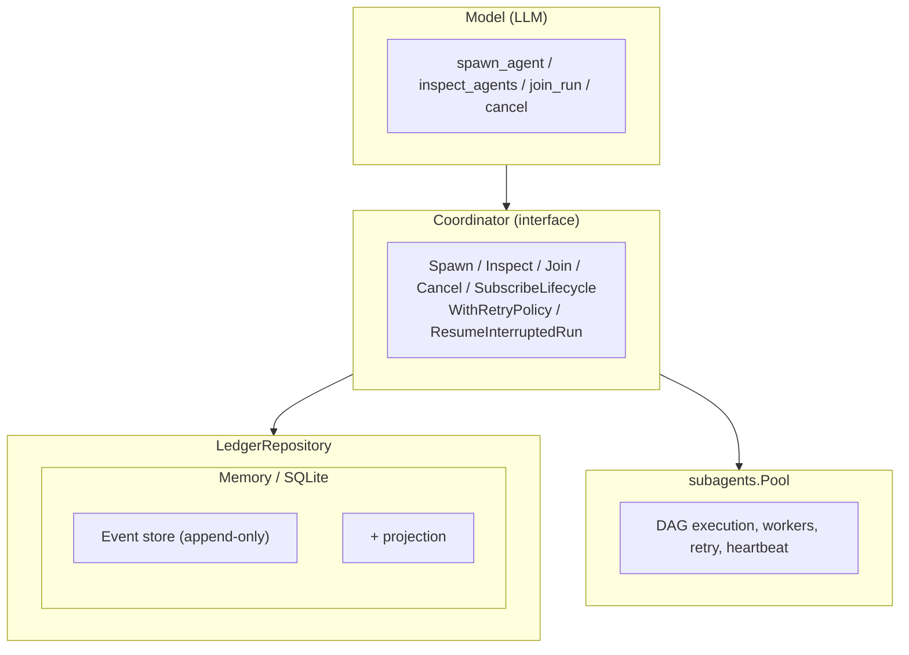

# Architecture Overview

## Host

- Language: Go
- Entrypoint: `cmd/mivia` -> binary `mivia`
- Libraries: `internal/`
- Module: `github.com/MiviaLabs/mivia-agent`

## Layers

1. **CLI** - chat REPL / one-shot; tool event tracing; TUI rendering
2. **Agent loop** - tool_calls until stop (`internal/agent`)
3. **Tool gateway** - read/search/edit/run under workspace policy (`internal/tools`)
4. **Workspace** - path confinement (`internal/workspace`)
5. **Providers** - OpenAI-compatible HTTP + tools (`internal/provider`)

The active provider and model come from the explicit provider-qualified model
catalog in TOML; there is no registry model fallback. The example config uses
`deepseek` with `deepseek-v4-flash` and declares its context capacity.
Config: TOML + env file for secrets. See `docs/product/config.md`.

## Agent definition pipeline

File-backed agent configuration follows a bounded four-stage path:

1. The config layer reads the trusted user `[agents]` controls and parses one
   strict TOML definition per file from `~/.mivia/agents/` and
   `<workspace>/.mivia/agents/`.
2. Discovery attaches user/workspace provenance, gives same-name user files
   precedence, and always discovers workspace agent files. The user gate is
   applied later to workspace prompts and project skill handlers.
3. `internal/agents` validates tool and skill names, resolves same-origin
   inheritance and deltas, and publishes immutable snapshots.
4. The CLI selects a snapshot for the root session or for a required task
   agent, then builds the scoped dispatcher from that snapshot.

The compiled root fallback is private and is used only when no file-backed
`mivia` definition is selected; it is not a selectable agent definition.
Each chat invocation starts a fresh root session. Saved chat state does not
resume a root conversation or restore agent identity; orchestration task
resume is a separate, explicitly confirmed ledger operation.

Runtime lifecycle identity is intentionally narrow: definition name and source,
an opaque instance ID, and the session-local model generation. Paths, digests,
prompts, tool sets, and content stay outside that event identity.

## Subagent Orchestration

Mivia runs sub-agents as **in-process concurrent goroutines**, not as separate OS processes.
The orchestration system provides an async Spawn/Inspect/Join/Cancel lifecycle model
backed by a durable LedgerRepository.

### Key components

| Component | Package | Role |
|-----------|---------|------|
| `Coordinator` interface | `internal/coordinator` | Public API: Spawn/Inspect/Join/Cancel, retry policy, lifecycle subscriptions |
| `RunHandle` | `internal/coordinator` | Opaque handle to an active run; safe for concurrent use |
| `LedgerRepository` interface | `internal/ledger` | Storage boundary: 14 methods for run/task/event CRUD with CAS |
| `MemoryLedgerRepository` | `internal/ledger` | In-memory backend with RWMutex, defensive copies - default for ephemeral sessions |
| `StorageLedgerRepository` | `internal/ledger` | SQLite backend via append-only events + in-memory projection - crash-safe |
| `DisplayNameGenerator` | `internal/ledger` | Unique human-readable agent names (e.g. "agent-7"), collision-safe |
| `MetricsAdapter` | `internal/events` | Per-kind event counts and handler timing |
| `Diagnostics` | `internal/cli` | ListRuns, ActiveHandles, MetricsSnapshot (privacy-safe operator views) |

### Lifecycle

1. **Spawn** - validates the DAG, creates run+tasks in ledger, launches pool execution in background goroutine
2. **Inspect** - returns a defensive-copy snapshot of the run and its tasks from the ledger
3. **Join** - blocks until the run reaches a terminal state (completed/failed/canceled)
4. **Cancel** - two-phase: marks tasks as `cancel_requested`, cancels the pool context, reconciles to `canceled`

### DAG execution

Tasks can declare `depends_on` dependencies. The coordinator's `runDAG` loop:

1. Identifies dependency-ready tasks (all dependencies completed)
2. Marks tasks whose dependencies failed as `blocked`
3. Transitions ready tasks to `running` and submits them as a batch to the pool
4. On result, transitions to `completed`, `failed`, or `timed_out`
5. If retry is configured, failed/timed_out tasks enter `retry_pending` → backoff → `queued` → retry

### Retry

Configured via `WithRetryPolicy(RetryPolicy)`:

| Field | Default | Description |
|-------|---------|-------------|
| `MaxRetries` | 0 (disabled) | Maximum retry attempts per task |
| `BaseBackoff` | 1s | Initial backoff before first retry |
| `MaxBackoff` | 30s | Cap on per-retry delay |
| `BackoffFactor` | 2.0 | Exponential multiplier |
| `JitterFraction` | 0.25 | Randomisation ±12.5% |

### Durable persistence & crash recovery

When `store_backend = "sqlite"` is configured:

1. Every mutation writes an append-only event to SQLite AND updates an in-memory projection
2. On startup, `Recover()` scans the store for runs with non-terminal statuses and marks them as `WasInterrupted`
3. `ResumeInterruptedRun(runID)` transitions running tasks to `failed` with `interrupted_unrecoverable`, then re-runs the DAG (optionally with retry)

### Lifecycle event subscriptions

The Coordinator supports `SubscribeLifecycle(fn)` which returns an `unsubscribe()` function.
Subscribers receive `LifecycleEvent` values synchronously as tasks transition.
Used by future TUI integration and diagnostics.

### Provider/model generations and TUI dialogs

The session owns an immutable provider/model binding generation. A model switch
builds the provider completer, model profile, and generation-owned dispatcher
before publishing them together while idle; in-flight turns retain their
captured generation. Session metadata persists the provider/model pair.

The model picker is a base-plus-modal surface: it renders the explicit catalog,
keeps providers and slash-containing model IDs distinct, and disables rows with
missing credentials without exposing secret or provider payload details.

### TUI base-plus-modal rendering

The chat TUI always renders its base frame first. Help, status, tools, sessions,
and block/fleet detail are modal producers rendered into a bounded, centered
cell rectangle over that base; they do not replace the transcript canvas.
`internal/cli` computes one `dialogLayout` per render, including the exact inner
width and page height, and uses that geometry for wrapping, paging, wheel input,
and resize clamping. The compositor normalizes both canvases to the raw terminal
dimensions and carries ANSI SGR state across panel seams. Modal input owns mouse
and paste messages before transcript hit testing or viewport fallback. Status
and fleet detail are snapshots captured at open; reopening refreshes them.

### See also

- Concurrency model: `docs/architecture/concurrency.md`
- Skill system: `docs/architecture/skills.md`
- Agent tools: `docs/product/agent.md`
- Persistence: `docs/architecture/embedded-persistence.md`
