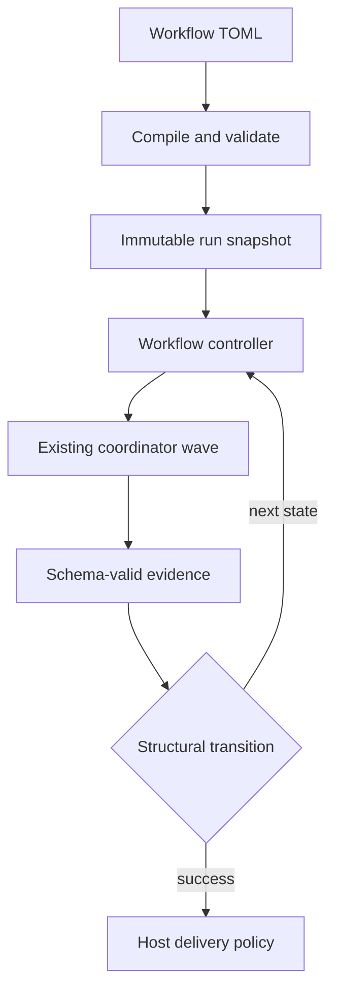

# Workflow Architecture

## Boundary

The workflow controller is a durable sequential state machine above the existing coordinator. The coordinator continues to execute an acyclic task batch; it must not gain cycle support.



A loop is represented as a fresh, numbered workflow step attempt. It is never a coordinator DAG back-edge.

## Contract

Workflow files live under `.mivia/workflows/*.toml`. A v1 definition has:

- a version, canonical name, input contract, limits, and one initial step;
- sequential steps with one of five kinds: `agent`, `agent_gate`, `agent_panel`, `evidence_gate`, or `human_gate`;
- optional per-step `on_failure` target (defaults to `"failure"` when omitted; a non-terminal target is a repair loop bounded per step by `[limits] max_on_failure_reentries`, default 3);
- optional per-step `max_turns` (default `0` = unlimited, range `0-10000`): bounds the agent-loop turns of the step's children — for an `agent_panel` step, every panel member and the synthesis child; for `agent` and `agent_gate` steps, the step's own loop;
- explicit structural transitions to a step or reserved `success` / `failure` terminal;
- optional terminal delivery policy;
- optional `[stacking]` section that opts the workflow into the stacked small-PR engine (see the Stacking section below).

Transitions match only a closed attempt status and declared output-schema scalar or enum fields. Their matcher has no expressions, regexes, maps, arrays, negation, or implicit traversal. A route with zero or multiple matches fails closed.

## Compiler responsibilities

Compilation is side-effect free. It performs safe workflow discovery, strict TOML parsing, name and reference resolution, template/schema loading, semantic graph checks, matching-case overlap checks, bounds checks, stacking config validation, and a stable definition digest.

The compiler rejects unknown fields, non-regular or escaping files, ambiguous routes, unbounded cycles, unreachable states, missing terminal paths, unresolved agents/verifiers/schemas/templates, and evidence bindings that do not reference a proven preceding schema-valid output. It also validates the `[stacking]` section when present: explicit step references must exist, thresholds must be in range, and merge policy must be `approve` or `auto`. When the section is absent, the compiler does not synthesize anything and the digest stays unchanged.

Stack step synthesis (injecting `decompose` and `chunk_plan_validate` steps, reserved inputs, and router transitions) is a post-compile admission step in the controller, not part of compilation. The compiled digest is copied unchanged through synthesis so that an absent `[stacking]` section is digest-neutral.

## Runtime design

Later phases persist an immutable run snapshot and separate projections for runs, numbered step attempts, transition decisions, loop counters, approvals, and deliveries. State mutation uses optimistic version compare-and-set. The controller records a selected transition and its explanation before dispatching the next state.

Agent steps are adapted to one existing coordinator task. The adapter preserves existing agent scope, retries, cancellation, heartbeats, task routing, and recovery. Gates route only on typed evidence.

## Panel review steps

An `agent_panel` step fans a review out to 2-4 independent `[[steps.panel.members]]`, each a
single-task coordinator run with its own agent/provider/model/skill/template/output-schema
binding, then dispatches one synthesis child (the step's own `agent`) over the bounded, strictly-
decoded member reports. `failure_policy = "require_all"` and `require_distinct_bindings = true`
are the only supported values; the compiler rejects anything else. Every member's report and the
synthesizer's output are validated against a strict JSON decoder (unknown fields, duplicate keys,
oversized IDs, and out-of-bound finding counts are all rejected) before the step can settle.

The host, never a model, computes the step's final verdict from the member reports
(`ComputeHostVerdict`): any member reporting `changes_requested` or a nonempty findings list forces
the gate closed, and the synthesizer cannot override it. A downstream transition matches the
step's output on `host_verdict` (`"approved"` / `"changes_requested"`), not `verdict` - `agent_gate`
steps use `verdict`; `agent_panel` steps use `host_verdict`, since the host, not the model, owns
that field.

The feature-delivery workflow's `review_panel` step is the reference adoption: three
`panel-reviewer` members (`correctness`, `security`, `integration`, each on a distinct
provider/model pair) and one `review-synthesizer` synthesis step. See
[Security and privacy](../security/overview.md#panel-review-agent_panel-workflow-steps) for the
panel's data-handling contract.

Panel attempts retry like any other step: a member or synthesis failure settles the
attempt Failed, and the step's declared `on_failure` route decides what runs next. The
feature-delivery workflow names the panel itself, so a failed panel attempt re-runs all
members with a fresh attempt (each retry is a fresh, numbered panel attempt in the
ledger). Re-entries are bounded per step by the workflow's
`[limits] max_on_failure_reentries` (default 3); a spent budget routes to the terminal
`failure` step.

## Delivery design

Delivery lives outside both the workflow TOML and agent tools. A host-owned provider implementation creates a branch in the run worktree, commits, pushes, and creates or finds one GitHub PR using a persisted idempotency key. It receives a runtime publication grant, never an agent instruction.

The PR title and body come from the agent's change-summary output. The change-summary output supplies `pr_title` and `pr_summary`. The host validates them against the optional project policy before any push or PR create. A violation is a repairable `PRMetadataError`. The run routes to the `delivery.on_pr_metadata_failure` step through the existing `wf-delivery` repair mechanism. The repair step receives the failure text as a host-injected `delivery.failure` context binding. The agent never fetches it.

### Delivery repair

Delivery runs after the run reaches its success terminal, outside the step
graph, so a delivery failure has no automatic route back into the graph
unless the workflow declares one.

`delivery.on_failure` names a step to return to. On a failure that a step can
plausibly repair, the run records the failure as an attempt that routes to
that step and returns to `running`. The active step is derived from the last
attempt's route, the same way an in-graph repair loop resumes, so the repair
step sees the failure and can act on it. The run then reaches the success
terminal again and delivery runs again. The cycle is bounded: a cause the
step cannot fix does not repeat forever.

Not every delivery failure repairs. A transport fault - an unreachable
remote, a failed push - is not a condition in the change, so no agent step
can fix it. Such a failure leaves the run at `delivery_pending` instead, and
a later delivery attempt succeeds once the network recovers. See
[`internal/cli/workflow_deliver_repair.go`](../../internal/cli/workflow_deliver_repair.go)
and the `delivery.on_failure` field in the
[workflow user guide](../product/workflows-guide.md#authoring-a-workflow).

## Stacking (small-PR delivery)

Stacking is a generic engine capability that produces small, stacked,
incrementally-merged PRs. Any workflow opts in with a per-workflow
`[stacking]` section. The global default is on; a workflow deliberately
turns it off with `enabled = false`. The engine injects the plan, decompose,
and chunk mechanics — no per-workflow boilerplate.

### Admission-time synthesis and digest stability

Synthesis runs at admission time, not compile time. The controller calls
`SynthesizeStacking` when a stacking-enabled workflow starts a run. It
appends two engine-injected steps (`decompose` and `chunk_plan_validate`)
and the router transitions to the original plan step, then returns a copy
of the compiled workflow with the synthesized graph. The compiled digest
is copied unchanged through synthesis (the `[stacking]` section uses
`omitempty` JSON tags, so an absent section is digest-neutral). This means
the compile-time digest stays stable regardless of whether stacking is
enabled.

### Synthesized graph shape

The synthesis adds two steps and a repair loop to the workflow graph:

1. `decompose` (agent step) — runs the workflow's planning steps, then
   produces a `chunk-plan-v1.json` output carrying `stack_mode` (`single`,
   `multi`, or `no_bug`) and the chunk list.
2. `chunk_plan_validate` (agent_gate step) — deterministically validates
   the decompose output against the stacking rules (see below).
3. Router transitions from the plan step:
   - `succeeded` + `stack_mode=single` → continue inline to `implement_step`
     (today's single-PR path, zero driver involvement).
   - `succeeded` + `stack_mode=no_bug` → `success` (no plan, nothing to stack).
   - `succeeded` + `stack_mode=multi` → `chunk_plan_validate`.
   - `failed` → `failure`.
4. `chunk_plan_validate` → `success` when the plan is valid.
5. `chunk_plan_validate` → `decompose` via the `decompose_repair` loop
   (max 3 iterations) when the plan is invalid. The loop is exhausted when
   the validator rejects the plan three times; the run then fails.

The deterministic validator is host-side. The host never trusts the model's
decompose output. It checks: `stack_mode` enum, chunk count ≤ `max_chunks`,
`est_diff_lines` ≤ `hard_lines`, files per chunk ≤ `max_files`, file sets
disjoint across chunks, every chunk has tests, `depends_on` is a DAG. An
invalid plan routes back to `decompose` through the repair loop; a valid
plan passes through to `success`.

### Reserved inputs and admission rules

The engine reserves five input names for stacking runs. They are never
forwarded to workflow steps:

| Input | Plan mode | Chunk mode |
|-------|-----------|------------|
| `stack_mode` | absent or `"plan"` | `"chunk"` |
| `chunk` | absent | required |
| `pr_base` | absent | required |
| `stack_part` | absent | required |
| `chunk_plan` | forbidden | optional |

Admission validates these rules via `validateStackingReservedInputs`:
- A missing `stack_mode` defaults to `"plan"`.
- `stack_mode=plan` or `stack_mode=single` forbids `chunk_plan`.
- `stack_mode=chunk` requires `chunk`, `pr_base`, and `stack_part`.
- Any other `stack_mode` value is an admission error.

### Chunk-mode start-at-implement and binding resolution

A chunk-mode run starts at `implement_step`, not at the workflow's initial
step. The controller sets the active step to `implement_step` via
`runStartStepID`. Downstream steps receive chunk-scoped context bindings:

- Reserved inputs (`chunk`, `pr_base`, `stack_part`, `chunk_plan`) are
  injected as context inputs on every post-implement step.
- Bindings to pre-implement steps (all declared steps except
  `implement_step`) must be `optional` or `envelope_only`. A mandatory
  binding to a pre-implement step is rejected at admission — the host
  never silently drops it.
- Envelope-only bindings resolve to a ledger-reference envelope (artifact
  pointer + short note); the step reads the full artifact on demand via
  `workflow_inspect`.

### Deterministic host-side chunk-plan validator

The validator (`ValidateChunkPlan`) runs entirely on the host. It parses
the decompose step's JSON output and applies the stacking rules
deterministically. It never calls an agent or a model. The validator is
wired into the controller's route decision: when a succeeded decompose
step routes toward `chunk_plan_validate`, the controller validates first.
An invalid plan is routed back to decompose through the repair loop; a
valid plan passes through. The route decision uses the synthesized graph's
edges (`chunkPlanRepairRoute` / `settleSucceededRoute`).

### Generic task ledger (D8) as durable stack state

Plans and task statuses are engine-ledger artifacts with scope bindings,
not stacking-specific state. The generic task ledger (`internal/workflows/tasks`)
provides one mechanism for many scopes: `session:<id>`, `step:<run>:<step>`,
`agent:<name>`, `workflow:<name>`, `run:<id>`. Stacking binds chunk tasks
to `run:<plan-run-id>`.

The ledger is event-sourced over the shared storage store. Every mutation
appends one durable event; the in-memory projection rebuilds from the event
log on catch-up. Status transitions are atomic and journaled in call order.
Statuses are opaque strings: the engine validates non-empty and journals
transitions, but never interprets the vocabulary. Stacking defines its own
vocabulary (`planned`, `queued`, `running`, `implemented`, `reviewed`,
`published`, `merged`, `reopened`, `failed`, `skipped`); the engine only
makes transitions durable and atomic.

### Delivery integration

Delivery honors the reserved stacking inputs when present:

- `pr_base` overrides the workflow's default PR base branch. The host
  validates the branch name (allowed characters, length ≤ 100, no `..` or
  leading `-`). Invalid values are repairable `PRMetadataError`s.
- `stack_part` (canonical `k/N` form) is validated for shape. The host
  appends a `Stack-Part: k/N` trailer to the PR title after sanitization
  and policy validation. The agent-controlled title stays intact; the host
  adds the marker. An invalid `stack_part` or an over-limit result is a
  repairable `PRMetadataError`.
- The actual diff size is checked against `hard_lines` after staging. The
  measurement is the added+deleted line count of `git diff --cached`
  (`--find-renames`, `--ignore-all-space`). A diff exceeding the hard limit
  is a repairable `PRMetadataError`; the repair loop shrinks the chunk and
  delivers again. Without a stacking configuration the gate is off and
  single-PR delivery is unchanged.

### Driver CLI and recovery model

The driver is a generic Go CLI (`mivia stack`) with three subcommands:

```bash
mivia stack plan <workflow> [--workspace dir] [--config path]
mivia stack drive <workflow> [--stack <plan-run-id>] [--workspace dir] [--config path]
mivia stack status <workflow> [--stack <plan-run-id>] [--workspace dir] [--config path]
```

`stack plan` starts a plan-mode run (no `stack_mode` input). The plan run
id becomes the stack id. `stack drive` reconciles the stack, admits chunk
runs in topological order, applies the merge policy, and finishes with a
full-suite integration run. `stack status` prints per-chunk status from the
task ledger.

**Merge policies:**
- `approve` (default, policy A): each PR stays at `delivery_pending` until a
  human grants publish (`mivia workflow deliver <run-id> --allow-publish`).
  The driver halts at the publish grant and waits.
- `auto` (policy B): the driver auto-delivers green PRs and continues.
  The publish grant remains the single human checkpoint.

**Halt-on-failure:** any chunk that fails terminally (exhausted retry budget)
halts the stack. The driver returns an error naming the chunk and the cause.

**Recovery on restart:** every driver start runs idempotent reconciliation
(§5a). The driver loads tasks by scope, reconciles each non-terminal task
against its run and git merge state, and schedules the next admission wave.
Stable admission keys (`<stack-id>:<chunk-id>`) ensure that re-admission
after a restart returns the same run — no duplicate runs, no lost tasks.
The reconciliation is derived from durable state only (task ledger, run
ledger, git merge state).

## See also

- [Workflow user guide](../product/workflows-guide.md)
- [Workflow product overview](../product/workflows.md)
- [Security and privacy](../security/overview.md)

## Phase ordering

1. Contract, docs, schemas, and fixtures.
2. Strict discovery, parser, compiler, and read-only CLI.
3. Durable ledger and isolated worktree lifecycle.
4. Coordinator adapter and agent steps.
5. Typed transitions, bounded loops, and gates.
6. GitHub delivery.
7. Failure injection, race/fuzz coverage, and operator documentation.
