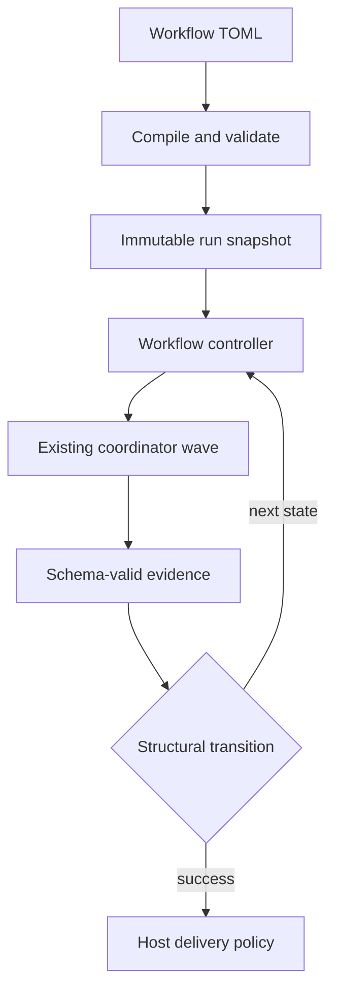

# Workflow Architecture

## Boundary

The workflow controller is a durable sequential state machine above the existing coordinator. The coordinator continues to execute an acyclic task batch; it must not gain cycle support.

A loop is represented as a fresh, numbered workflow step attempt. It is never a coordinator DAG back-edge.

## Contract

Workflow files live under `.mivia/workflows/*.toml`. A v1 definition has:

- a version, canonical name, input contract, limits, and one initial step;
- sequential steps with one of five kinds: `agent`, `agent_gate`, `agent_panel`, `evidence_gate`, or `human_gate`;
- optional per-step `on_failure` target (defaults to `"failure"` when omitted; a non-terminal target is a repair loop bounded per step by `[limits] max_on_failure_reentries`, default 3);
- explicit structural transitions to a step or reserved `success` / `failure` terminal;
- optional terminal delivery policy.

Transitions match only a closed attempt status and declared output-schema scalar or enum fields. Their matcher has no expressions, regexes, maps, arrays, negation, or implicit traversal. A route with zero or multiple matches fails closed.

## Compiler responsibilities

Compilation is side-effect free. It performs safe workflow discovery, strict TOML parsing, name and reference resolution, template/schema loading, semantic graph checks, matching-case overlap checks, bounds checks, and a stable definition digest.

The compiler rejects unknown fields, non-regular or escaping files, ambiguous routes, unbounded cycles, unreachable states, missing terminal paths, unresolved agents/verifiers/schemas/templates, and evidence bindings that do not reference a proven preceding schema-valid output.

## Runtime design

Later phases persist an immutable run snapshot and separate projections for runs, numbered step attempts, transition decisions, loop counters, approvals, and deliveries. State mutation uses optimistic version compare-and-set. The controller records a selected transition and its explanation before dispatching the next state.

Agent steps are adapted to one existing coordinator task. The adapter preserves existing agent scope, retries, cancellation, heartbeats, task routing, and recovery. Gates route only on typed evidence.

## Panel review steps

An `agent_panel` step fans a review out to 2-4 independent `[[steps.panel.members]]`, each a
single-task coordinator run with its own agent/provider/model/skill/template/output-schema
binding, then dispatches one synthesis child (the step's own `agent`) over the bounded, strictly-
decoded member reports. `failure_policy = "require_all"` and `require_distinct_bindings = true`
are the only supported values; the compiler rejects anything else. Every member's report and the
synthesizer's output are validated against a strict JSON decoder (unknown fields, duplicate keys,
oversized IDs, and out-of-bound finding counts are all rejected) before the step can settle.

The host, never a model, computes the step's final verdict from the member reports
(`ComputeHostVerdict`): any member reporting `changes_requested` or a nonempty findings list forces
the gate closed, and the synthesizer cannot override it. A downstream transition matches the
step's output on `host_verdict` (`"approved"` / `"changes_requested"`), not `verdict` - `agent_gate`
steps use `verdict`; `agent_panel` steps use `host_verdict`, since the host, not the model, owns
that field.

The feature-delivery workflow's `review_panel` step is the reference adoption: three
`panel-reviewer` members (`correctness`, `security`, `integration`, each on a distinct
provider/model pair) and one `review-synthesizer` synthesis step. See
[Security and privacy](../security/overview.md#panel-review-agent_panel-workflow-steps) for the
panel's data-handling contract.

Panel attempts retry like any other step: a member or synthesis failure settles the
attempt Failed, and the step's declared `on_failure` route decides what runs next. The
feature-delivery workflow names the panel itself, so a failed panel attempt re-runs all
members with a fresh attempt (each retry is a fresh, numbered panel attempt in the
ledger). Re-entries are bounded per step by the workflow's
`[limits] max_on_failure_reentries` (default 3); a spent budget routes to the terminal
`failure` step.

## Delivery design

Delivery lives outside both the workflow TOML and agent tools. A host-owned provider implementation creates a branch in the run worktree, commits, pushes, and creates or finds one GitHub PR using a persisted idempotency key. It receives a runtime publication grant, never an agent instruction.

The PR title and body come from the agent's change-summary output. The change-summary output supplies `pr_title` and `pr_summary`. The host validates them against the optional project policy before any push or PR create. A violation is a repairable `PRMetadataError`. The run routes to the `delivery.on_pr_metadata_failure` step through the existing `wf-delivery` repair mechanism. The repair step receives the failure text as a host-injected `delivery.failure` context binding. The agent never fetches it.

### Delivery repair

Delivery runs after the run reaches its success terminal, outside the step
graph, so a delivery failure has no automatic route back into the graph
unless the workflow declares one.

`delivery.on_failure` names a step to return to. On a failure that a step can
plausibly repair, the run records the failure as an attempt that routes to
that step and returns to `running`. The active step is derived from the last
attempt's route, the same way an in-graph repair loop resumes, so the repair
step sees the failure and can act on it. The run then reaches the success
terminal again and delivery runs again. The cycle is bounded: a cause the
step cannot fix does not repeat forever.

Not every delivery failure repairs. A transport fault - an unreachable
remote, a failed push - is not a condition in the change, so no agent step
can fix it. Such a failure leaves the run at `delivery_pending` instead, and
a later delivery attempt succeeds once the network recovers. See
[`internal/cli/workflow_deliver_repair.go`](../../internal/cli/workflow_deliver_repair.go)
and the `delivery.on_failure` field in the
[workflow user guide](../product/workflows-guide.md#authoring-a-workflow).

## See also

- [Workflow user guide](../product/workflows-guide.md)
- [Workflow product overview](../product/workflows.md)
- [Security and privacy](../security/overview.md)

## Phase ordering

1. Contract, docs, schemas, and fixtures.
2. Strict discovery, parser, compiler, and read-only CLI.
3. Durable ledger and isolated worktree lifecycle.
4. Coordinator adapter and agent steps.
5. Typed transitions, bounded loops, and gates.
6. GitHub delivery.
7. Failure injection, race/fuzz coverage, and operator documentation.
