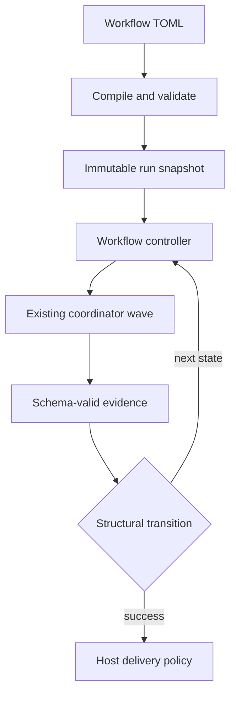

# Workflow Architecture

## Boundary

The workflow controller is a durable sequential state machine above the existing coordinator. The coordinator continues to execute an acyclic task batch; it must not gain cycle support.

A loop is represented as a fresh, numbered workflow step attempt. It is never a coordinator DAG back-edge.

## Contract

Workflow files live under `.mivia/workflows/*.toml`. A v1 definition has:

- a version, canonical name, input contract, limits, and one initial step;
- sequential steps with one of four kinds: `agent`, `agent_gate`, `evidence_gate`, or `human_gate`;
- optional per-step `on_failure` target (defaults to `"failure"` when omitted);
- explicit structural transitions to a step or reserved `success` / `failure` terminal;
- optional terminal delivery policy.

Transitions match only a closed attempt status and declared output-schema scalar or enum fields. Their matcher has no expressions, regexes, maps, arrays, negation, or implicit traversal. A route with zero or multiple matches fails closed.

## Compiler responsibilities

Compilation is side-effect free. It performs safe workflow discovery, strict TOML parsing, name and reference resolution, template/schema loading, semantic graph checks, matching-case overlap checks, bounds checks, and a stable definition digest.

The compiler rejects unknown fields, non-regular or escaping files, ambiguous routes, unbounded cycles, unreachable states, missing terminal paths, unresolved agents/verifiers/schemas/templates, and evidence bindings that do not reference a proven preceding schema-valid output.

## Runtime design

Later phases persist an immutable run snapshot and separate projections for runs, numbered step attempts, transition decisions, loop counters, approvals, and deliveries. State mutation uses optimistic version compare-and-set. The controller records a selected transition and its explanation before dispatching the next state.

Agent steps are adapted to one existing coordinator task. The adapter preserves existing agent scope, retries, cancellation, heartbeats, task routing, and recovery. Gates route only on typed evidence.

## Delivery design

Delivery lives outside both the workflow TOML and agent tools. A host-owned provider implementation creates a branch in the run worktree, commits, pushes, and creates or finds one GitHub PR using a persisted idempotency key. It receives a runtime publication grant, never an agent instruction.

## Phase ordering

1. Contract, docs, schemas, and fixtures.
2. Strict discovery, parser, compiler, and read-only CLI.
3. Durable ledger and isolated worktree lifecycle.
4. Coordinator adapter and agent steps.
5. Typed transitions, bounded loops, and gates.
6. GitHub delivery.
7. Failure injection, race/fuzz coverage, and operator documentation.
