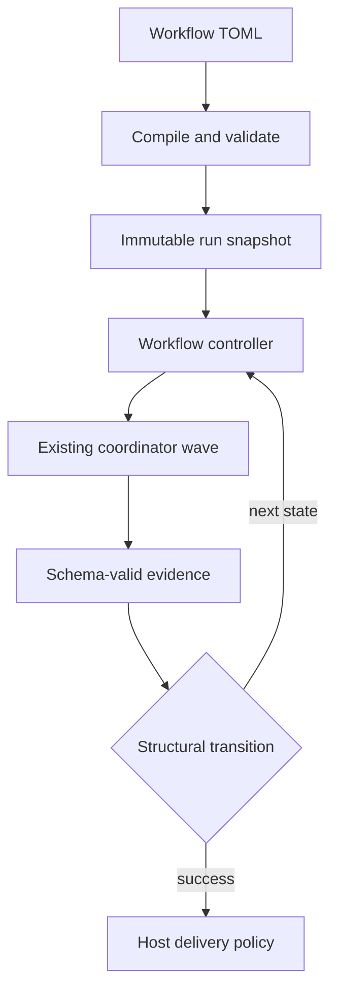

# Workflow Architecture

## Boundary

The workflow controller is a durable sequential state machine above the existing coordinator. The coordinator continues to execute an acyclic task batch; it must not gain cycle support.



A loop is represented as a fresh, numbered workflow step attempt. It is never a coordinator DAG back-edge.

## Contract

Workflow files live under `.mivia/workflows/*.toml`. A v1 definition has:

- a version, canonical name, input contract, limits, and one initial step;
- sequential steps with one of five kinds: `agent`, `agent_gate`, `agent_panel`, `evidence_gate`, or `human_gate`;
- optional per-step `on_failure` target (defaults to `"failure"` when omitted; a non-terminal target is a repair loop bounded per step by `[limits] max_on_failure_reentries`, default 3);
- optional per-step `max_turns` (default `0` = unlimited, range `0-10000`): bounds the agent-loop turns of the step's children — for an `agent_panel` step, every panel member and the synthesis child; for `agent` and `agent_gate` steps, the step's own loop;
- explicit structural transitions to a step or reserved `success` / `failure` terminal;
- optional terminal delivery policy;
- optional `[stacking]` section that opts the workflow into the stacked small-PR engine (see the Stacking section below).

Transitions match only a closed attempt status and declared output-schema scalar or enum fields. Their matcher has no expressions, regexes, maps, arrays, negation, or implicit traversal. A route with zero or multiple matches fails closed.

## Compiler responsibilities

Compilation is side-effect free. It performs safe workflow discovery, strict TOML parsing, name and reference resolution, template/schema loading, semantic graph checks, matching-case overlap checks, bounds checks, stacking config validation, and a stable definition digest.

The compiler rejects unknown fields, non-regular or escaping files, ambiguous routes, unbounded cycles, unreachable states, missing terminal paths, unresolved agents/verifiers/schemas/templates, and evidence bindings that do not reference a proven preceding schema-valid output. It also validates the `[stacking]` section when present: explicit step references must exist, thresholds must be in range, and merge policy must be `approve` or `auto`. When the section is absent, the compiler does not synthesize anything and the digest stays unchanged.

Stack step synthesis (injecting `decompose` and `chunk_plan_validate` steps, reserved inputs, and router transitions) is a post-compile admission step in the controller, not part of compilation. The compiled digest is copied unchanged through synthesis so that an absent `[stacking]` section is digest-neutral.

## Runtime design

Later phases persist an immutable run snapshot and separate projections for runs, numbered step attempts, transition decisions, loop counters, approvals, and deliveries. State mutation uses optimistic version compare-and-set. The controller records a selected transition and its explanation before dispatching the next state.

Agent steps are adapted to one existing coordinator task. The adapter preserves existing agent scope, retries, cancellation, heartbeats, task routing, and recovery. Gates route only on typed evidence.

## Panel review steps

An `agent_panel` step fans a review out to 2-4 independent `[[steps.panel.members]]`, each a
single-task coordinator run with its own agent/provider/model/skill/template/output-schema
binding, then dispatches one synthesis child (the step's own `agent`) over the bounded, strictly-
decoded member reports. `failure_policy = "require_all"` and `require_distinct_bindings = true`
are the only supported values; the compiler rejects anything else. Every member's report and the
synthesizer's output are validated against a JSON decoder that rejects duplicate keys, oversized
IDs, and out-of-bound finding counts before the step can settle; unrecognized fields are skipped
rather than rejected, so a member report with extra fields does not fail the step on that basis
alone.

Before any member call, the host reserves the synthesis envelope's full byte
budget (`BuildSynthesisEnvelope`) — metadata plus the bounded report
size — so a provider call is never made against a budget that could still
grow underneath it.

The host, never a model, computes the step's final verdict from the member reports
(`ComputeHostVerdict`): any member reporting `changes_requested` or a nonempty findings list forces
the gate closed, and the synthesizer cannot override it. A downstream transition matches the
step's output on `host_verdict` (`"approved"` / `"changes_requested"`), not `verdict` - `agent_gate`
steps use `verdict`; `agent_panel` steps use `host_verdict`, since the host, not the model, owns
that field.

The feature-delivery workflow's `review_panel` step is the reference adoption: three
`panel-reviewer` members (`correctness`, `security`, `integration`, each on a distinct
provider/model pair) and one `review-synthesizer` synthesis step. See
[Security and privacy](../security/overview.md#panel-review-agent_panel-workflow-steps) for the
panel's data-handling contract.

Panel attempts retry like any other step: a member or synthesis failure settles the
attempt Failed, and the step's declared `on_failure` route decides what runs next. The
feature-delivery workflow names the panel itself, so a failed panel attempt re-runs all
members with a fresh attempt (each retry is a fresh, numbered panel attempt in the
ledger). Re-entries are bounded per step by the workflow's
`[limits] max_on_failure_reentries` (default 3); a spent budget routes to the terminal
`failure` step.

Each panel member runs under its own principal (`PanelChildPrincipal`), derived
fresh per member rather than inherited from the host caller. A panel child
cannot act with the host's authority; its tool scope is bounded by its own
declared agent/skill binding, the same as any other single-task coordinator
run.

Panel dispatch races the same concurrent-admission surface as any coordinator
fan-out: `cancelOrTombstone` and `EnsureTerminalSingleTaskRun` resolve the case
where a panel member's task is cancelled or tombstoned while another dispatch
is admitting it, so a panel attempt settles exactly once even when admission
and cancellation land close together.

## Delivery design

Delivery lives outside both the workflow TOML and agent tools. A host-owned provider implementation creates a branch in the run worktree, commits, pushes, and creates or finds one GitHub PR using a persisted idempotency key. It receives a runtime publication grant, never an agent instruction.

The PR title and body come from the agent's change-summary output. The change-summary output supplies `pr_title` and `pr_summary`. The host validates them against the optional project policy before any push or PR create. A violation is a repairable `PRMetadataError`. The run routes to the `delivery.on_pr_metadata_failure` step through the existing `wf-delivery` repair mechanism. The repair step receives the failure text as a host-injected `delivery.failure` context binding. The agent never fetches it.

### Delivery repair

Delivery runs after the run reaches its success terminal, outside the step
graph, so a delivery failure has no automatic route back into the graph
unless the workflow declares one.

`delivery.on_failure` names a step to return to. On a failure that a step can
plausibly repair, the run records the failure as an attempt that routes to
that step and returns to `running`. The active step is derived from the last
attempt's route, the same way an in-graph repair loop resumes, so the repair
step sees the failure and can act on it. The run then reaches the success
terminal again and delivery runs again. The cycle is bounded: a cause the
step cannot fix does not repeat forever.

Not every delivery failure repairs. A transport fault - an unreachable
remote, a failed push - is not a condition in the change, so no agent step
can fix it. Such a failure leaves the run at `delivery_pending` instead, and
a later delivery attempt succeeds once the network recovers. See the
`delivery.on_failure` field in the
[workflow user guide](../product/workflows-guide.md#authoring-a-workflow).

## Stacking (small-PR delivery)

Stacking is a generic engine capability that produces small, stacked,
incrementally-merged PRs. A workflow opts in with a per-workflow
`[stacking]` section that names `plan_step` and `implement_step`; without
the section the workflow runs single-PR. A declared section is enabled
unless it sets `enabled = false`. The engine injects the plan, decompose,
and chunk mechanics — no per-workflow boilerplate.

### Admission-time synthesis and digest stability

Synthesis runs at admission time, not compile time. The controller calls
`SynthesizeStacking` when a stacking-enabled workflow starts a run. It
appends two engine-injected steps (`decompose` and `chunk_plan_validate`)
and the router transitions to the original plan step, then returns a copy
of the compiled workflow with the synthesized graph. The compiled digest
is copied unchanged through synthesis (the `[stacking]` section uses
`omitempty` JSON tags, so an absent section is digest-neutral). This means
the compile-time digest stays stable regardless of whether stacking is
enabled.

### Synthesized graph shape

The synthesis adds two steps and a repair loop to the workflow graph:

1. `decompose` (agent step) — runs the workflow's planning steps, then
   produces a `chunk-plan-v1.json` output carrying `stack_mode` (`single`,
   `multi`, or `no_bug`) and the chunk list.
2. `chunk_plan_validate` (agent_gate step) — deterministically validates
   the decompose output against the stacking rules (see below).
3. Router transitions from the plan step:
   - `succeeded` + `stack_mode=single` → continue inline to `implement_step`
     (today's single-PR path, zero driver involvement).
   - `succeeded` + `stack_mode=no_bug` → `success` (no plan, nothing to stack).
   - `succeeded` + `stack_mode=multi` → `chunk_plan_validate`.
   - `failed` → `failure`.
4. `chunk_plan_validate` → `success` when the plan is valid.
5. `chunk_plan_validate` → `decompose` via the `decompose_repair` loop
   (max 3 iterations) when the plan is invalid. The loop is exhausted when
   the validator rejects the plan three times; the run then fails.

The deterministic validator is host-side. The host never trusts the model's
decompose output. It checks: `stack_mode` enum, chunk count ≤ `max_chunks`,
`est_diff_lines` ≤ `hard_lines`, files per chunk ≤ `max_files`, file sets
disjoint across chunks, every chunk has tests, `depends_on` is a DAG. An
invalid plan routes back to `decompose` through the repair loop; a valid
plan passes through to `success`.

### Reserved inputs and admission rules

The engine reserves five input names for stacking runs. They are never
forwarded to workflow steps:

| Input | Plan mode | Chunk mode |
|-------|-----------|------------|
| `stack_mode` | absent or `"plan"` | `"chunk"` |
| `chunk` | absent | required |
| `pr_base` | absent | required |
| `stack_part` | absent | required |
| `chunk_plan` | forbidden | optional |

Admission validates these rules via `validateStackingReservedInputs`:
- A missing `stack_mode` defaults to `"plan"`.
- `stack_mode=plan` or `stack_mode=single` forbids `chunk_plan`.
- `stack_mode=chunk` requires `chunk`, `pr_base`, and `stack_part`.
- Any other `stack_mode` value is an admission error.

### Chunk-mode start-at-implement and binding resolution

A chunk-mode run starts at `implement_step`, not at the workflow's initial
step. The controller sets the active step to `implement_step` via
`runStartStepID`. Downstream steps receive chunk-scoped context bindings:

- Reserved inputs (`chunk`, `pr_base`, `stack_part`, `chunk_plan`) are
  injected as context inputs on every post-implement step.
- Bindings to pre-implement steps (all declared steps except
  `implement_step`) must be `optional` or `envelope_only`. A mandatory
  binding to a pre-implement step is rejected at admission — the host
  never silently drops it.
- Envelope-only bindings resolve to a ledger-reference envelope (artifact
  pointer + short note); the step reads the full artifact on demand via
  `workflow_inspect`.

### Deterministic host-side chunk-plan validator

The validator (`ValidateChunkPlan`) runs entirely on the host. It parses
the decompose step's JSON output and applies the stacking rules
deterministically. It never calls an agent or a model. The validator is
wired into the controller's route decision: when a succeeded decompose
step routes toward `chunk_plan_validate`, the controller validates first.
An invalid plan is routed back to decompose through the repair loop; a
valid plan passes through. The route decision uses the synthesized graph's
edges (`chunkPlanRepairRoute` / `settleSucceededRoute`).

### Generic task ledger (D8) as durable stack state

Plans and task statuses are engine-ledger artifacts with scope bindings,
not stacking-specific state. The generic task ledger (`internal/workflows/tasks`)
provides one mechanism for many scopes: `session:<id>`, `step:<run>:<step>`,
`agent:<name>`, `workflow:<name>`, `run:<id>`. Stacking binds chunk tasks
to `run:<plan-run-id>`.

The ledger is event-sourced over the shared storage store. Every mutation
appends one durable event; the in-memory projection rebuilds from the event
log on catch-up. Status transitions are atomic and journaled in call order.
Statuses are opaque strings: the engine validates non-empty and journals
transitions, but never interprets the vocabulary. Stacking defines its own
vocabulary (`planned`, `queued`, `running`, `implemented`, `reviewed`,
`published`, `merged`, `reopened`, `failed`, `skipped`); the engine only
makes transitions durable and atomic.

### Delivery integration

Delivery honors the reserved stacking inputs when present:

- `pr_base` overrides the workflow's default PR base branch. The host
  validates the branch name (allowed characters, length ≤ 100, no `..` or
  leading `-`). Invalid values are repairable `PRMetadataError`s.
- `stack_part` (canonical `k/N` form) is validated for shape. The host
  appends a single-line `[stack k/N]` tag to the PR title after
  sanitization and policy validation — the same bracket-affix convention
  a deferred/split follow-up PR's title uses, since both are the same
  "this PR's base is another PR's branch" relationship. The
  agent-controlled title stays intact as the leading words; the host adds
  the tag. An invalid `stack_part` shape is a repairable `PRMetadataError`.
  A tagged title over GitHub's 256-character ceiling is silently
  truncated, never a repairable error — the overflow is caused by the
  host's own tag, not anything the agent did wrong, and the agent's title
  already passed its own length check alone before the tag existed. The
  tag is a pull-request-only affix: the delivery commit's subject is the
  agent's own untagged title, so the workspace commit-message policy's
  `maxSubjectLength` and the repo's commit-msg hook measure the title the
  agent authored — the tag never consumes that budget.
- The actual diff size is checked against `hard_lines` after staging. The
  measurement is the added+deleted line count of `git diff --cached`
  (`--find-renames`, `--ignore-all-space`). A diff exceeding the hard limit
  is a repairable `DiffSizeError`: the run returns to the diff-size repair
  step (`on_diff_size_failure`, falling back to `on_failure`), the agent
  shrinks or splits the chunk in the worktree so the delivered diff fits,
  and delivery runs again. The cycle is bounded by `max_repairs`; only an
  exhausted repair cycle settles the run terminal (`delivery_failed`).
  Without a stacking configuration the gate is off and single-PR delivery
  is unchanged.
- With `[stacking] split_deferred = true`, an over-limit diff is first
  offered to a host-computed automatic split: the host measures the actual
  per-file diff size (`git diff --cached --numstat`, largest files first)
  and defers files to a follow-up PR until the kept diff fits, writing the
  decision into the reserved `deferred_files` input that
  `freshDeliveryCommitSplit` then executes. The split is refused - a plain
  `DiffSizeError` - when it would separate a file from its same-directory
  test companion (`*_test`, `*.test`, `*_spec`, `*.spec`, `test_*`,
  `Test*`): a delivered commit that ships code without its tests (or tests
  without their code) can fail the repository's own pre-push hook for
  reasons the evidence gates never saw. The same guard rejects a repair
  agent's own `deferred_files` declaration before any commit, so a file and
  its tests always ship in the same commit (both delivered or both
  deferred).
- When a pre-push hook rejects the delivered commit, the recorded failure
  is led by a delivery-commit inventory: the delivered-commit files
  (`base..HEAD`), the deferred files, and the worktree changes the
  delivered commit does not carry. The hint states that the hook verified
  the DELIVERED COMMIT tree, not the worktree, so a repair agent can tell
  "the hook rejected the code" from "the hook tested a stale or partial
  tree" instead of reverting production code to satisfy the delivered
  commit's stale test expectations.
- `on_diff_size_failure` names the step that repairs an over-limit diff,
  exactly like `on_failure` names the generic repair step; an empty value
  falls back to `on_failure`, so existing stacking workflows keep their
  declared repair step. The engine additionally runs a post-implement
  diff-size gate right after the implement step when the run's git context
  is pinned (fresh starts and resumes both wire it): an over-limit worktree
  diff reroutes the succeeded implement step to the SAME repair step, so
  the chunk is broken down BEFORE the panel and preflight pipeline run on
  it, instead of after a full pipeline pass and a delivery rejection. A
  diff that slips past the early gate is still caught at delivery and
  routed to the repair step there. The run is never failed for size alone:
  the repair step (an agent step) always gets the chance to shrink or split
  the change.
- `deliver_plan_run` (default `false`) controls whether a stacking plan
  run's own diff is published. The plan run is the stack root, not the
  deliverable: after its chunk stack drives to completion the plan run
  settles `succeeded` and nothing is published for it unless the workflow
  opts in with `delivery.deliver_plan_run = true`. The plan and its
  artifacts stay recorded in the ledger either way.

### Driver CLI and recovery model

The driver is a generic Go CLI (`mivia stack`) with three subcommands:

```bash
mivia stack plan <workflow> [--workspace dir] [--config path]
mivia stack drive <workflow> [--stack <plan-run-id>] [--workspace dir] [--config path]
mivia stack status <workflow> [--stack <plan-run-id>] [--workspace dir] [--config path]
```

`stack plan` starts a plan-mode run (no `stack_mode` input). The plan run
id becomes the stack id. `stack drive` reconciles the stack, admits the
next ready wave of chunk runs, applies the merge policy, and finishes with
a full-suite integration run. `stack status` prints per-chunk status from
the task ledger.

**Wave admission and concurrency:** each drive pass computes the next
admission wave — every chunk whose dependencies (`depends_on`) have all
merged, in topological order. Chunks within one wave are independent by
construction (a chunk only enters a wave once every chunk it depends on has
already merged), so the driver admits and drives the whole wave
concurrently, bounded by `stacking.max_concurrent_chunks` (default 4). Each
chunk already runs in its own isolated worktree, so concurrent execution
needs no extra isolation. A per-chunk atomic claim guarantees exactly one
admission per chunk even when multiple chunks are dispatched at once, so
re-running `stack drive` after a restart or a partial failure never
double-admits a chunk that is already in flight. The claim is an optimistic
compare-and-swap on the chunk task's status in the generic task ledger
(§ [Generic task ledger (D8) as durable stack state](#generic-task-ledger-d8-as-durable-stack-state)
below): admission reads the current status, then CASes it to `queued` only if
it still matches what was read; a losing CAS means another admission already
claimed the chunk, so the loser simply skips it instead of retrying the
compare-and-swap.

**Merging stays serialized.** Only chunk *execution* (the agent's work in
each chunk's worktree) runs concurrently; merges are still applied one PR
at a time, in dependency order, by the merge-policy pass described below.
Multiple chunks can reach `delivery_pending` or get published in the same
drive pass, but they still merge one at a time.

**Incremental decompose.** `decompose`'s output may declare `has_more: true`
plus `remaining_scope` when a change needs more chunks than one call plans
(bounded by `max_wave_chunks`). Once every currently-known chunk has merged,
if the latest wave declared `has_more`, the driver admits a new run that
starts directly at the `decompose` step (`stack_mode = "decompose_continue"`,
via the same reserved-input/start-step mechanism `stack_mode = "chunk"`
already uses for chunk runs), seeded with `remaining_scope` in place of the
plan step's output, and folds the resulting chunks into the same stack
(same task-ledger scope, same stable invocation-key resumability as chunk
runs). This repeats until a wave declares no more scope, `max_total_chunks`
is reached (a refused admission with a clear error, never a silent
truncation), or a wave fails. A crash-and-resume `stack drive` reconstructs
the full cross-wave chunk list from the run ledger before driving, so a
wave admitted by a prior process is never lost.

**Merge policies:**
- `approve` (default, policy A): each PR stays at `delivery_pending` until a
  human grants publish (`mivia workflow deliver <run-id> --allow-publish`).
  The driver halts at the publish grant and waits.
- `auto` (policy B): the driver auto-delivers green PRs and continues.
  The publish grant remains the single human checkpoint.

**Halt-on-failure:** any chunk that fails terminally (exhausted retry budget)
halts the stack. The driver returns an error naming the chunk and the cause.

**Recovery on restart:** every driver start runs idempotent reconciliation
(§5a). The driver loads tasks by scope, reconciles each non-terminal task
against its run and git merge state, and schedules the next admission wave.
Stable admission keys (`<stack-id>:<chunk-id>`) ensure that re-admission
after a restart returns the same run — no duplicate runs, no lost tasks.
The reconciliation is derived from durable state only (task ledger, run
ledger, git merge state).

**Drive-before-delivery settle.** `internal/workflows/localengine/engine_stack_settle.go`
gates delivery on a completed drive: `waitForIntegrationSettle` and
`settlePlanRun` do not mark a plan run deliverable until
`stackDriveCompleted` is true, so the integration run always settles before
the plan run does. This ordering holds for both the API-admitted path and
the CLI `stack drive` path.

This settle logic is not fully autonomous yet. Merging a stack's chunk PRs
out of band, with no live `stack drive` or `workflow deliver` process
watching, does not settle the plan run — nothing polls for that merge.
See [Workflow stack settle: known gaps](workflow-stack-settle.md) for the
specific gaps and their evidence.

## See also

- [Workflow user guide](../product/workflows-guide.md)
- [Workflow product overview](../product/workflows.md)
- [Security and privacy](../security/overview.md)
