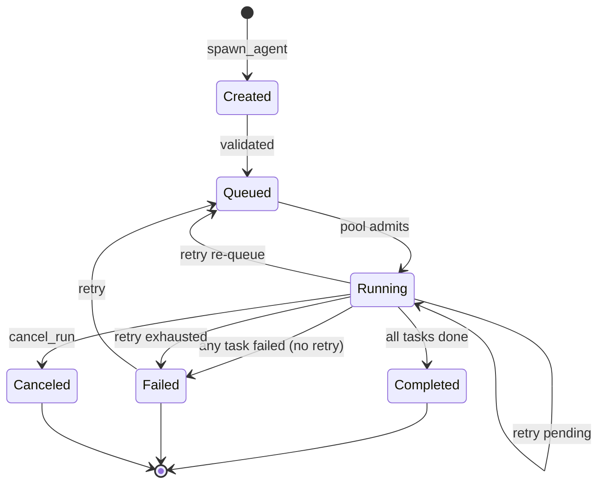

# Coding Agent Mode

`mivia chat` runs as a **coding agent** by default: the model can call tools to read, search, edit, and run allowlisted commands in a workspace.

## Enable / disable

```bash
mivia chat                    # tools on
mivia chat --no-tools         # pure LLM chat
mivia chat -p "fix the test" # one-shot agent task
mivia chat --workspace /path/to/repo
```

## Filesystem tools

| Tool | Purpose |
|------|---------|
| `read_file` | Read a file with optional offset/limit |
| `list_dir` | List a directory |
| `grep` | Search file contents by regex |
| `glob` | Find paths by pattern |
| `write_file` | Create or overwrite a file |
| `search_replace` | Replace exact text in a file |
| `run_command` | Last-resort allowlisted argv (no shell); multi-ecosystem binaries |

Tool names, descriptions, and schemas are **project- and language-generic**. mivia is a host coding agent for any workspace.

## Orchestration tools

Mivia supports an async subagent orchestration model — the model can spawn multiple sub-agents
that run concurrently as DAGs, inspect their progress, block on results, or cancel them.

```
spawn_agent  ──►  tasks (DAG) ──►  run handle
                    │
inspect_agents ──►  run snapshot (status, task states)
join_run      ──►  block until terminal ──►  results + refs
cancel_run    ──►  two-phase cancel (requested → canceled)
```

| Tool | Purpose |
|------|---------|
| `spawn_agent` | Create a new orchestration run with a DAG of tasks. Supports `idempotency_key`, `wait` (none/task/run), `wait_task_id`, and per-task `timeout_seconds`/`budget` |
| `inspect_agents` | Returns a snapshot of a run: status, task states, display name, timestamps |
| `join_run` | Block until a run completes; returns per-task results with redacted output/error refs |
| `cancel_run` | Cancel a running orchestration run (two-phase: `cancel_requested` → `canceled`) |
| `delegate` | Single sub-agent task (oneshot or multi_step with full tool access) |
| `dispatch_tasks` | Parallel sub-tasks with optional DAG dependencies and partial results |

## Execution-history tools

Task results carry `output_ref` / `error_ref` — content references of the form
`ref:<kind>:<digest>` naming bytes recorded in the execution history. Two read-only
tools make that history reachable. Unlike the orchestration tools above, these are
**unprivileged**, so sub-agents may call them too.

| Tool | Purpose |
|------|---------|
| `ledger_read` | Resolve a content reference and return the recorded bytes. `{"ref": "..."}` → recorded content, or `status: "not_found"` |
| `list_run_events` | Ordered lifecycle events for one run: `{"run_id", "kind"?, "limit"?}` → event metadata (id, sequence, kind, task id, attempt id, timestamp) |

There is deliberately **no freeform query tool**. Both tools run fixed, parameterized
reads; the agent supplies bound arguments only. This removes the injection surface
rather than guarding it, and it works on every storage backend rather than only the
optional durable one.

Behaviour worth knowing:

- **`not_found` means the bytes are absent.** A reference whose *shape* is wrong is
  reported as a malformed reference instead, so `not_found` stays usable as evidence
  that a reference points at nothing.
- **References minted before this change do not resolve.** Output references were
  previously recorded under a truncated digest while the model was shown the full one,
  so the two never matched. No migration recovers them: the content rows are keyed by
  the truncated form and the source bytes are gone. A pre-change *output* reference is
  reported as a malformed reference, because its digest was truncated to 16 hex
  characters and is not a canonical reference at all; a pre-change *error* reference
  already used the full digest and so is reported as `not_found`.
- **`kind` is a closed set on input.** An unrecognised `kind` is rejected with the
  accepted values, because a filter typo returning zero rows is indistinguishable from
  "no such events happened". Event kinds *returned* are not bounded by that set — the
  store yields whatever it holds.
- **`list_run_events` is scoped to the creating session principal.** Access requires the
  same principal (session id and role), dispatcher and repository as the run's creator,
  and unknown and unauthorized run IDs are deliberately indistinguishable. Sub-agents
  inherit their parent's principal, so a nested agent can read events for its parent
  session's runs — including runs from other turns of that session. A run recovered from
  an earlier session is not visible unless it is resumed.
- **`ledger_read` is keyed only by content digest — there is no run scoping.** Any
  reference is resolvable by any caller in the process that holds it. For
  high-entropy recorded output that is unguessable, but recorded *error* text is often
  short and templated, so an agent can confirm a guess by hashing a candidate string and
  checking whether it resolves. Treat this as an equality oracle over recorded content,
  not as a confidentiality boundary.
- **`ledger_read` returns untrusted data.** Recorded output is sub-agent-authored and
  tool-captured. It is returned framed as data, passed through the configured redaction
  policy, and capped in size. Content from it must never be treated as instructions.
  `bytes` reports the original length before redaction and truncation, so a fully
  redacted secret still discloses how long it was.
- **Event payloads are never returned** by `list_run_events` — metadata only.
- **`created_at` is the replay instant for recovered runs.** Event timestamps are
  assigned when an event enters the in-memory projection, and a run replayed from
  durable storage re-enters it, so its events carry the time of the replay rather than
  of the original append. Sequence order is preserved.

### Lifecycle



### DAG execution

Tasks can declare `depends_on` for dependency ordering. The scheduler:

1. Runs all tasks with no dependencies concurrently
2. Only schedules a task after all its dependencies complete
3. Marks tasks whose dependencies fail as `blocked`
4. If retry is configured, failed/timed-out tasks are retried with exponential backoff + jitter

### Idempotency

Pass `idempotency_key` to `spawn_agent` to make the call idempotent:
- If the key matches a completed run, the existing results are returned
- If the key matches an in-flight run, the existing handle is returned (no duplicate)
- A different task set with the same key returns `ErrIdempotencyConflict`

### Partial results

`dispatch_tasks` supports `partial_results: true` — if some tasks fail, the successful
results are still returned alongside error information. Useful for challenge/audit rounds.

## Safety

- Paths must stay under `--workspace` (default: current directory).
- `.env` and secret-like files are not readable via tools.
- `run_command` is **not** a free shell: pass `argv` as a string array; binary must be allowlisted.
- Default allowlist is multi-ecosystem (`git`, `make`, language toolchains, package managers, `rg`, …) and excludes shells/network fetchers.
- Tool output in the ledger is replaced with bounded redacted references (`ref:output:...`, `ref:error:...`), not raw content.
- A reference handed to the model resolves, or it is not handed to the model. References are minted in exactly one place, and a reference whose content write failed is dropped rather than recorded.

## Loop

The model may call tools repeatedly. The default is unlimited; configure `/steps N` for an explicit per-turn limit. Cancellation, provider failure, or a final assistant response ends the run.

## See also

- Architecture: `docs/architecture/overview.md`
- Concurrency: `docs/architecture/concurrency.md`
- Config: `docs/product/config.md`
- Rules: `.mivia/rules/60-tools-project-language-generic.md` (tool surface must stay generic)
