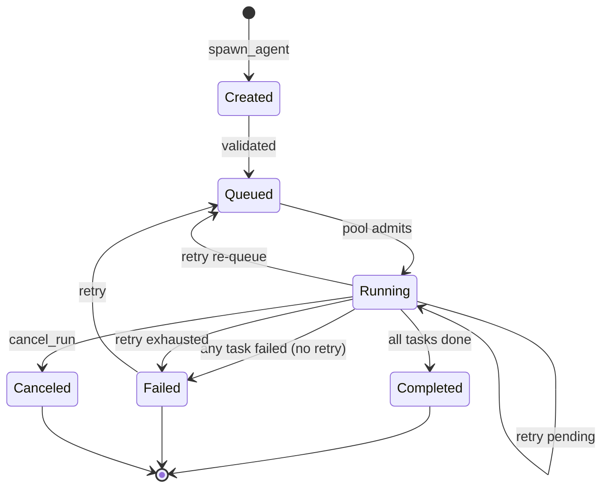

# Coding Agent Mode

`mivia chat` runs as a **coding agent** by default: the model can call tools to read, search, edit, and run allowlisted commands in a workspace.

## Enable / disable

```bash
mivia chat                    # tools on
mivia chat --no-tools         # pure LLM chat
mivia chat -p "fix the test" # one-shot agent task
mivia chat --workspace /path/to/repo
```

## Filesystem tools

| Tool | Purpose |
|------|---------|
| `read_file` | Read a file with optional offset/limit |
| `list_dir` | List a directory |
| `grep` | Search file contents by regex |
| `glob` | Find paths by pattern |
| `write_file` | Create or overwrite a file |
| `search_replace` | Replace exact text in a file |
| `run_command` | Last-resort allowlisted argv (no shell); multi-ecosystem binaries |

Tool names, descriptions, and schemas are **project- and language-generic**. mivia is a host coding agent for any workspace.

## Orchestration tools

Mivia supports an async subagent orchestration model — the model can spawn multiple sub-agents
that run concurrently as DAGs, inspect their progress, block on results, or cancel them.

```
spawn_agent  ──►  tasks (DAG) ──►  run handle
                    │
inspect_agents ──►  run snapshot (status, task states)
join_run      ──►  block until terminal ──►  results + refs
cancel_run    ──►  two-phase cancel (requested → canceled)
```

| Tool | Purpose |
|------|---------|
| `spawn_agent` | Create a new orchestration run with a DAG of tasks. Supports `idempotency_key`, `wait` (none/task/run), `wait_task_id`, and per-task `timeout_seconds`/`budget` |
| `inspect_agents` | Returns a snapshot of a run: status, task states, display name, timestamps |
| `join_run` | Block until a run completes; returns per-task results with redacted output/error refs |
| `cancel_run` | Cancel a running orchestration run (two-phase: `cancel_requested` → `canceled`) |
| `delegate` | Single sub-agent task (oneshot or multi_step with full tool access) |
| `dispatch_tasks` | Parallel sub-tasks with optional DAG dependencies and partial results |

### Lifecycle



### DAG execution

Tasks can declare `depends_on` for dependency ordering. The scheduler:

1. Runs all tasks with no dependencies concurrently
2. Only schedules a task after all its dependencies complete
3. Marks tasks whose dependencies fail as `blocked`
4. If retry is configured, failed/timed-out tasks are retried with exponential backoff + jitter

### Idempotency

Pass `idempotency_key` to `spawn_agent` to make the call idempotent:
- If the key matches a completed run, the existing results are returned
- If the key matches an in-flight run, the existing handle is returned (no duplicate)
- A different task set with the same key returns `ErrIdempotencyConflict`

### Partial results

`dispatch_tasks` supports `partial_results: true` — if some tasks fail, the successful
results are still returned alongside error information. Useful for challenge/audit rounds.

## Safety

- Paths must stay under `--workspace` (default: current directory).
- `.env` and secret-like files are not readable via tools.
- `run_command` is **not** a free shell: pass `argv` as a string array; binary must be allowlisted.
- Default allowlist is multi-ecosystem (`git`, `make`, language toolchains, package managers, `rg`, …) and excludes shells/network fetchers.
- Tool output in the ledger is replaced with bounded redacted references (`ref:output:...`, `ref:error:...`), not raw content.

## Loop

The model may call tools repeatedly. The default is unlimited; configure `/steps N` for an explicit per-turn limit. Cancellation, provider failure, or a final assistant response ends the run.

## See also

- Architecture: `docs/architecture/overview.md`
- Concurrency: `docs/architecture/concurrency.md`
- Config: `docs/product/config.md`
- Rules: `.ai/rules/60-tools-project-language-generic.md` (tool surface must stay generic)
