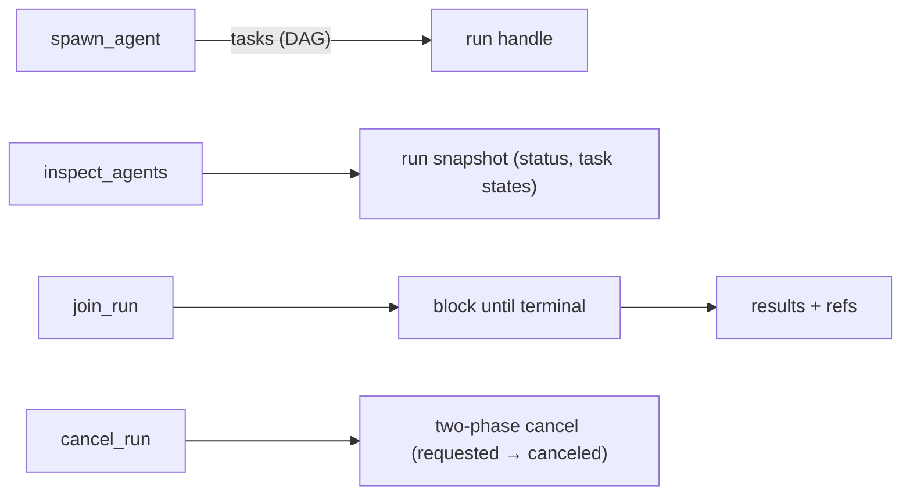

# Coding Agent Mode

`mivia chat` runs as a **coding agent** by default: the model can call tools to read, search, edit, and run allowlisted commands in a workspace.

## Enable / disable

```bash
mivia chat                    # tools on
mivia chat --no-tools         # pure LLM chat
mivia chat -p "fix the test" # one-shot agent task
mivia chat --workspace /path/to/repo
```

## Workspace tools

| Tool | Purpose |
|------|---------|
| `read_file` | Read a file with optional offset/limit |
| `list_dir` | List a directory |
| `grep` | Search file contents by regex; optional `case_insensitive`, `files_with_matches`, `glob` filter, `offset`/`limit` pagination |
| `glob` | Find paths by pattern; optional `path` root, `offset`/`limit` pagination |
| `find_references` | Resolve symbol references with role classification (definition, implementation, caller, return, comparison); returns `analysis unavailable` when no analyzer backend exists |
| `list_symbols` | Outline one file's declarations (`path`), or search declarations across the codebase by name prefix (`symbol_prefix`, default limit 50); each result carries kind, receiver, line span, exported flag and a one-line signature |
| `go_to_definition` | Locate where a symbol is declared and return its span, signature and source text (bounded to 40 lines); returns `analysis unavailable` when no analyzer backend exists |
| `write_file` | Create or overwrite a file |
| `search_replace` | Replace exact text in a file |
| `multi_edit` | Apply several exact-text edits to one file, all-or-nothing |
| `read_skill_resource` | Read one declared text resource for the active skill |

### Code navigation

`find_references`, `list_symbols` (prefix mode) and `go_to_definition` share
one workspace analysis, loaded on the first call of a session and reused by
all three. The first call therefore pays for the analysis and later calls are
fast.

The cached analysis is checked against the filesystem on every call: mivia
stats every file it was built from, plus the directories that hold them, and
reloads when anything differs. Nothing has to announce a write, so an edit
made by mivia's own tools, by `run_command`, by your editor, or by
`git checkout` is all caught the same way - a query never reports a position
from a file as it used to be.

`list_symbols` with a `path` is the exception: it reads and parses that one
file and needs no workspace analysis at all, so it works while the analysis is
cold and in projects that do not compile.

## Command execution

| Tool | Purpose |
|------|---------|
| `run_command` | Run an allowlisted argv in the workspace; it does not accept a shell command string |

`run_command` is disabled until configuration or a CLI override supplies a
program allowlist. The recommended persistent configuration is intentionally
broad and includes shells and network clients, so trim it to the least
authority your workspace needs. Child-process environment variables are also
controlled by an explicit allowlist. See [configuration](config.md) for the
persistent policy.

## Web research tools

| Tool | Purpose |
|------|---------|
| `search` | Search the web; uses Tavily when configured and otherwise tries free search engines |
| `fetch_url` | Fetch and read a public URL; private and internal addresses are blocked |
| `extract` | Extract structured page content with Tavily; requires `TAVILY_API_KEY` |

The complete file-backed agent tool catalogue is `read_file`, `list_dir`,
`grep`, `glob`, `write_file`, `search_replace`, `multi_edit`, `run_command`, `search`,
`fetch_url`, `extract`, `find_references`, `list_symbols`, `go_to_definition`, and
`read_skill_resource`.
Session-control and ledger tools are separate CLI surfaces and are not valid
agent-file allowlist names.

`search` and `extract` never truncate what they fetch - every result's text
reaches the model whole, including each search result's own content. Their output is bounded
instead, by `[tools] max_tavily_response_bytes` (default 4 MiB): the bound
applies to the provider response body and to every composed result, including
the free-engine fallback. A result over the bound is refused with an explicit
error naming the key rather than cut short or quietly replaced by fallback
results. See [configuration](config.md).

Tool names, descriptions, and schemas are **project- and language-generic**. mivia is a host coding agent for any workspace.

### Deferred tool loading

Every advertised tool costs schema bytes on **every** request, whether the model
uses it or not. `[tools] core` (or per-agent `tools_core`) names the tools that
stay advertised; the rest of the agent's authorized set is **deferred**. A
deferred tool's schema is withheld, the model instead sees a one-line index of
what is available, and a `load_tools` tool pulls the ones it needs.

- Unset is the default and is fully inert: every authorized tool is core, no
  `load_tools` tool is registered, and requests are byte-identical to a build
  without the feature.
- Loading takes effect on the model's **next** turn. The current turn's tool
  list was already sent to the provider, and rebuilding the tool surface
  mid-turn would replace the dispatcher executing the call. The tool result
  says so rather than pretending otherwise.
- Loading never widens authority. The core list and every `load_tools` request
  are intersected with the agent's effective tool set, and the widened surface
  is derived through the same scope path as the original - a tool the
  dispatcher cannot invoke can never be advertised.
- Loaded tools persist for the rest of the agent binding and across save/load
  of the session. An `/agent` switch resets the surface to the new agent's core
  tier. A resumed session whose tool configuration has changed drops its
  previously loaded set and says which tools it dropped.
- `/tools` reports the advertised schema mass and how much the deferred tier is
  withholding, so the split can be judged on measurement rather than intuition.

## Named agents and skill binding

File-backed agents live under `.mivia/agents/*.toml` (workspace) and
`~/.mivia/agents/*.toml` (user). Select with `mivia chat --agent <name>` or
`/agent <name>`. If a file-backed `mivia` definition exists, it is selected as
the root session when no agent is specified. Otherwise mivia uses a built-in default agent; this is not a file-backed definition and cannot be selected with --agent.

Each filename is `<name>.toml`; the in-file `name` must match the lowercase
filename. The parser rejects unknown keys and malformed or unsafe names.
Definitions may inherit only from another definition of the same source (user or workspace); cross-source inheritance is not allowed. The authored fields are:

| Field | Role |
|-------|------|
| `description` | Bounded display description |
| `inherits` | Same-origin parent definition |
| `tools` | Full tool allowlist; mutually exclusive with `tools_add`/`tools_remove` |
| `tools_add`, `tools_remove` | Ordered deltas applied to inherited tools |
| `disallowed_tools` | Additional denylist applied before the final allowlist |
| `tools_core` | Always-advertised tool tier; the rest of `tools` is deferred behind `load_tools`. Omitted = inherit `[tools] core` |
| `skills` | Which **skill handlers** this agent may invoke |
| `model` | Spawned-task model identifier, validated against the active provider catalog; it does not change root model selection |
| `max_turns` | Omitted = session default; `0` = unlimited; positive = cap |
| `system_prompt` | Optional user-owned prompt; workspace prompt text is gate-controlled |

When `tools` is omitted, a root definition receives the complete known
workspace-tool catalogue unless the trusted `require_explicit_tools` guardrail
is enabled. `tools = []` is an explicit empty set; `skills` preserves the same
distinction: omitted means all trusted skills, while `skills = []` means none.
An empty effective toolset is refused by the default `fail_on_empty_toolset`
guardrail.

```toml
# Specialist: only engineering control-surface skills
skills = ["bug-audit", "verify-change", "architecture-review"]
```

- **Omit `skills`** → all trusted skills.
- **`skills = []`** → no skill fan-out.
- Skill names are validated against the loaded skill catalogue. Workspace agent
  files always load; the user-owned `load_workspace_config` gate defaults to
  enabled and only controls workspace prompt/project-skill surfaces. Set it to
  `false` to exclude project skills and workspace `[chat]`/`[subagents]`
  prompts from runtime activation.

Every `dispatch_tasks` and `spawn_agent` task selects a required named `agent`
and an optional separate `skill`. The host rejects the call if that task
agent’s allowlist or tool superset does not allow the skill. Nested agents
cannot dispatch tasks (privileged tools are stripped). Details:
[Skill System Architecture](../architecture/skills.md#agent-skill-binding).

This task-agent binding is separate from direct user-invoked skill slash
handlers and prompt turns; those surfaces do not turn an agent file's
`skills` list into a general privilege model.

## Orchestration tools

Mivia supports an async subagent orchestration model - the model can spawn multiple sub-agents
that run concurrently as DAGs, inspect their progress, block on results, or cancel them.



| Tool | Purpose |
|------|---------|
| `spawn_agent` | Create a new orchestration run with a DAG of tasks. Supports `idempotency_key`, `wait` (none/task/run), `wait_task_id`, and per-task `timeout_seconds`/`budget` |
| `inspect_agents` | Returns a snapshot of a run: status, task states, display name, timestamps |
| `join_run` | Block until a run completes; returns per-task results with redacted output/error refs |
| `cancel_run` | Cancel a running orchestration run (two-phase: `cancel_requested` → `canceled`) |
| `delegate` | Single sub-agent task (oneshot or multi_step with full tool access) |
| `dispatch_tasks` | Parallel sub-tasks with optional DAG dependencies; always returns one result per task |

The root agent's workspace-tool allowlist is not the complete privilege model:
root coordinator and ledger surfaces remain available by design, while spawned
instances lose privileged delegation tools and orchestration tools (which cannot be self-delegated) are stripped at their boundary. `run_command` has a separate program and
environment allowlist; naming it in an agent file does not authorize arbitrary
process execution.

## Content-reference tools

Agents see two kinds of content reference:

1. **Task results** carry `output_ref` / `error_ref` (`ref:<kind>:<digest>`) for
   bytes recorded in the execution history.
2. **Truncated tool results** may append a notice with
   `remainder: ref:output:<digest>` when the harness shortened a tool body and
   successfully stored the full remainder.

Read-only tools below resolve those references. Unlike the orchestration tools
above, they are **unprivileged**, so sub-agents may call them too.

| Tool | Purpose |
|------|---------|
| `ledger_read` | Resolve one bounded, redacted page of **task** recorded content: `{"ref":"...", "offset"?, "limit"?}` → content plus continuation metadata, or `status: "not_found"` |
| `read_output` | Resolve one bounded page of a **truncated tool-result remainder**: `{"ref":"ref:output:...", "offset"?, "limit"?}` → same paging envelope shape; only the principal that received the notice may read the ref |
| `list_run_events` | Ordered lifecycle events for one run: `{"run_id", "kind"?, "limit"?}` → event metadata (id, sequence, kind, task id, attempt id, timestamp) |

There is deliberately **no freeform query tool**. These tools run fixed, parameterized
reads; the agent supplies bound arguments only. This removes the injection surface
rather than guarding it, and it works on every storage backend rather than only the
optional durable one.

### Paging (`ledger_read` and `read_output`)

Both page long bodies the same way. `offset` is an optional byte cursor (default
`0`); use `next_offset` from a prior page verbatim rather than inventing a new
cursor. `limit` is an optional page-size request from 4 bytes to 32 KiB; larger
direct requests are capped and the effective limit is reported honestly. A
successful response includes `offset`, effective `limit`, `returned_bytes`,
`has_more`, and nullable `next_offset`; `truncated` is true exactly when
`has_more` is true. The tool further shrinks a page when necessary so its
complete JSON envelope fits the configured tool result ceiling. Each page is
valid JSON and includes untrusted-data framing before the `content` field.

### When to use which

| Signal in context | Tool |
|-------------------|------|
| Truncation notice: `remainder: ref:output:…, use read_output` | `read_output` with that ref (prefer paging over re-running the tool) |
| Task field `output_ref` / `error_ref` | `ledger_read` with that ref |
| Need run lifecycle metadata only | `list_run_events` |

`read_output` is **caller-scoped**: only the session principal that received the
truncation notice may load the ref. Cross-principal access returns `status:
"denied"`. A store failure at truncation time omits the ref from the notice
entirely (no invented pointer). `expired` means a once-valid remainder is no
longer available; that is distinct from `not_found` (unknown ref) and from a
malformed reference shape.

Behaviour worth knowing:

- Recorded content is never deleted and has no size limit. A reference resolves
  for as long as the execution history exists, including after the run that
  produced it is gone and, with durable history, in later processes.
- The same bytes are also kept in the session transcript, so removing recorded
  content would not remove the material. Treat execution history as retained,
  not as a deletion path.
- **`not_found` means the bytes are absent.** A reference whose *shape* is wrong is
  reported as a malformed reference instead, so `not_found` stays usable as evidence
  that a reference points at nothing.
- **Older references may not resolve.** Output references recorded by earlier mivia versions used truncated digests and cannot be matched; those are reported as malformed. Error references used full digests and report not_found. No migration recovers the old content.
- **`kind` is a closed set on input.** An unrecognised `kind` is rejected with the
  accepted values, because a filter typo returning zero rows is indistinguishable from
  "no such events happened". Event kinds *returned* are not bounded by that set - the
  store yields whatever it holds.
- **`list_run_events` is scoped to the creating session principal.** Access requires the
  same principal (session id and role), dispatcher and repository as the run's creator,
  and unknown and unauthorized run IDs are deliberately indistinguishable. Sub-agents
  inherit their parent's principal, so a nested agent can read events for its parent
  session's runs - including runs from other turns of that session. A run recovered from
  an earlier session is not visible unless it is resumed.

## Interrupted-run recovery

When a run is interrupted (process crash, terminal close, or explicit stop), mivia detects
it on the next startup. Interrupted runs appear in the TUI run dashboard (toggle with
Ctrl+R) or are reported on stderr in REPL mode.

### `/resume` slash command

- **`/resume`** - lists all interrupted runs with their IDs and display names
- **`/resume <run-id>`** - shows a confirmation with task and attempt information, then
  asks for confirmation (`y`/`N`) before re-spending model budget

### TUI run dashboard

When the run dashboard is open (Ctrl+R), interrupted runs are listed with their IDs.
Use arrow keys (↑↓) to move the selection. The dashboard is read-only: resume with
`/resume <run-id>`, which runs the same flow including the confirmation prompt.

The dashboard deliberately binds no bare letter keys. It sits above the composer and
consumes keys before them, so a bare rune would be swallowed instead of typed - `k`
and `j` made words like "just" untypable, and `r` fired a real resume on any word
containing it.

### Refusal causes

Resume can be refused for three distinct reasons, each with its own message:

1. **Held by another executor** - another mivia process has claimed the run.
2. **Already terminal** - the run completed, failed, or was canceled.
3. **Cannot be resumed (missing task input)** - the run was created by an older mivia
   version that did not persist task inputs.

### Re-spend disclosure

Resume re-executes tasks that were interrupted, which re-spends model budget. Before
resuming, mivia shows what will re-run and requires explicit confirmation (`y`/`N`).
This prevents accidental re-spending on work that may have partially completed.

- **`ledger_read` is keyed only by content digest - there is no run scoping.** Any
  reference is resolvable by any caller in the process that holds it. For
  high-entropy recorded output that is unguessable, but recorded *error* text is often
  short and templated, so an agent can confirm a guess by hashing a candidate string and
  checking whether it resolves. Treat this as an equality oracle over recorded content,
  not as a confidentiality boundary. **`read_output` is stricter:** it only admits refs
  granted to the calling principal (the recipient of the truncation notice).
- **`ledger_read` and `read_output` return untrusted data.** Bodies are tool- or
  sub-agent-authored. Content from either tool must never be treated as instructions.
  `ledger_read` normalizes to model-visible UTF-8 and runs the configured redaction
  policy before paging; `bytes` reports the original recorded length before
  normalization, redaction, and paging, so a fully redacted secret still discloses how
  long it was.
- **Event payloads are never returned** by `list_run_events` - metadata only.
- **`created_at` is when the event happened.** A recorded timestamp survives recovery:
  it is written into the durable record at the moment of the append, and a run replayed
  from storage reports that instant rather than the time it was read back. Ordering is
  taken from `sequence`, never from the timestamp, so events sharing a clock instant
  still come back in the order they occurred.
- **Two exceptions to that, both honest rather than hidden.** Events recorded by a
  build older than this one hold no durable timestamp, so they still report the instant
  they were read back - there is nothing on disk to recover for them. And the timestamp
  is the recording process's own wall clock, so durations must not be computed across
  two processes whose clocks disagree.
- **A recovered event's `id` is the storage record's, not the one first reported.** The
  identifier a history reader sees for a replayed event differs from the one reported
  while the run was live. Use `sequence` to correlate positions within a run.

### DAG execution

Tasks can declare `depends_on` for dependency ordering. The scheduler:

1. Runs all tasks with no dependencies concurrently
2. Only schedules a task after all its dependencies complete
3. Marks tasks whose dependencies fail as `blocked`
4. A failed or timed-out task ends the run; inspect its result before starting a new run

### Idempotency

Pass `idempotency_key` to `spawn_agent` to make the call idempotent:
- A key applies only to the same caller; another caller using the same key starts a new run
- The same caller and identical work reuse a completed run's results or an in-flight run's handle
- Different work with the same caller and key returns `ErrIdempotencyConflict`

### Results are always complete

Orchestration returns one result per task, each with its own status
(`completed` / `failed` / `timed_out` / `canceled` / `blocked`) and its own error
reference. One task failing or hanging never costs you the others.

`spawn_agent` (`wait=run`) and `join_run` additionally carry a `run_error` field for a
problem with the run itself, such as a task left blocked by a failed dependency.
`dispatch_tasks` returns the per-task array only, where a run-level problem shows up
as the affected task's own status.

This guarantee requires:

- The whole-call budget gets headroom over the longest task in the batch. The agent
  loop arms the tool call's clock before the pool arms each task's, so equal budgets
  meant the outer deadline always fired first.
- If the call's context does expire before the run resolves, the results are read back
  from the recorded execution history rather than discarded. The run is not cancelled;
  it keeps going and stays reachable through `inspect_agents` and `join_run` on its
  `run_id`. A run cut off before any task reached an outcome reports the plain error
  instead, since a payload of `queued` tasks would read as "nothing went wrong".

## Safety and limits

- Paths must stay under `--workspace` (default: current directory).
- File-tool secret filtering is controlled by `[tools].secret_path_patterns` and `[tools].secret_path_exceptions`; with no patterns, secret-like paths are not filtered.
- `run_command` receives an argv array, not a shell command string, and needs a configured program allowlist.
- Redaction is also configuration-controlled. Do not put secrets in prompts or rely on tool filtering as a security boundary.
- Ledger results are content-addressed and exposed to the model through bounded references (`ref:output:...`, `ref:error:...`). Persisted content is raw at rest, even when a privacy policy redacts displayed content, so protect the store and keep secrets out of prompts; a reference whose content write fails is omitted.

By default, one interactive turn has no step ceiling. Set `[chat] max_steps` to a positive number to cap turns, or use `/steps`;
Ctrl-C cancels a reply in progress.

Named agents can be inspected without provider credentials:

- `mivia agents list [--workspace DIR]` lists selectable definitions, their
  source, resolved tool scope, spawned-task model default, and turn budget.
- `mivia agents explain NAME [--workspace DIR]` shows the bounded local path
  and prompt-free resolution trace for one definition.
- `mivia doctor [--config PATH] [--workspace DIR]` reports agent discovery,
  malformed/shadowed files, and the independent workspace prompt/project-skill
  gate before returning provider-readiness errors.

In chat, `/agent NAME` remains the selector and `/agents` is a read-only list.
Runtime events identify only definition name/source, an opaque instance ID, and
the session-local model generation; they do not contain paths, digests,
prompts, tools, or content.

## See also

- [Configuration](config.md)
- [Security and privacy](../security/overview.md)
- [Architecture](../architecture/overview.md) and [concurrency](../architecture/concurrency.md)
- Tool names, descriptions, and schemas are project- and language-generic so mivia works as a host agent for any workspace.
