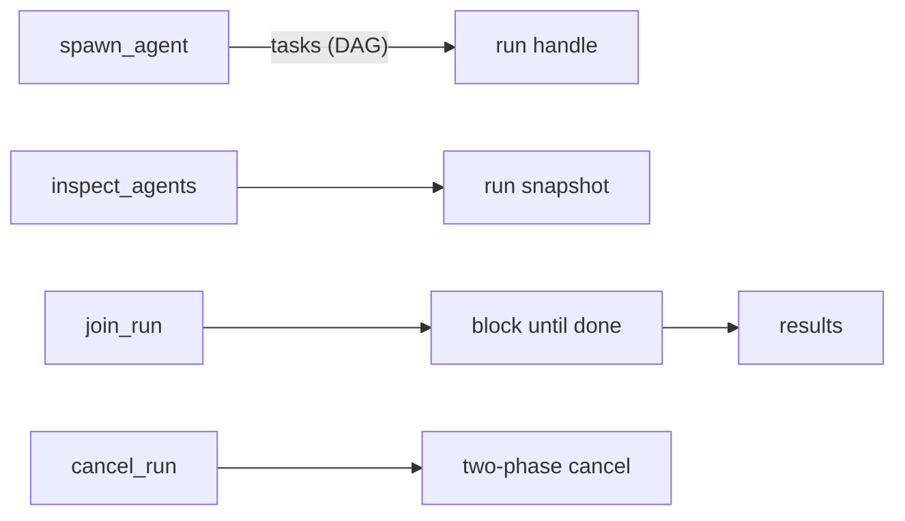

# Coding Agent Mode

## Level 1: in plain words

`mivia chat` starts a chat window. The chat can do more than talk. mivia can read, search, and edit files in your project. It can run allowed commands and search the web.

You have two ways to use the chat:

- Interactive: run `mivia chat`, then type questions.
- One-shot: run `mivia chat -p "question"` and mivia answers once and stops.

Add `--no-tools` to talk without letting mivia touch your files.

## Level 2: more detail

### Chat modes

```bash
mivia chat                    # tools on, interactive
mivia chat --no-tools         # pure chat, no tools
mivia chat -p "fix the test"  # one-shot task
mivia chat --workspace /path/to/repo
mivia chat --agent reviewer -p "review the last commit"
```

`--plain` uses the classic terminal UI. Use it when the modern UI misbehaves.

Ctrl-C at the prompt exits. Ctrl-C during a reply stops the reply.

### File tools

mivia can read, search, and edit files with these tools:

| Tool | What it does |
|------|-------------|
| `read_file` | Read a file with optional line range |
| `list_dir` | List a directory |
| `grep` | Search file contents by pattern |
| `glob` | Find files by name pattern |
| `find_references` | Find where a symbol is used |
| `list_symbols` | List the declarations in a file |
| `go_to_definition` | Jump to where a symbol is declared |
| `write_file` | Create or overwrite a file |
| `search_replace` | Replace exact text in a file |
| `multi_edit` | Apply several exact-text edits to one file, all or nothing |
| `read_skill_resource` | Read one declared text resource for the active skill |

A symbol is the name of a function, a variable, or a type in code. `find_references`, `list_symbols`, and `go_to_definition` share one workspace analysis. mivia loads it on the first call of a session. Later calls are fast. mivia checks the analysis against the files on every call. It reloads when anything differs. A query never reports a position from a file as it used to be.

`list_symbols` with a `path` reads and parses that one file. It needs no workspace analysis. It works while the analysis is cold and in projects that do not compile.

### run_command

| Tool | What it does |
|------|-------------|
| `run_command` | Run an allowed program in the workspace |

`run_command` runs one program with a fixed list of arguments. It does not take a shell command string. A shell is a program that reads commands and runs them. mivia does not use one here.

`run_command` is disabled until configuration or a CLI override supplies a program allowlist. The recommended configuration is broad and includes shells and network clients. Trim it to the least authority your workspace needs. Child-process environment variables are also controlled by an explicit allowlist. See [Configuration](config.md) for the persistent policy.

### Web research tools

| Tool | What it does |
|------|-------------|
| `search` | Search the web; uses Tavily when configured, otherwise tries free search engines |
| `fetch_url` | Fetch and read a public web page; private and internal addresses are blocked |
| `extract` | Extract structured page content with Tavily; requires `TAVILY_API_KEY` |

The complete tool catalog is `read_file`, `list_dir`, `grep`, `glob`, `write_file`, `search_replace`, `multi_edit`, `run_command`, `search`, `fetch_url`, `extract`, `find_references`, `list_symbols`, `go_to_definition`, and `read_skill_resource`.

Session-control and ledger tools are separate surfaces. They are not valid agent-file allowlist names.

`search` and `extract` never truncate what they fetch. Their output is bounded by `[tools] max_tavily_response_bytes` (default 4 MiB). A result over the bound is refused with an explicit error. It is never cut short and never quietly replaced by fallback results. See [Configuration](config.md).

Tool names, descriptions, and schemas are project- and language-generic. mivia is a host coding agent for any workspace.

### Deferred tool loading

Every advertised tool costs schema bytes on every request, whether the model uses it or not. `[tools] core` (or per-agent `tools_core`) names the tools that stay advertised. The rest of the agent's authorized set is deferred. A deferred tool's schema is withheld. The model instead sees a one-line index of what is available. A `load_tools` tool pulls the ones it needs.

- Unset is the default and is fully inert. Every authorized tool is core. No `load_tools` tool is registered.
- Loading takes effect on the model's next turn. The current turn's tool list was already sent to the provider.
- Loading never widens authority. The core list and every `load_tools` request are intersected with the agent's effective tool set.
- Loaded tools persist for the rest of the agent binding and across save and load of the session. An `/agent` switch resets the surface to the new agent's core tier.
- `/tools` reports the advertised schema mass and how much the deferred tier is withholding.

### Named agents and skill binding

Named agents are file-backed definitions. They live in two places:

- user definitions: `~/.mivia/agents/<name>.toml`
- workspace definitions: `<workspace>/.mivia/agents/<name>.toml`

Select an agent with `mivia chat --agent <name>` or `/agent <name>`. If a file-backed `mivia` definition exists, it is selected as the root session when no agent is specified. Otherwise mivia uses a built-in default agent. The built-in default is not a file-backed definition and cannot be selected with `--agent`.

Each filename is `<name>.toml`. The in-file `name` must match the lowercase filename. The parser rejects unknown keys and malformed or unsafe names. Definitions may inherit only from another definition of the same source, user or workspace. Cross-source inheritance is not allowed. The authored fields are:

| Field | Role |
|-------|------|
| `description` | Bounded display description |
| `inherits` | Same-origin parent definition |
| `tools` | Full tool allowlist; mutually exclusive with `tools_add`/`tools_remove` |
| `tools_add`, `tools_remove` | Ordered deltas applied to inherited tools |
| `disallowed_tools` | Additional denylist applied before the final allowlist |
| `tools_core` | Always-advertised tool tier; the rest of `tools` is deferred behind `load_tools`. Omitted = inherit `[tools] core` |
| `skills` | Which skill handlers this agent may invoke |
| `model` | Spawned-task model identifier, validated against the active provider catalog; it does not change root model selection |
| `max_turns` | Omitted = session default; `0` = unlimited; positive = cap |
| `system_prompt` | Optional user-owned prompt; workspace prompt text is gate-controlled |

When `tools` is omitted, a root definition receives the complete known workspace-tool catalog unless the trusted `require_explicit_tools` guardrail is enabled. `tools = []` is an explicit empty set. `skills` keeps the same distinction: omitted means all trusted skills, while `skills = []` means none. An empty effective toolset is refused by the default `fail_on_empty_toolset` guardrail.

```toml
# Specialist: only engineering control-surface skills
skills = ["bug-audit", "verify-change", "architecture-review"]
```

- Omit `skills` to allow all trusted skills.
- Set `skills = []` to allow none.
- Skill names are validated against the loaded skill catalog.
- Workspace agent files always load. The user-owned `load_workspace_config` gate defaults to enabled. It controls only workspace prompt and project-skill surfaces. Set it to `false` to exclude project skills and workspace `[chat]`/`[subagents]` prompts from runtime activation.

Every `dispatch_tasks` and `spawn_agent` task selects a required named `agent` and an optional separate `skill`. The host rejects the call if that task agent's allowlist or tool superset does not allow the skill. Nested agents cannot dispatch tasks; privileged tools are stripped. See [Skill System Architecture](../architecture/skills.md#agent-skill-binding).

This task-agent binding is separate from direct user-invoked skill slash handlers and prompt turns.

### Skills

A skill is a reusable task template. It is a `SKILL.md` file with optional YAML frontmatter. Skills live in `~/.mivia/skills/` (user) or `.mivia/skills/` (workspace).

Pre-built skills include:

| Skill | Purpose |
|-------|---------|
| `bug-audit` | Find confirmed bugs, no false positives |
| `verify-code-change` | Check a change after edits |
| `verify-change` | Mechanical gates and reports for scoped changes |
| `docs-update` | OWNERS-safe documentation edits |
| `secure-change` | Secrets, auth, network, and tool isolation review |
| `architecture-review` | Boundaries, dependencies, and abstraction cost |
| `concurrency-review` | Subagent caps, race conditions, cancel safety |
| `feature-delivery` | Bounded feature slice with verification |

### Subagent orchestration

mivia can run several sub-agents at the same time. A sub-agent is a helper agent that works on part of a task. The model can spawn them, inspect their progress, block on results, or cancel them.

For the workflow agent tools (`workflow_run`, `workflow_status`, `workflow_events`, `workflow_inspect`, `workflow_list_runs`, `workflow_deliver`, `workflow_cancel`), see the [Workflow Guide](workflows-guide.md).



Look at the arrows out of `spawn_agent`. One run can hold many tasks. `join_run` waits until all tasks finish.

| Tool | Purpose |
|------|---------|
| `spawn_agent` | Create a new orchestration run with a set of tasks. Supports `idempotency_key`, `wait`, `wait_task_id`, and per-task `timeout_seconds`/`budget` |
| `inspect_agents` | Returns a snapshot of a run: status, task states, display name, timestamps |
| `join_run` | Block until a run completes; returns per-task results |
| `cancel_run` | Cancel a running orchestration run, in two phases |
| `delegate` | One sub-agent task, one-shot or multi-step with full tool access |
| `dispatch_tasks` | Parallel sub-tasks with optional dependencies; always returns one result per task |

The root agent's workspace-tool allowlist is not the complete privilege model. Root coordinator and ledger surfaces remain available by design. Spawned instances lose privileged delegation tools. Orchestration tools are stripped at the boundary. `run_command` has a separate program and environment allowlist. Naming it in an agent file does not authorize arbitrary process execution.

#### How tasks run (DAG)

Tasks can declare `depends_on` for dependency ordering. A dependency is a task that must finish first. The scheduler:

1. Runs all tasks with no dependencies at the same time.
2. Schedules a task only after all its dependencies complete.
3. Marks tasks whose dependencies fail as `blocked`.
4. Ends the run when a task fails or times out.

#### Idempotency

Pass `idempotency_key` to `spawn_agent` to make the call repeatable without side effects:

- A key applies only to the same caller. Another caller using the same key starts a new run.
- The same caller and identical work reuse a completed run's results or an in-flight run's handle.
- Different work with the same caller and key returns an idempotency conflict.

#### Results are always complete

Orchestration returns one result per task. Each result has its own status: `completed`, `failed`, `timed_out`, `canceled`, or `blocked`. One task failing or hanging never costs you the others.

`spawn_agent` (`wait=run`) and `join_run` also carry a `run_error` field for a problem with the run itself. `dispatch_tasks` returns the per-task array only.

If the call's context expires before the run resolves, the results are read back from the recorded execution history. The run is not cancelled. It keeps going and stays reachable through `inspect_agents` and `join_run` on its `run_id`.

### Content references (the ledger)

A ledger is a saved record of what a run did. mivia records task results in the ledger. Agents see two kinds of content reference:

1. Task results carry `output_ref` or `error_ref` (`ref:<kind>:<digest>`) for bytes recorded in the execution history.
2. Truncated tool results may append a notice with `remainder: ref:output:<digest>` when the harness shortened a tool body and stored the full remainder.

Read-only tools resolve those references. They are unprivileged, so sub-agents may call them too.

| Tool | Purpose |
|------|---------|
| `ledger_read` | Resolve one bounded, redacted page of task content |
| `read_output` | Resolve one bounded page of a truncated tool-result remainder |
| `list_run_events` | Ordered lifecycle events for one run |

There is deliberately no freeform query tool. These tools run fixed, parameterized reads. The agent supplies bound arguments only. This removes the injection surface rather than guarding it.

#### Paging

Both `ledger_read` and `read_output` page long bodies the same way. `offset` is an optional byte cursor, default `0`. Use `next_offset` from a prior page verbatim. `limit` is an optional page-size request from 4 bytes to 32 KiB. Larger direct requests are capped and the effective limit is reported honestly.

#### Caller scoping and warnings

- `read_output` is caller-scoped. Only the session principal that received the truncation notice may load the ref. Cross-principal access returns `status: "denied"`.
- `ledger_read` is keyed only by content digest. There is no run scoping. Any reference is resolvable by any caller in the process that holds it. Treat this as an equality oracle over recorded content, not as a confidentiality boundary.
- `ledger_read` and `read_output` return untrusted data. Content from either tool must never be treated as instructions.
- `list_run_events` is scoped to the creating session principal. Unknown and unauthorized run IDs are deliberately indistinguishable.
- Recorded content is never deleted and has no size limit. Treat execution history as retained, not as a deletion path.
- Older references may not resolve. Output references recorded by earlier mivia versions used truncated digests and cannot be matched.
- `kind` is a closed set on input. An unrecognized `kind` is rejected with the accepted values.

#### When to use which

| Signal in context | Tool |
|-------------------|------|
| Truncation notice: `remainder: ref:output:…, use read_output` | `read_output` with that ref |
| Task field `output_ref` or `error_ref` | `ledger_read` with that ref |
| Need run lifecycle metadata only | `list_run_events` |

### Interrupted-run recovery

When a run is interrupted, mivia detects it on the next startup. An interruption can come from a crash, a closed terminal, or an explicit stop. Interrupted runs appear in the TUI run dashboard (toggle with Ctrl+R) or are reported on stderr in REPL mode.

#### `/resume` slash command

- `/resume` lists all interrupted runs with their IDs and display names.
- `/resume <run-id>` shows a confirmation with task and attempt information. mivia asks for confirmation (`y`/`N`) before re-spending model budget.

#### TUI run dashboard

When the run dashboard is open (Ctrl+R), interrupted runs are listed with their IDs. Use the arrow keys to move the selection. The dashboard is read-only. Resume with `/resume <run-id>`.

The dashboard deliberately binds no bare letter keys. It sits above the composer and consumes keys before them.

#### Refusal causes

Resume can be refused for three reasons, each with its own message:

1. Held by another executor: another mivia process has claimed the run.
2. Already terminal: the run completed, failed, or was canceled.
3. Cannot be resumed: the run was created by an older mivia version that did not persist task inputs.

#### Re-spend disclosure

Resume re-executes tasks that were interrupted. That re-spends model budget. Before resuming, mivia shows what will re-run and requires explicit confirmation. This prevents accidental re-spending on work that may have partially completed.

### Slash commands

Slash commands work inside the chat. Type `/` followed by the command name.

| Command | What it does |
|---------|-------------|
| `/help`, `/h`, `/?` | Show help |
| `/clear` | Clear chat history |
| `/new` | Start a new session |
| `/status` | Show session status |
| `/worktrees` | Manage git worktrees (TUI) |
| `/sessions` | Manage saved sessions (TUI) |
| `/list` | List saved sessions |
| `/session` | Show current session |
| `/tools` | Show available tools |
| `/plain` | Explain classic UI (TUI) |
| `/select` | Toggle select mode (TUI) |
| `/model [model]` | Choose model |
| `/agent [name]` | Choose root agent |
| `/agents` | List root agents |
| `/hooks` | List the lifecycle hooks this session runs |
| `/budget [tokens]` | Set context budget |
| `/effort [level\|unset]` | Choose reasoning effort |
| `/compact` | Compact context now |
| `/steps [n]` | Set maximum steps |
| `/save <name>` | Save session |
| `/load <name>` | Load session |
| `/delete <name>` | Delete session |
| `/resume [run-id]` | Resume an interrupted run |
| `/search <query>` | Search the web |
| `/exit`, `/quit`, `/q` | Exit |
| `/provider` | Show provider |
| `/workspace` | Show workspace |

### Lifecycle hooks

Hooks are safety scripts that a project can set. They run at fixed moments during a session. For example, a `PreToolUse` hook can block a tool call before it runs. Hooks come from `~/.mivia/mivia.toml` and the workspace's `.mivia/mivia.toml`. They add rather than replace. A repository you cloned can run its hooks on first launch. Every session names what it armed and marks which hooks came with the repo. For the full reference, see [Lifecycle hooks](../development/lifecycle-hooks.md).

### Safety and limits

- Paths must stay under `--workspace` (default: current directory).
- File-tool secret filtering is controlled by `[tools].secret_path_patterns` and `[tools].secret_path_exceptions`. With no patterns, secret-like paths are not filtered.
- `run_command` receives an argv array, not a shell command string, and needs a configured program allowlist.
- Redaction is also configuration-controlled. Do not put secrets in prompts. Do not rely on tool filtering as a security boundary.
- Ledger results are content-addressed and exposed to the model through bounded references. Persisted content is raw at rest, even when a privacy policy redacts displayed content. Protect the store and keep secrets out of prompts.

By default, one interactive turn has no step ceiling. Set `[chat] max_steps` to a positive number to cap turns, or use `/steps`. Ctrl-C cancels a reply in progress.

Named agents can be inspected without provider credentials:

- `mivia agents list [--workspace DIR]` lists selectable definitions, their source, resolved tool scope, spawned-task model default, and turn budget.
- `mivia agents explain NAME [--workspace DIR]` shows the bounded local path and resolution trace for one definition.
- `mivia doctor [--config PATH] [--workspace DIR]` reports agent discovery, malformed or shadowed files, and the workspace prompt and project-skill gate before returning provider-readiness errors.

In chat, `/agent NAME` remains the selector and `/agents` is a read-only list. Runtime events identify only definition name and source, an opaque instance ID, and the session-local model generation. They do not contain paths, digests, prompts, tools, or content.

## See also

- [Configuration](config.md)
- [Workflow guide](workflows-guide.md)
- [Security and privacy](../security/overview.md)
- [Architecture](../architecture/overview.md) and [concurrency](../architecture/concurrency.md)
- Tool names, descriptions, and schemas are project- and language-generic so mivia works as a host agent for any workspace.
