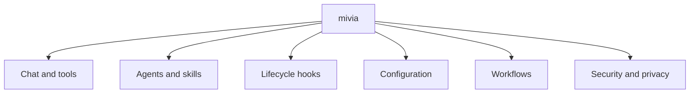

# Product Overview

## What mivia is

mivia is a local CLI coding agent. It runs in your terminal, reads and edits
files in your project, runs commands such as your test suite, and can drive
multi-step workflows in an isolated worktree with a durable run record.

mivia runs on your machine. Your files stay there. mivia sends your prompt
and the context it selects to the AI provider you configure - nothing else
leaves your machine.

## The pieces

## Chat and tools

`mivia chat` starts an interactive session with tool access: read, search,
and edit files; run allowed commands; search the web. `mivia chat -p
"question"` runs one turn and exits.

See [Coding agent mode](agent.md) for the full tool list and slash commands.

## Agents and skills

A named agent is a file-backed definition (`.mivia/agents/<name>.toml` or
`~/.mivia/agents/`) that scopes tools, skills, model, and system prompt.
Select one with `--agent <name>` or `/agent <name>`.

A skill is a reusable task template (`SKILL.md`) an agent can invoke - things
like `bug-audit`, `architecture-review`, or `feature-delivery` ship with the
repository.

mivia can run several sub-agents concurrently as DAG tasks: `spawn_agent`,
`dispatch_tasks`, `inspect_agents`, `join_run`, and `cancel_run` give the
model orchestration control over a batch of tasks with dependencies, one
result per task, and idempotent retries.

See [Coding agent mode](agent.md#named-agents-and-skill-binding) for the full
schema and [Skill System Architecture](../architecture/skills.md) for how
skills are discovered and scoped.

## Lifecycle hooks

A hook is your own script that mivia runs on a tool-call event, every time,
whether or not the model wants it. `PreToolUse` can block a call before it
runs; `PostToolUse` reacts after (format, lint); `Stop` observes a turn's end.

Hooks come from two config files - `~/.mivia/mivia.toml` (yours) and the
workspace's `.mivia/mivia.toml` (the project's) - and they add rather than
replace. A project you clone can arm its own hooks the first time you start
mivia there; the session names every hook it armed and marks which came from
the repository.

See [Lifecycle hooks](../development/lifecycle-hooks.md) for the full
contract, and [Development hooks](../development/hooks.md) for how this
differs from this repository's own Git hooks.

## Configuration

mivia reads settings from `mivia.toml` and an API key from your environment.
The key never lives in the settings file. `mivia doctor` verifies the setup
without printing the key.

See [Configuration](config.md) for the search order, provider setup, and
every tunable.

## Workflows

A workflow is a TOML-defined, multi-step process - plan, implement, review,
verify - that runs in an isolated worktree with a durable ledger recording
every step. Interrupted runs resume from that ledger.

See [Workflows](workflows.md) and the [Workflow guide](workflows-guide.md).

## Security and privacy

Your API key stays in your environment, never in project files. Powerful
tools (`run_command`, secret-path filtering, redaction) are off until you
configure them.

See [Security and privacy](../security/overview.md).

## What mivia is not

- Not a cloud service. It runs on your machine.
- No hosted control plane; the hosted multi-tenant platform is a separate product.
- MCP client support uses stdio and Streamable HTTP servers that the user or project configures.
- Not a replacement for every vendor coding agent.

## Guides

| Guide | Covers |
|-------|--------|
| [Configuration](config.md) | Providers, credentials, policy controls |
| [Coding agent mode](agent.md) | Tools, orchestration, limits |
| [Workflows](workflows.md) | Step-by-step processes |
| [Workflow guide](workflows-guide.md) | Workflow commands in detail |
| [Lifecycle hooks](../development/lifecycle-hooks.md) | Your own scripts on tool-call events |
| [Security and privacy](../security/overview.md) | How mivia protects your data |
| [Architecture](../architecture/overview.md) and [concurrency](../architecture/concurrency.md) | How mivia is built |
