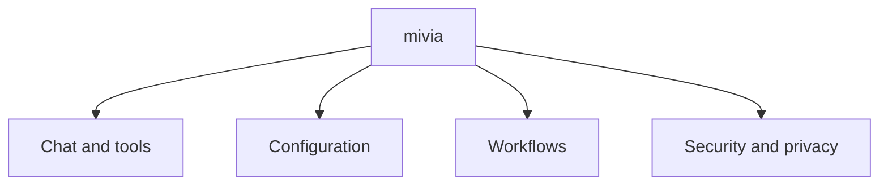

# Product Overview

## What mivia is

mivia is a helper program. It runs on your computer, in a terminal window. A terminal is the text window where you type commands.

mivia uses an AI model to work with a project. A project is a folder of files. mivia can read the files, search them, and edit them. It can run commands, such as tests.

You do not need Go, an agent framework, or any programming skill to read this guide.

## The pieces

mivia has a few parts. Each part does one job. Each part has a short version and a deeper version. Read the short version first. Read the deeper version only if you want more.

Look at the boxes below mivia. Each box is one system. The rest of this guide explains each box.

## Chat and tools (level 1: in plain words)

Chat is how you talk to mivia. You type a question. mivia answers. mivia can also read, search, and edit files in your project.

### Level 2: more detail

`mivia chat` starts a chat window. Add `-p "question"` to ask one question and stop. mivia has tools that read files, search text, edit files, run allowed commands, and search the web. Read [Coding agent mode](agent.md) for the full list.

## Configuration (level 1: in plain words)

Configuration is how you tell mivia which AI provider to use and how to behave. A provider is a company that runs an AI service. You give mivia an API key. An API key is a secret code. mivia keeps the key private.

### Level 2: more detail

mivia reads settings from two places: a settings file and your environment. The settings file is called `mivia.toml`. Your environment is the set of variables your computer keeps for running programs. API keys live in the environment only, never in the settings file. `mivia doctor` checks that everything is set up. Read [Configuration](config.md).

## Workflows (level 1: in plain words)

A workflow is a fixed list of steps. mivia runs the steps in order. Use a workflow for a task that must follow the same path every time, such as "plan, build, review, and check a feature".

### Level 2: more detail

A workflow is a file in the `.mivia/workflows/` folder of your project. It runs in a worktree. A worktree is a separate copy of the project folder. The workflow works there, so it never changes your own files. mivia saves a record of the run in the ledger. A ledger is a saved record of what a run did. Read [Workflows](workflows.md) and the [Workflow guide](workflows-guide.md).

## Security and privacy (level 1: in plain words)

mivia keeps your API key out of your project files. Powerful tools are off until you turn them on. mivia does not collect personal data.

### Level 2: more detail

Your API key lives in your environment. Nothing that looks like a secret is built into the program. `run_command`, the tool that runs other programs, stays off until you allow the programs it may run. Treat a project you did not write like untrusted code: read its files before you let mivia run there. Read [Security and privacy](../security/overview.md).

## What mivia is not

- mivia is not a cloud service. It runs on your computer.
- mivia has no hosted control plane. The hosted multi-tenant platform is a separate product.
- mivia has no MCP integration. MCP is not part of the current product.
- mivia does not replace every vendor coding agent.

## Guides

- [Configuration](config.md): providers, credentials, and policy controls
- [Coding agent mode](agent.md): tools, orchestration, and limits
- [Workflows](workflows.md): step-by-step processes
- [Workflow guide](workflows-guide.md): workflow commands in detail
- [Security and privacy](../security/overview.md): how mivia protects your data
- [Architecture](../architecture/overview.md) and [concurrency](../architecture/concurrency.md): how mivia is built, for developers
