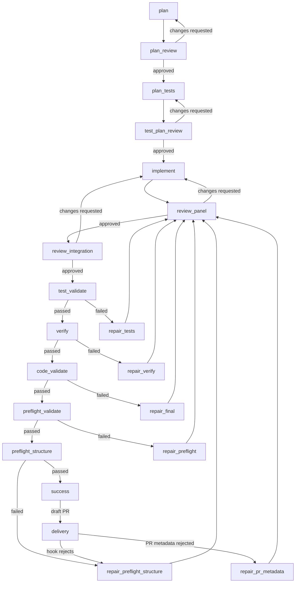
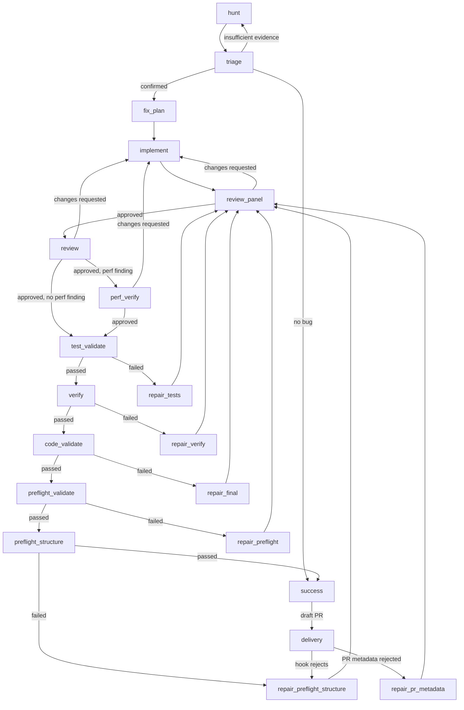

# Workflow Guide

CLI commands and agent tools for running workflows. See [Workflows](workflows.md)
for the concepts (workflow, run record, checks, and worktree).

```bash
mivia workflows list                                                          # list workflows
mivia workflow run feature-delivery --input task="add rate limiter middleware" # start a run
mivia workflow status wfr-ABCDEF1234                                          # watch it
mivia workflow events wfr-ABCDEF1234
mivia workflow deliver wfr-ABCDEF1234 --allow-publish                         # deliver the result
```

## The workflow commands

`mivia workflows` works with the workflow files themselves.

```bash
mivia workflows list                     # list all .mivia/workflows/*.toml
mivia workflows show feature-delivery     # compiled details for one workflow
mivia workflows validate                  # validate all workflow files
mivia workflows validate feature-delivery # validate one workflow file
mivia workflows explain feature-delivery  # step and transition summary
```

`mivia workflow` works with runs. A run is one execution of a workflow.

```bash
# Start a new run
mivia workflow run feature-delivery --input task="add rate limiter middleware"

# List runs
mivia workflow runs
mivia workflow runs --status running --limit 20

# Watch runs until every matched run is terminal
mivia workflow runs --watch

# Resume an interrupted run
mivia workflow resume wfr-ABCDEF1234

# Resume a run that settles at delivery_pending and deliver it in the same call
mivia workflow resume wfr-ABCDEF1234 --allow-publish

# Force-resume a run held by a stale process
mivia workflow resume wfr-ABCDEF1234 --force

# Deep status (active step, attempts, loops, delivery, approvals)
mivia workflow status wfr-ABCDEF1234

# Audit trail (ordered events with timestamps)
mivia workflow events wfr-ABCDEF1234
mivia workflow events wfr-ABCDEF1234 --limit 20 --offset 0

# Approve or reject a human check
mivia workflow approve wfr-ABCDEF1234 approval-1 --actor alice
mivia workflow reject wfr-ABCDEF1234 approval-1 --actor alice --reason "incomplete"

# Deliver a completed run (requires explicit publish approval)
mivia workflow deliver wfr-ABCDEF1234 --allow-publish

# Cancel a running or waiting run
mivia workflow cancel wfr-ABCDEF1234

# Clean up a terminal run
mivia workflow cleanup wfr-ABCDEF1234

# Delete a settled run and its stored record
mivia workflow delete wfr-ABCDEF1234

# Delete a run stranded by a dead executor (claim-free or expired claim only;
# a live executor's fresh claim is still refused)
mivia workflow delete wfr-ABCDEF1234 --force
```

A run without `--allow-publish` finishes as `delivery_pending`. It stays there until someone delivers it with the grant.

## Shared flags

| Flag | Applies to | Default | Description |
|------|------------|---------|-------------|
| `--workspace <dir>` | all commands | `.` | Directory that owns the repository and run store |
| `--config <path>` | `workflow *` commands | user default | Config file path |
| `--force` | `workflow resume`, `workflow delete` | false | Crash recovery override: clear/take over a stale execution claim (resume), or delete a non-terminal run stranded by a dead executor (delete). A live executor's fresh claim is refused either way |
| `--allow-publish` | `workflow run`, `workflow deliver`, `workflow resume` | false | Grant publish approval for the run |
| `--watch` | `workflow runs` | false | Poll every 5s; return when every matched run is terminal |

## Worktrees

A write-capable run works in a worktree; your own files never change. Manually created worktrees use `[worktrees].branch_prefix` (default `mivia/`). Workflow-run worktrees use the fixed `wf/` branch prefix.

```bash
# Create a worktree with a branch, for example mivia/fix
mivia worktree create fix

# Create a worktree from a specific branch
mivia worktree create fix --branch my-base

# List worktrees
mivia worktree list

# Remove a worktree
mivia worktree remove fix

# Adopt an existing worktree that mivia does not manage yet
mivia worktree adopt fix
```

`worktree adopt` takes a worktree that already exists and brings it under mivia's management. `worktree remove` keeps the branch. It removes the worktree folder only. See [Configuration](config.md#worktree-branches) for the prefix rules.

## Agent tools

When `.mivia/workflows/` exists, eight agent tools become available. The model can call these to start, monitor, inspect, deliver, cancel, and delete workflow runs from within a chat session.

Write tools:

| Tool | Purpose |
|------|---------|
| `workflow_run` | Start or resume a workflow run |
| `workflow_deliver` | Deliver a `delivery_pending` run |
| `workflow_cancel` | Cancel a running or waiting run |
| `workflow_delete` | Delete a workflow run's durable record; `force=true` also deletes a non-terminal run stranded by a dead executor (a live claim is still refused) |

Read tools:

| Tool | Purpose |
|------|---------|
| `workflow_list_runs` | List runs with optional status filter and paging |
| `workflow_status` | Deep status for one run (step, attempts, loops, delivery) |
| `workflow_events` | Ordered audit trail for one run (paginated) |
| `workflow_inspect` | One step attempt detail (output, evidence, transition) |

`workflow_inspect` is an agent tool. The CLI has no inspect subcommand. To see a step attempt from the CLI, use `workflow status` for the attempt status and `workflow events` for the trail.

### workflow_run

Start a new run or resume an interrupted run.

| Parameter | Type | Required | Description |
|-----------|------|----------|-------------|
| `workflow` | string | yes (new run) | Workflow name from `.mivia/workflows/` |
| `inputs` | object | varies | Key-value map matching the workflow's input contract |
| `allow_publish` | boolean | no | Allow publishing (default: `false`) |
| `resume` | boolean | no | Resume from durable snapshot (default: `false`) |
| `run_id` | string | yes (resume) | Existing run ID to resume |
| `force` | boolean | no | Clear a stale execution claim when resuming |

Returns: `run_id`, `status`, workflow name, and `resumed` flag.

### workflow_status

Deep status for one workflow run.

| Parameter | Type | Required | Description |
|-----------|------|----------|-------------|
| `run_id` | string | yes | Workflow run ID (form: `wfr-...`) |

Returns: run metadata, active step, version, timestamps, base commit, worktree path, all attempts with their status and transition target, loop iteration counts, delivery records, and approval records.

### workflow_events

Ordered audit trail for one workflow run.

| Parameter | Type | Required | Description |
|-----------|------|----------|-------------|
| `run_id` | string | yes | Workflow run ID |
| `limit` | integer | no | Maximum events to return (default: 50) |
| `offset` | integer | no | Events to skip from start (default: 0) |

Returns: run ID, an event array with sequence number, timestamp, kind, and detail summary, plus pagination metadata.

### workflow_inspect

Inspect one step attempt.

| Parameter | Type | Required | Description |
|-----------|------|----------|-------------|
| `run_id` | string | yes | Workflow run ID |
| `step` | string | yes | Step ID from the workflow definition |
| `attempt` | integer | yes | Attempt number (starts at 1) |

Returns: step attempt status, coordinator run and task references, validated output JSON, evidence selection, and transition decision.

### workflow_list_runs

List active and historical workflow runs.

| Parameter | Type | Required | Description |
|-----------|------|----------|-------------|
| `status` | string | no | Filter by run status (for example: `running`, `succeeded`, `canceled`) |
| `limit` | integer | no | Maximum runs to return (default: 50) |
| `offset` | integer | no | Runs to skip from start (default: 0) |

Returns: a run array with ID, workflow name, status, age, and start timestamp, plus pagination metadata.

### workflow_deliver

Deliver a completed workflow run that is waiting for publication.

| Parameter | Type | Required | Description |
|-----------|------|----------|-------------|
| `run_id` | string | yes | Workflow run ID |
| `allow_publish` | boolean | yes (must be `true`) | Allow publishing |

The tool refuses delivery without explicit `allow_publish=true`. This permission is never implicit. An eligible run without the grant finishes as `delivery_pending` until delivery is called with the grant.

### workflow_cancel

Cancel a running or waiting workflow run. Canceling an already-terminal run is a no-op.

| Parameter | Type | Required | Description |
|-----------|------|----------|-------------|
| `run_id` | string | yes | Workflow run ID |

`delivery_pending` runs must be delivered or cleaned up first. Cancel is refused for those.

## Observability

Three levels of observability:

| Level | How to look | What you see |
|-------|-------------|--------------|
| Status | `workflow_status` or CLI `workflow status` | Active step, attempts, loops, delivery |
| Audit trail | `workflow_events` or CLI `workflow events` | Ordered events with timestamps |
| Deep inspect | `workflow_inspect` (agent tool) | Validated output, evidence, transition decision |

#### Heartbeat cadence

While a workflow step runs, three clocks keep it observable:

- The run claim is refreshed every **100s** (`DefaultClaimLease` / 3).
- The agent sub-step emits a **30s** `subagent_heartbeat`.
- An `agent` step's join watchdog emits a `step_heartbeat` progress event once
  per watchdog tick while the join is live: every `min(bound/8, 30s)`, i.e. up
  to **30s**.

Evidence gates and human gates are not on the heartbeat clock: they emit
`gate_started` (evidence gates) or `approval_requested` (human gates) at start
and `step_completed` at completion, never `step_heartbeat`. The full protocol
is documented in `.mivia/rules/70-long-running-heartbeat.md`.

## The shipped workflow: feature-delivery

The repository ships two workflows: `feature-delivery` and `bug-fix`. This section
documents `feature-delivery`, which runs a full plan, review, implement, and verify cycle:
The next section documents `bug-fix`.



Look at the right side of the diagram. Five gates run the tests and checks. Each failed gate sends the run back for repair. The repairs feed into review_panel again.

### What each part does

The workflow first creates and challenges a change plan. It then creates and
challenges a test plan. Only then does it change files. The implementation
goes through a three-reviewer panel, then a cross-layer integration review.
Each failed automated check routes to a focused repair step, then to the
panel again. A rejected PR title or summary routes to the dedicated metadata
repair step, which rewrites only the metadata and feeds back through the
panel. A run can continue to repair while it stays inside its attempt and
duration limits.

| Steps | Kind | Agent and skill | Purpose |
|------|------|-----------------|---------|
| `plan`, `plan_tests`, `implement`, and all `repair_*` steps | `agent` | `workflow-engineer` + `workflow-feature-delivery` | Plan, write tests, change files, and repair failed evidence. |
| `plan_review`, `test_plan_review`, and `review_integration` | `agent_gate` | `reviewer` + `secure-change` | Challenge plans and review cross-layer effects before automated gates. |
| `review_panel` | `agent_panel` | Three `panel-reviewer` members (`correctness`, `security`, `integration`, each on a distinct provider/model) synthesized by `review-synthesizer` | Independently review the implementation for correctness, security, and architectural fit; the host, not any single model, computes the final verdict. |
| `test_validate`, `verify`, `code_validate`, `preflight_validate`, and `preflight_structure` | `evidence_gate` | Fixed verifier or fixed command | Run the required checks outside the implementation agent. |
| `delivery` | Delivery policy | Not an agent step | Create a draft GitHub pull request after `success`, only after explicit publish approval. |

`review_panel` requires DeepSeek, OpenRouter, and Z.AI credentials, and
`allow_workspace_agent_providers = true` in your own `~/.mivia/mivia.toml`
(see [Credential-routing protection](../security/overview.md#credential-routing-protection)).
Missing policy or credentials fail admission; there is no fallback. See
[Panel review](../architecture/workflows.md#panel-review-steps) for how the
panel step works and
[Panel review data handling](../security/overview.md#panel-review-agent_panel-workflow-steps)
for what each member and the synthesizer can see.

The workflow starts in an isolated worktree. It stores the compiled workflow,
inputs, templates, schemas, and resolved agent bindings in the run record. A
resumed run uses that saved snapshot. It does not silently use later workflow
or agent changes.

### Where the workflow is configured

Use this map when you need to inspect or change the shipped workflow.

| Concern | Source | Change with care |
|---------|--------|------------------|
| Step order, routes, limits, and delivery policy | [`.mivia/workflows/feature-delivery.toml`](../../.mivia/workflows/feature-delivery.toml) | This file is the workflow contract. It cannot grant provider, tool, or publish permission. |
| Agent prompts | [`.mivia/workflows/templates/`](../../.mivia/workflows/templates/) | Each template defines the task for one workflow step. |
| Structured step results | [`.mivia/workflows/schemas/`](../../.mivia/workflows/schemas/) | Routes use these validated fields, not free-form prose. |
| Implementation agent | [`.mivia/agents/workflow-engineer.toml`](../../.mivia/agents/workflow-engineer.toml) | This agent can edit its isolated worktree. It cannot run commands or publish. |
| Review agent | [`.mivia/agents/reviewer.toml`](../../.mivia/agents/reviewer.toml) | This agent is read-only. It returns review evidence. |
| Provider catalog, credentials, worktrees, and subagent limits | [`.mivia/mivia.toml`](../../.mivia/mivia.toml) | Keep API keys in the environment or env file, never in this file. |

### Agent models

The shipped workflow uses two separate model settings. This separation gives
the review gates an independent provider from the implementation steps.

| Agent | Provider | Model | Used by |
|-------|----------|-------|---------|
| `workflow-engineer` | `deepseek` | `deepseek-v4-flash` | Plan, test plan, implementation, and repairs. |
| `reviewer` | `openrouter` | `tencent/hy3-preview` | Plan review, test-plan review, change review, and integration review. |

The agent file selects its provider and model. The provider catalog in
`.mivia/mivia.toml` must declare that model. The run records the resolved
provider and model when the run starts. A resume fails if an agent setting changed.

### Run the shipped workflow in this repository

For this repository, use the helper script. It starts the run in the
background, sets `--allow-publish`, and writes the run log under
`.mivia/run-logs/` by default.

```bash
scripts/run-delivery-workflow.sh docs-workflow-guide <<'TASK'
Document the feature-delivery workflow with its agents, models, and configuration.
TASK
```

Use `mivia workflow status <run-id>` and `mivia workflow events <run-id>` to
monitor the run. Use the general CLI form shown earlier when you do not want
to grant publish approval.

The evidence gates use fixed verifier profiles:

| Gate | What it runs |
|------|-------------|
| `test_validate` | `go test ./...` |
| `verify` | `go vet ./...` and `go build ./cmd/mivia` |
| `code_validate` | `go test -race ./...` |
| `preflight_validate` | `python3 scripts/validate_invariants.py` |
| `preflight_structure` | `python3 scripts/check_go_structure.py --strict --worktree` |

The delivery policy is a draft pull request to GitHub `master`. It requires `--allow-publish`.

## The shipped workflow: bug-fix

The repository ships a second workflow named `bug-fix`. It hunts for at most two confirmed
reachable performance or logic bugs in a scope, triages the findings, fixes them with
regression tests, and delivers a draft pull request:



### What each part does

The `hunt` step runs a read-only hostile audit with the `bug-audit` skill. It reports at
most two confirmed findings, each in the performance or logic class. Every finding must
satisfy the confirmation bar: expected invariant, quoted evidence, concrete reachable path,
and concrete impact. The `triage` gate independently challenges each finding against the
code. It confirms the findings, sends weak findings back to the hunt step for rework, or
declares no bug. A no-bug run reaches the success terminal with no code change; the host
no-diff gate then settles the run without a pull request.

The `fix_plan` and `implement` steps fix the confirmed findings with the smallest change and
add a regression test that fails before the fix. The `review_panel` step is the main code-review
gate: three independent `panel-reviewer` members (`correctness`, `security`, `integration`) on
distinct provider/model pairs, synthesized by `review-synthesizer`, compute the host verdict.
The `review` step is the post-panel gate that echoes `has_perf` to route conditional perf
verification and also loops back to `implement` on changes requested. It flags any change that
makes the verification harness more strict as a violation. When a performance-class finding is
present, the `perf_verify` gate measures the fixed code against the base code and requires the
claimed improvement or a cost-neutral result. The evidence gates then run the same checks as
`feature-delivery`.

All loops are bounded: `triage` to `hunt` (5), `review_panel` to `implement` (8), `review` to
`implement` (8), `perf_verify` to `implement` (4), and each evidence-gate repair loop (5). The
workflow sets no global step or duration cap, so long agentic reviews and tasks can run past 24
hours.

| Steps | Kind | Agent and skill | Purpose |
|-------|------|-----------------|---------|
| `hunt` | `agent` | `auditor` + `bug-audit` | Read-only hostile audit; report at most 2 confirmed findings. |
| `triage` | `agent_gate` | `reviewer` + `bug-audit` | Confirm or reject each finding. |
| `fix_plan`, `implement`, and all `repair_*` steps | `agent` | `workflow-engineer` + `workflow-feature-delivery` | Plan the fix, implement it, and repair failed evidence. |
| `review_panel` | `agent_panel` | Three `panel-reviewer` members (`correctness`, `security`, `integration`, each on a distinct provider/model) synthesized by `review-synthesizer` | Main code-review gate: independently review the fix for correctness, security, and architectural fit; the host, not any single model, computes the final verdict. |
| `review` | `agent_gate` | `reviewer` + `secure-change` | Post-panel gate: echo `has_perf` to route conditional perf verification; loop back to `implement` on changes requested. |
| `perf_verify` | `agent_gate` | `performance` + `performance-review` | Measure the fix when a perf finding is present. |
| `test_validate`, `verify`, `code_validate`, `preflight_validate`, and `preflight_structure` | `evidence_gate` | Fixed verifier or fixed command | Run the required checks outside the implementation agent. |
| `delivery` | Delivery policy | Not an agent step | Create a draft GitHub pull request after `success`, only after explicit publish approval. |

### Inputs and limits

The `task` and `scope` inputs are required and accept up to 1 MiB each. The workflow
contract sets `max_step_attempts = 0` and `max_duration_seconds = 0`: no global step cap
and no run deadline. Execution stays finite because every cycle is a bounded loop.

### Run the bug-fix workflow

Start a run with the direct CLI form and the publish grant:

```bash
mivia workflow run bug-fix --allow-publish \
  --input task="Hunt for confirmed reachable performance or logic bugs in the scope and fix them." \
  --input scope="internal/durablefence"
```

Use `mivia workflow status <run-id>` and `mivia workflow events <run-id>` to monitor the
run. The workflow contract lives in
[`.mivia/workflows/bug-fix.toml`](../../.mivia/workflows/bug-fix.toml). Its templates are
`templates/bugfix-*` and its schemas are `schemas/findings-v1.json`,
`schemas/triage-v1.json`, `schemas/plan-v1.json`,
`schemas/change-summary-v1.json`, `schemas/verification-v1.json`,
`schemas/review-panel-v1.json`, `schemas/panel-review-v1.json`,
`schemas/review-fix-v1.json`, and `schemas/perf-v1.json`.

## Authoring a workflow

A workflow file is TOML, located at `.mivia/workflows/<name>.toml`. The maximum file size is 64 KiB.

Top-level fields:

```toml
version = 1
name = "my-workflow"
description = "What this workflow does"
initial_step = "plan"
```

Inputs:

```toml
[inputs.task]
type = "string"
required = true
max_bytes = 12000
```

Limits:

```toml
[limits]
max_step_attempts = 16    # 0-10000 (0 = unlimited)
max_duration_seconds = 10800  # 0-86400 (0 = no deadline)
max_on_failure_reentries = 3   # 0-1000 (0 = controller default 3)
max_transient_step_retries = 3 # 0-1000 (0 = controller default 3)
```

`max_on_failure_reentries` bounds how many times ONE step may re-enter its
declared non-terminal `on_failure` (repair) target after genuine failures.
It applies to agent steps, `agent_panel` steps (a failed panel attempt re-runs
all of its members), and `evidence_gate` host-failure repairs, counted per
step. `max_transient_step_retries` bounds step-level retries of transient
LLM-provider failures within one attempt, each retry re-running the whole
step with a fresh task identity and a 10s/30s/60s backoff. Leaving either key
at 0 (or omitting it) applies the controller default of 3.

Steps:

```toml
[[steps]]
id = "plan"
kind = "agent"
agent = "workflow-engineer"
skill = "workflow-feature-delivery"
template = "templates/plan.md"
output_schema = "schemas/plan-v1.json"
context = [
  { from = "inputs.task", as = "task", max_bytes = 12000 },
]
on_failure = "failure"
```

| Field | Description |
|-------|-------------|
| `id` | Unique step identifier (cannot be `success` or `failure`) |
| `kind` | One of: `agent`, `agent_gate`, `agent_panel`, `evidence_gate`, `human_gate` |
| `agent` | Agent name for `agent` and `agent_gate` steps; the synthesis agent for `agent_panel` steps |
| `skill` | Skill to invoke under the agent's policy |
| `panel` | `[steps.panel]` table for `agent_panel` steps: `failure_policy = "require_all"`, `require_distinct_bindings = true`, and 2-4 `[[steps.panel.members]]`, each with its own `id`, `agent`, `provider`, `model`, `skill`, `template`, and `output_schema` |
| `verifier` | Verifier name for `evidence_gate` steps (for example: `go-test`) |
| `template` | Prompt template file path |
| `output_schema` | JSON schema file for output validation |
| `max_turns` | Bounds the agent-loop turns each child agent of this step may take: for an `agent_panel` step it bounds every panel member and the panel synthesis child; for `agent` and `agent_gate` steps it bounds the step's own loop. `0` = unlimited (default); range `0-10000`; negative rejected |
| `context` | Evidence bindings from inputs or prior step outputs |
| `on_failure` | Target step or terminal on failure (default: `failure`). A non-terminal target is a repair loop: the step re-enters it after genuine failures, bounded per step by `[limits] max_on_failure_reentries` (default 3). A step may name itself (`on_failure = "review"`) to retry the same step; `agent_panel` steps use this to re-run their members. |

`max_turns` is the per-step turn knob for the agent loops the step launches.
`0` (the default, matching the `[chat] max_steps` config and the agent loop's
`MaxSteps=0` semantics) means unlimited: the loop runs until the model stops
calling tools, the step's deadline, or the run deadline. A positive value caps
the loop, and the compiler rejects a negative value. Panel members and the
panel synthesis child share the step's value; the read-only panel reviews in
this repo rely on the unlimited default because deep reviews of large packages
outgrew a fixed turn cap (the old hardcoded `max_steps (16)` failure).

Context bindings pass typed evidence between steps:

```toml
context = [
  { from = "inputs.task", as = "task", max_bytes = 12000 },
  { from = "steps.plan.output", as = "plan", max_bytes = 24000 },
  { from = "steps.review.output", as = "review_findings", max_bytes = 16000, optional = true },
]
```

Transitions route based on step completion status and output schema fields:

```toml
[[transitions]]
from = "plan"
to = "plan_review"
match = { status = "succeeded" }

[[transitions]]
from = "plan_review"
to = "plan"
match = { status = "succeeded", output = { verdict = "changes_requested" } }
loop = "plan_review_repair"
max_iterations = 5
```

| Field | Description |
|-------|-------------|
| `from` | Source step ID |
| `to` | Target step ID or `success` / `failure` terminal |
| `match.status` | Step completion status to match |
| `match.output` | Output field values to match (no expressions, regexes, or negation) |
| `loop` | Named loop for back-edges (globally unique) |
| `max_iterations` | Loop cap: `>0` (max 1000) or `-1` (unlimited) |

Use a finite `max_iterations` for repair loops. A bounded loop enables the
controller's stall guard: when a review gate reproduces the same findings set
across several rounds, the run fails with a durable "no progress" cause
instead of burning the loop budget. An unbounded loop (`-1`) disables that
guard, so a review finding the agents cannot fix (for example one that needs a
host action) loops until the run duration bound stops it.

A transition matches only a closed attempt status and declared output-schema fields. Zero or multiple matches fails closed.

Delivery:

```toml
[delivery]
kind = "pull_request"
mode = "draft"
provider = "github"
base = "master"
title_template = "feat: {{ inputs.task }}"
commit_message_template = "feat(agent): workflow delivery\n\nDelivers: {{ inputs.task }}"
```

| Field | Values |
|-------|--------|
| `kind` | `pull_request` |
| `mode` | `none`, `draft`, `ready` |
| `provider` | `github` |
| `base` | Target branch |
| `title_template` | Go text/template for PR title |
| `commit_message_template` | Go text/template for commit message |
| `on_failure` | Step to return to when delivery fails for a repairable reason |
| `pr_title_policy` | Relative path to the project PR-title policy file (optional; default: `.mivia/policy/pr-title.toml`) |
| `on_pr_metadata_failure` | Step to return to when the agent PR title or summary fails the policy check (optional; default: `on_failure`) |
| `on_diff_size_failure` | Step to return to when the delivered diff exceeds the stacking `hard_lines` limit (optional; default: `on_failure`). The step shrinks or splits the chunk so the diff fits; the run is never failed for size alone |
| `deliver_plan_run` | Publish a stacking plan run's own PR after its chunk stack has been driven. Default `false`: the plan run settles `succeeded` and nothing is published for it — the chunk PRs carry the work, and the plan and its artifacts stay recorded in the ledger |

Publication requires the invoking user to grant `--allow-publish`. Without the grant, an eligible run finishes as `delivery_pending`.

For a stacking workflow, the plan-mode run is the stack root, not the deliverable. When a multi-chunk plan run finishes, its chunk stack is driven to completion first; only then does the host decide whether to publish the plan run itself. By default (`deliver_plan_run = false`) it does not: the plan run settles `succeeded` with its plan and artifacts recorded in the ledger, and the chunk PRs are the published work. Set `delivery.deliver_plan_run = true` to also publish the plan run's own PR; the stack still drives before publication, and the publish grant still applies.

Delivery runs after the success terminal, outside the step graph. A delivery
that fails therefore has no route back into the workflow, and the run stops
with all of its work done. `on_failure` gives it that route.

Set `on_failure` to the step that repairs the cause. A commit hook that refuses
the change is the usual cause. The run records the failure, returns to that
step, repairs the change, reaches the success terminal again, and delivers
again. The cycle is bounded, so a cause the step cannot fix does not repeat for
ever.

A transport fault does not go to that step. An unreachable remote or a failed
push is not a condition in the change, and no agent can repair it, so the run
stays at `delivery_pending` and a later delivery succeeds.

If `on_failure` is empty, the run holds at `delivery_pending` for a person.

## PR title and summary policy

The workflow change-summary output requires two agent-provided fields.
`pr_title` is the custom PR title. It is 1 to 256 characters. `pr_summary`
is the PR summary. It has exactly two sentences per the project policy.

A project can define a policy file at `.mivia/policy/pr-title.toml`. The
file is optional. When it is absent, no policy checks run. The `[delivery]`
section can name a different path with `pr_title_policy`.

The policy file has a `[title]` section and a `[summary]` section.

The `[title]` section supports:

| Field | Meaning |
|-------|---------|
| `pattern` | RE2 regex for the title. It can carry an optional `(?P<scope>...)` named group. |
| `min_chars` | Minimum title length. `0` means unset. |
| `max_chars` | Maximum title length. `0` means unset. |
| `scopes` | Allowed scope values. |

The `[summary]` section supports:

| Field | Meaning |
|-------|---------|
| `required` | Whether the summary is required. |
| `min_chars` | Minimum summary length. `0` means unset. |
| `max_chars` | Maximum summary length. `0` means unset. |
| `min_sentences` | Minimum sentence count. `0` means unset. |
| `max_sentences` | Maximum sentence count. `0` means unset. |

The sentence-boundary rule is deterministic. A boundary is a terminator
(`.`, `!`, `?`) followed by whitespace and an uppercase letter, or by the
end of the text. Abbreviations and version numbers do not split a sentence.

The title resolution order is fixed. Use the agent `pr_title` when it is
non-empty. Otherwise use the rendered `title_template` fallback.

The host validates the resolved title and the summary against the policy.
Validation runs after the no-diff gate and before any commit, push, or PR
create. A violation is a repairable `PRMetadataError`. The run routes to the
`on_pr_metadata_failure` step. The feature-delivery workflow uses a dedicated
`repair_pr_metadata` step.

The repair step receives the failure text as a host-injected context
binding `delivery.failure`. The template renders it as
`{{ evidence.delivery_hint }}`. The agent never fetches the hint. The PR body
includes the agent `pr_summary` followed by the standard provenance block.

## Run statuses

| Status | Meaning |
|--------|---------|
| `pending` | Admitted, not started |
| `running` | Working |
| `waiting_approval` | Held at a human gate |
| `delivery_pending` | Reached the success terminal; waiting to publish |
| `delivery_failed` | Publication was refused |
| `succeeded` | Finished and delivered |
| `failed` | Stopped with a cause |
| `canceled` | Stopped by a person |
| `timed_out` | Passed its duration limit |

`succeeded`, `failed`, `canceled`, and `timed_out` are terminal. `running` and
`waiting_approval` are resumable. `delivery_pending` and `delivery_failed` can
return to `running` through the delivery repair route above.

## Trust

A workflow file is untrusted repository input. Anyone can edit it. It may name an existing agent or verifier, but it cannot define or override:

- a model provider, endpoint, credential, or tool allowlist;
- a shell command, URL, environment variable, or secret;
- a Git base target outside runtime policy;
- publish permission.

A reviewer must return schema-valid structured evidence. Prose is never a routing signal. See [Workflows](workflows.md#trust-what-a-workflow-file-can-and-cannot-do) for the full model.

Workflow agent steps run inside an isolated worktree with a restricted tool surface. Their write tools honor the project write-path blocklist (`[tools].write_path_blocklist` in the config that started the run). Two paths are blocked by default: `.git` and `.mivia/mivia.toml`. The blocklist key adds more; `[tools].write_path_blocklist_remove` removes entries, including the two defaults, which is a trust decision (an agent that can edit the config or Git metadata can remove its own restrictions or bypass hook gates). A project that omits the key leaves `.mivia/agents`, `.mivia/policy`, `.mivia/rules`, `.mivia/skills`, `.mivia/workflows`, and Go module files writable by workflow agents, including the workflow definition itself. The interactive session is not bound by the blocklist. See [Configuration](config.md#write-path-blocklist).

### Blocked writes are a host problem, never a review failure

Workflow agent steps can never write a blocklisted path, so a task that demands one cannot be
delivered by the workflow. The harness refuses such a task at admission: `mivia workflow run`
rejects an input that instructs a write to a blocklisted path before any agent runs, with a
diagnostic naming the path. If a blocked write is still recorded mid-run (the change summary's
`blocked_paths`, a claimed `files_changed` entry, or a review finding demanding a blocked-path
edit), the run settles terminal as `failed` with an honest `workflow blocked: ...` cause naming
the path — the review gate is never the failure sink for an execution deadlock, and the repair
loop never spins on an unsatisfiable demand.

Fixing a workflow definition (`.mivia/workflows/`), a policy, or any other blocklisted surface is
a root-owned change: execute it from the interactive session (which is not bound by the
blocklist), not as a `bug-fix`/`feature-delivery` run.

## How a run is checked before it starts

Before a run starts, the compiler checks the workflow file:

1. All steps are reachable from the initial step.
2. No duplicate match criteria per source step.
3. Loop iteration bounds are valid.
4. No unbounded cycles without global limits.
5. Context bindings are valid, with no path traversal, and byte bounds hold.
6. Verifier names are valid for evidence gate steps.
7. On-failure targets reference declared steps or terminals.
8. Delivery config is valid: kind, mode, provider, and base.
9. No input instructs a write to a write-blocklisted path (refused at admission with a diagnostic naming the path; route the change through the interactive session instead).

## Resume

Interrupted runs can be resumed from the durable run-record snapshot. The snapshot contains the compiled workflow, templates, schemas, inputs, and resolved agent digests. Use `--force` to clear a stale run claim.

## Stacking small PRs

A workflow with a `[stacking]` section opts into the stacked small-PR engine. The engine decomposes work into chunks, delivers each as a small PR, and merges them incrementally. See [Workflow architecture](../architecture/workflows.md#stacking-small-pr-delivery) for the engine design.

### Authoring `[stacking]`

Add a `[stacking]` section to the workflow TOML. All keys are optional; omitted values take the global defaults.

```toml
[stacking]
enabled = true          # default true; set false to opt out
plan_step = "fix_plan"  # optional; inferred from the implement step's context binding
implement_step = "implement"  # optional; inferred from the change-summary schema or id "implement"
max_chunks = 12         # default 12
soft_lines = 200        # default 200
hard_lines = 400        # default 400
max_files = 5           # default 5
merge_policy = "approve" # "approve" (default) or "auto"
max_total_chunks = 200        # default 200; ceiling across all decompose waves of one plan
max_wave_chunks = 12          # default 12; ceiling per single decompose call
max_concurrent_chunks = 4     # default 4; chunk runs the driver admits and drives at once
```

Explicit step references are validated at compile time (unknown step, out-of-range thresholds, invalid merge policy). When the section is absent, stacking is enabled with the global defaults and inference is best-effort — existing workflows compile unchanged.

`max_concurrent_chunks` is enforced: it bounds how many chunk runs `stack drive` admits and drives at once (see "Concurrent wave execution" below). `max_total_chunks` is enforced across every decompose wave of one stack: the driver refuses to admit a continuation wave that would push the total chunk count over it, with a clear error rather than a silent truncation. `max_wave_chunks` is accepted and validated but not yet enforced as a distinct per-call cap — a workflow's declared `max_chunks` is still what each individual decompose call is checked against; `max_wave_chunks` exists to let a workflow state its intended per-call limit for when that distinction lands.

### Incremental decompose (large changes)

When a change needs more chunks than fit in one `decompose` call, decompose can plan only the next wave and declare `has_more`/`remaining_scope` in its output (see `.mivia/workflows/templates/decompose.md`). Once every currently-known chunk in the stack has merged, if the latest wave declared `has_more`, `stack drive` automatically admits a fresh run that starts directly at the `decompose` step (`stack_mode = "decompose_continue"`), seeded with the prior wave's `remaining_scope` text instead of the original plan artifact, and folds its chunks into the same stack. This repeats until a wave declares no more scope, `max_total_chunks` is reached, or a wave fails. Most plans fit in one wave and never trigger this path.

### What a plan-mode run does

A plan-mode run starts a stacking-enabled workflow without `stack_mode`. It:

1. Executes the workflow's own planning steps (hunt/triage for bug-fix; plan for feature-delivery).
2. Runs the engine-injected `decompose` step, which produces a chunk plan (`chunk-plan-v1.json`).
3. Runs the engine-injected `chunk_plan_validate` gate, which deterministically checks the plan (disjoint files, size limits, DAG, tests).
4. Routes:
   - `no_bug` / no changes → `success` without a plan (driver reports "nothing to stack").
   - `single` → continues inline to `implement_step` (today's single-PR path).
   - `multi` → `success` with the plan as run output (the driver uses this plan).

The plan run id becomes the stack id. Use `mivia stack plan <workflow>` to start one.

### The `mivia stack` commands

```bash
mivia stack plan <workflow> [--workspace dir] [--config path]
mivia stack drive <workflow> [--stack <plan-run-id>] [--workspace dir] [--config path]
mivia stack status <workflow> [--stack <plan-run-id>] [--workspace dir] [--config path]
```

| Command | What it does |
|---------|-------------|
| `stack plan` | Starts a plan-mode run. The plan run id is the stack id. |
| `stack drive` | Reconciles the stack, admits the next ready wave of chunk runs, applies the merge policy, and runs a final integration run. Resumable on restart. |
| `stack status` | Prints per-chunk status (chunk id, status, run ref, PR number, depends_on) from the task ledger. |

### Concurrent wave execution

Each drive pass computes the next admission wave — every chunk whose dependencies have all merged. Chunks in the same wave are independent by construction, so the driver admits and drives the whole wave concurrently, bounded by `max_concurrent_chunks` (default 4). Each chunk runs in its own isolated worktree, and a per-chunk atomic claim guarantees exactly one admission per chunk even when several are dispatched at once — re-running `stack drive` after a restart or a partial failure never double-admits a chunk already in flight.

Only chunk *execution* is concurrent. Merging still happens one PR at a time, in dependency order — multiple chunks can reach `delivery_pending` or get published within the same drive pass, but they merge one at a time.

### Merge policies

| Policy | Behavior |
|--------|----------|
| `approve` (default, policy A) | Each PR stays at `delivery_pending` until a human grants publish (`mivia workflow deliver <run-id> --allow-publish`). The driver halts at the publish grant and waits. |
| `auto` (policy B) | The driver auto-delivers green PRs and continues. The publish grant remains the single human checkpoint. |

### Halt-on-failure

Any chunk that fails terminally (exhausted retry budget) halts the stack. The driver returns an error naming the chunk and the cause. The stack does not continue past a terminal failure.

### Recovery on restart

Every `stack drive` start runs idempotent reconciliation: it loads chunk tasks from the task ledger, reconciles each non-terminal task against its run and git merge state, and schedules the next admission wave. Stable admission keys (`<stack-id>:<chunk-id>`) ensure that re-admission after a restart returns the same run — no duplicate runs, no lost tasks. Reconciliation is derived from durable state only (task ledger, run ledger, git merge state).

## See also

- [Workflow product overview](workflows.md)
- [Workflow architecture](../architecture/workflows.md)
- [Configuration](config.md)
- [Security and privacy](../security/overview.md)
