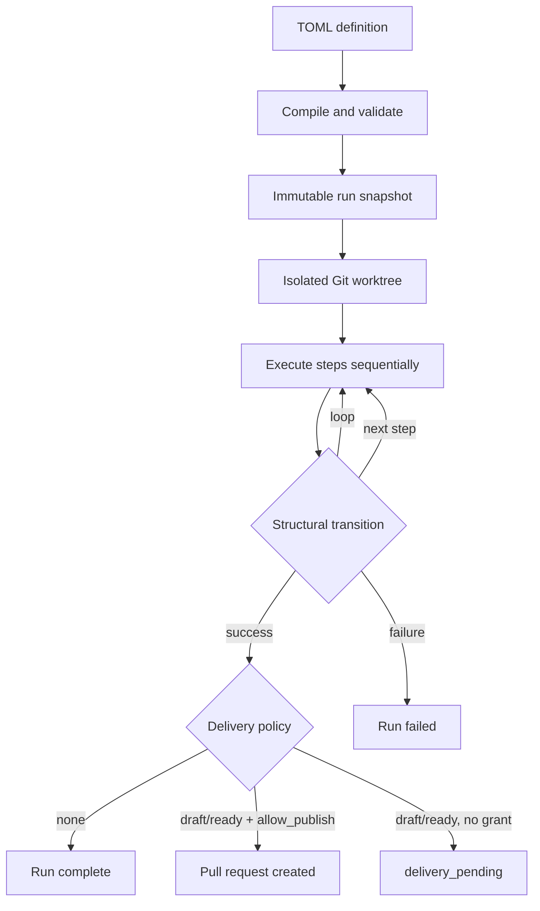
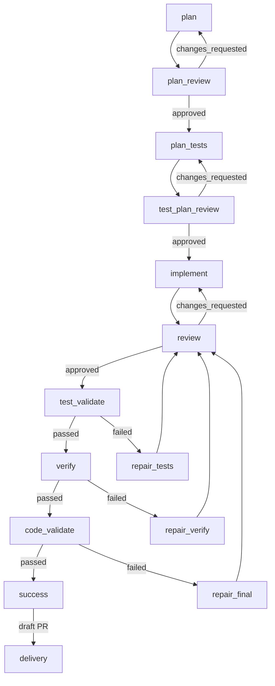

# Workflow Guide

How to use, author, and monitor Mivia workflows.

## What is a workflow

A workflow is a repository-authored state machine in `.mivia/workflows/<name>.toml`. It selects agents and host capabilities, then declares a bounded sequential process with typed evidence gates and optional repair loops. The host controls credentials, tools, Git state, and publication.

Workflows run in an isolated Git worktree. They never write to your checkout.

## Quick start

### Discover available workflows

```bash
mivia workflows list                     # list all .mivia/workflows/*.toml
mivia workflows show feature-delivery     # compiled details for one workflow
mivia workflows validate                  # validate all workflow files
mivia workflows validate feature-delivery # validate one workflow file
mivia workflows explain feature-delivery  # step/transition summary
```

### Run a workflow

```bash
# Start a new run
mivia workflow run feature-delivery --input task="add rate limiter middleware"

# Resume an interrupted run
mivia workflow resume wfr-ABCDEF1234

# Force-resume a run held by a stale process
mivia workflow resume wfr-ABCDEF1234 --force
```

### Monitor a running workflow

```bash
# Deep status (active step, attempts, loops, delivery, approvals)
mivia workflow status wfr-ABCDEF1234

# Audit trail (ordered events with timestamps)
mivia workflow events wfr-ABCDEF1234
mivia workflow events wfr-ABCDEF1234 --limit 20 --offset 0

# Inspect one step attempt (validated output, evidence, transition)
mivia workflow inspect wfr-ABCDEF1234 plan 1
```

### List all workflow runs

```bash
mivia workflows list                          # workflows in .mivia/workflows/
```

Workflow runs are tracked in the durable ledger. Use the agent tools
(`workflow_list_runs`, `workflow_status`, `workflow_events`, `workflow_inspect`)
from within an agent session to query run state without leaving the chat.

### Approve or reject a human gate

```bash
# Human gate steps require explicit approval or rejection
mivia workflow approve wfr-ABCDEF1234 approval-1 --actor operator
mivia workflow reject wfr-ABCDEF1234 approval-1 --actor operator --reason "incomplete"
```

### Deliver a completed workflow

```bash
# Deliver a pull request (requires explicit publish grant)
mivia workflow deliver wfr-ABCDEF1234 --allow-publish

# A run without --allow-publish finishes as delivery_pending
```

### Cancel or clean up

```bash
mivia workflow cancel wfr-ABCDEF1234    # cancel a running or waiting run
mivia workflow cleanup wfr-ABCDEF1234   # clean up a terminal run
```

## Shared flags

| Flag | Applies to | Default |
|------|------------|---------|
| `--workspace <dir>` | all commands | `.` |
| `--config <path>` | `workflow *` commands | user default |
| `--force` | `workflow resume` | false |

## Agent tools

When `.mivia/workflows/` exists, seven agent tools become available. The model can call these to start, monitor, inspect, deliver, and cancel workflow runs from within a chat session.

### Write tools

| Tool | Purpose |
|------|---------|
| `workflow_run` | Start or resume a workflow run |
| `workflow_deliver` | Deliver a `delivery_pending` run |
| `workflow_cancel` | Cancel a running or waiting run |

### Read tools

| Tool | Purpose |
|------|---------|
| `workflow_list_runs` | List runs with optional status filter and paging |
| `workflow_status` | Deep status for one run (step, attempts, loops, delivery) |
| `workflow_events` | Ordered audit trail for one run (paginated) |
| `workflow_inspect` | One step attempt detail (output, evidence, transition) |

### workflow_run

Start a new run or resume an interrupted run.

| Parameter | Type | Required | Description |
|-----------|------|----------|-------------|
| `workflow` | string | yes (new run) | Workflow name from `.mivia/workflows/` |
| `inputs` | object | varies | Key-value map matching the workflow's input contract |
| `allow_publish` | boolean | no | Grant publication permission (default: `false`) |
| `resume` | boolean | no | Resume from durable snapshot (default: `false`) |
| `run_id` | string | yes (resume) | Existing run ID to resume |
| `force` | boolean | no | Clear a stale execution claim when resuming |

Returns: `run_id`, `status`, `workflow` name, `resumed` flag.

### workflow_status

Deep status for one workflow run.

| Parameter | Type | Required | Description |
|-----------|------|----------|-------------|
| `run_id` | string | yes | Workflow run ID (form: `wfr-...`) |

Returns: run metadata, active step, version, timestamps, base commit, worktree path, all attempts with their status and transition target, loop iteration counts, delivery records, and approval records.

### workflow_events

Ordered audit trail for one workflow run.

| Parameter | Type | Required | Description |
|-----------|------|----------|-------------|
| `run_id` | string | yes | Workflow run ID |
| `limit` | integer | no | Maximum events to return (default: 50) |
| `offset` | integer | no | Events to skip from start (default: 0) |

Returns: run ID, event array with sequence number, timestamp, kind, and detail summary, plus pagination metadata.

### workflow_inspect

Inspect one step attempt.

| Parameter | Type | Required | Description |
|-----------|------|----------|-------------|
| `run_id` | string | yes | Workflow run ID |
| `step` | string | yes | Step ID from the workflow definition |
| `attempt` | integer | yes | Attempt number (starts at 1) |

Returns: step attempt status, coordinator run and task references, validated output JSON, evidence selection, and transition decision.

### workflow_list_runs

List active and historical workflow runs.

| Parameter | Type | Required | Description |
|-----------|------|----------|-------------|
| `status` | string | no | Filter by run status (for example: `running`, `succeeded`, `canceled`) |
| `limit` | integer | no | Maximum runs to return (default: 50) |
| `offset` | integer | no | Runs to skip from start (default: 0) |

Returns: run array with ID, workflow name, status, age, and start timestamp, plus pagination metadata.

### workflow_deliver

Deliver a completed workflow run that is waiting for publication.

| Parameter | Type | Required | Description |
|-----------|------|----------|-------------|
| `run_id` | string | yes | Workflow run ID |
| `allow_publish` | boolean | yes (must be `true`) | Grant publication permission |

The tool refuses delivery without explicit `allow_publish=true`. This permission is never implicit. An eligible run without the grant finishes as `delivery_pending` until delivery is called with the grant.

### workflow_cancel

Cancel a running or waiting workflow run. Idempotent: canceling an already-terminal run is a no-op.

| Parameter | Type | Required | Description |
|-----------|------|----------|-------------|
| `run_id` | string | yes | Workflow run ID |

`delivery_pending` runs must be delivered or cleaned up first; cancel is refused for those.

## Authoring a workflow

### File location and format

Workflow files are TOML, located at `.mivia/workflows/<name>.toml`. Maximum file size is 64 KiB.

### Top-level fields

```toml
version = 1
name = "my-workflow"
description = "What this workflow does"
initial_step = "plan"
```

### Inputs

Declare typed inputs that callers must supply.

```toml
[inputs.task]
type = "string"
required = true
max_bytes = 12000
```

### Limits

Bound the overall run duration and step attempts.

```toml
[limits]
max_step_attempts = 16    # 0-100
max_duration_seconds = 10800  # 0-86400
```

### Steps

Four step kinds:

| Kind | Purpose |
|------|---------|
| `agent` | Execute an agent task |
| `agent_gate` | Independent review by an agent |
| `evidence_gate` | Deterministic verification by a registered verifier |
| `human_gate` | Require human approval or rejection |

```toml
[[steps]]
id = "plan"
kind = "agent"
agent = "workflow-engineer"
skill = "workflow-feature-delivery"
template = "templates/plan.md"
output_schema = "schemas/plan-v1.json"
context = [
  { from = "inputs.task", as = "task", max_bytes = 12000 },
]
on_failure = "failure"
```

| Field | Description |
|-------|-------------|
| `id` | Unique step identifier (cannot be `success` or `failure`) |
| `kind` | One of: `agent`, `agent_gate`, `evidence_gate`, `human_gate` |
| `agent` | Agent name for `agent` and `agent_gate` steps |
| `skill` | Skill to invoke under the agent's policy |
| `verifier` | Verifier name for `evidence_gate` steps (for example: `go-test`) |
| `template` | Prompt template file path |
| `output_schema` | JSON schema file for output validation |
| `context` | Evidence bindings from inputs or prior step outputs |
| `on_failure` | Target step or terminal on failure (default: `failure`) |

Context bindings pass typed evidence between steps:

```toml
context = [
  { from = "inputs.task", as = "task", max_bytes = 12000 },
  { from = "steps.plan.output", as = "plan", max_bytes = 24000 },
  { from = "steps.review.output", as = "review_findings", max_bytes = 16000, optional = true },
]
```

### Transitions

Transitions route based on step completion status and output schema fields.

```toml
[[transitions]]
from = "plan"
to = "plan_review"
match = { status = "succeeded" }

[[transitions]]
from = "plan_review"
to = "plan_tests"
match = { status = "succeeded", output = { verdict = "approved" } }

[[transitions]]
from = "plan_review"
to = "plan"
match = { status = "succeeded", output = { verdict = "changes_requested" } }
loop = "plan_review_repair"
max_iterations = -1
```

| Field | Description |
|-------|-------------|
| `from` | Source step ID |
| `to` | Target step ID or `success` / `failure` terminal |
| `match.status` | Step completion status to match |
| `match.output` | Output field values to match (no expressions, regexes, or negation) |
| `loop` | Named loop for back-edges (globally unique) |
| `max_iterations` | Loop cap: `>0` (max 100) or `-1` (unlimited) |

A transition matches only a closed attempt status and declared output-schema fields. Zero or multiple matches fails closed.

### Delivery

Optional pull-request delivery at the terminal `success` state.

```toml
[delivery]
kind = "pull_request"
mode = "draft"
provider = "github"
base = "master"
title_template = "feat: {{ inputs.task }}"
commit_message_template = "feat(agent): workflow delivery\n\nDelivers: {{ inputs.task }}"
```

| Field | Values |
|-------|--------|
| `kind` | `pull_request` |
| `mode` | `none`, `draft`, `ready` |
| `provider` | `github` |
| `base` | Target branch |
| `title_template` | Go text/template for PR title |
| `commit_message_template` | Go text/template for commit message |

Publication requires the invoking user to grant `--allow-publish`. Without the grant, an eligible run finishes as `delivery_pending`.

## Execution flow

### Compilation

Before a run starts, the compiler performs eight validation checks:

1. Graph reachability: all steps reachable from the initial step
2. Transition overlaps: no duplicate match criteria per source step
3. Loop constraints: iteration bounds are valid
4. Cycle detection: no unbounded cycles without global limits
5. Context bindings: valid references, no path traversal, byte bounds
6. Verifier names: valid format for evidence gate steps
7. On-failure targets: reference declared steps or terminals
8. Delivery config: valid kind, mode, provider, and base

### Run lifecycle



A loop is a fresh, numbered step attempt. It is never a coordinator DAG back-edge.

### Run isolation

A write-capable run creates a host-owned Git worktree at a recorded base commit. The run never writes to your checkout. Resume uses the immutable snapshot, not a changed workspace file.

### Resume

Interrupted runs (process crash, terminal close, or explicit cancel) can be resumed from the durable ledger snapshot. The snapshot contains the compiled workflow, templates, schemas, inputs, and resolved agent digests. Use `--force` to clear a stale execution claim.

### Observability

Three levels of observability:

| Level | Tool | Detail |
|-------|------|--------|
| Status | `workflow_status` / CLI `status` | Active step, attempts, loops, delivery |
| Audit trail | `workflow_events` / CLI `events` | Ordered events with timestamps |
| Deep inspect | `workflow_inspect` / CLI `inspect` | Validated output, evidence, transition decision |

## Trust model

A workflow file is untrusted repository input. It may name an existing agent or verifier, but it cannot define or override:

- A model provider, endpoint, credential, or tool allowlist
- A shell command, URL, environment variable, or secret
- A Git base target outside runtime policy
- Publication permission

A reviewer must return schema-valid structured evidence. Prose is never a routing signal.

## Shipped workflow: feature-delivery

The `feature-delivery` workflow implements a full ADLC cycle:



### Steps

| Step | Kind | Purpose |
|------|------|---------|
| `plan` | agent | Create implementation plan |
| `plan_review` | agent_gate | Independent plan review (secure-change) |
| `plan_tests` | agent | Plan test coverage |
| `test_plan_review` | agent_gate | Independent test plan review |
| `implement` | agent | Implement with tests |
| `review` | agent_gate | Independent code review |
| `repair_tests` | agent | Fix failing tests |
| `repair_verify` | agent | Fix verification failures |
| `repair_final` | agent | Fix final gate failures |
| `test_validate` | evidence_gate | Run `go-test` verifier |
| `verify` | evidence_gate | Run `go-verify` verifier |
| `code_validate` | evidence_gate | Run `go-final` verifier |

### Repair loops

Six repair loops with unlimited iterations (bounded by `max_step_attempts = 16`):

1. `plan_review_repair`: plan review → plan (plan changes requested)
2. `test_plan_review_repair`: test plan review → plan tests
3. `review_repair`: code review → implement (code changes requested)
4. `test_repair`: test validation → repair tests → review
5. `verify_repair`: verify → repair verify → review
6. `final_repair`: final validation → repair final → review

### Delivery

Mode: `draft` PR to GitHub `master`. Requires `--allow-publish`.

## See also

- [Workflow product overview](workflows.md)
- [Workflow architecture](../architecture/workflows.md)
- [Configuration](config.md)
- [Security and privacy](../security/overview.md)
