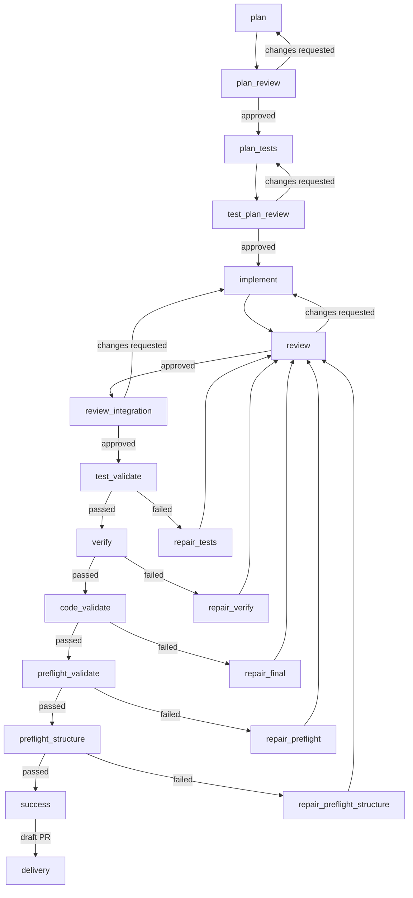

# Workflow Guide

CLI commands and agent tools for running workflows. See [Workflows](workflows.md)
for the concepts (workflow, run record, checks, and worktree).

```bash
mivia workflows list                                                          # list workflows
mivia workflow run feature-delivery --input task="add rate limiter middleware" # start a run
mivia workflow status wfr-ABCDEF1234                                          # watch it
mivia workflow events wfr-ABCDEF1234
mivia workflow deliver wfr-ABCDEF1234 --allow-publish                         # deliver the result
```

## The workflow commands

`mivia workflows` works with the workflow files themselves.

```bash
mivia workflows list                     # list all .mivia/workflows/*.toml
mivia workflows show feature-delivery     # compiled details for one workflow
mivia workflows validate                  # validate all workflow files
mivia workflows validate feature-delivery # validate one workflow file
mivia workflows explain feature-delivery  # step and transition summary
```

`mivia workflow` works with runs. A run is one execution of a workflow.

```bash
# Start a new run
mivia workflow run feature-delivery --input task="add rate limiter middleware"

# List runs
mivia workflow runs
mivia workflow runs --status running --limit 20

# Resume an interrupted run
mivia workflow resume wfr-ABCDEF1234

# Resume a run that settles at delivery_pending and deliver it in the same call
mivia workflow resume wfr-ABCDEF1234 --allow-publish

# Force-resume a run held by a stale process
mivia workflow resume wfr-ABCDEF1234 --force

# Deep status (active step, attempts, loops, delivery, approvals)
mivia workflow status wfr-ABCDEF1234

# Audit trail (ordered events with timestamps)
mivia workflow events wfr-ABCDEF1234
mivia workflow events wfr-ABCDEF1234 --limit 20 --offset 0

# Approve or reject a human check
mivia workflow approve wfr-ABCDEF1234 approval-1 --actor alice
mivia workflow reject wfr-ABCDEF1234 approval-1 --actor alice --reason "incomplete"

# Deliver a completed run (requires explicit publish approval)
mivia workflow deliver wfr-ABCDEF1234 --allow-publish

# Cancel a running or waiting run
mivia workflow cancel wfr-ABCDEF1234

# Clean up a terminal run
mivia workflow cleanup wfr-ABCDEF1234

# Delete a settled run and its stored record
mivia workflow delete wfr-ABCDEF1234
```

A run without `--allow-publish` finishes as `delivery_pending`. It stays there until someone delivers it with the grant.

## Shared flags

| Flag | Applies to | Default |
|------|------------|---------|
| `--workspace <dir>` | all commands | `.` |
| `--config <path>` | `workflow *` commands | user default |
| `--force` | `workflow resume` | false |
| `--allow-publish` | `workflow run`, `workflow deliver`, `workflow resume` | false |

## Worktrees

A write-capable run works in a worktree; your own files never change. Manually created worktrees use `[worktrees].branch_prefix` (default `mivia/`). Workflow-run worktrees use the fixed `wf/` branch prefix.

```bash
# Create a worktree with a branch, for example mivia/fix
mivia worktree create fix

# Create a worktree from a specific branch
mivia worktree create fix --branch my-base

# List worktrees
mivia worktree list

# Remove a worktree
mivia worktree remove fix

# Adopt an existing worktree that mivia does not manage yet
mivia worktree adopt fix
```

`worktree adopt` takes a worktree that already exists and brings it under mivia's management. `worktree remove` keeps the branch. It removes the worktree folder only. See [Configuration](config.md#worktree-branches) for the prefix rules.

## Agent tools

When `.mivia/workflows/` exists, eight agent tools become available. The model can call these to start, monitor, inspect, deliver, cancel, and delete workflow runs from within a chat session.

Write tools:

| Tool | Purpose |
|------|---------|
| `workflow_run` | Start or resume a workflow run |
| `workflow_deliver` | Deliver a `delivery_pending` run |
| `workflow_cancel` | Cancel a running or waiting run |
| `workflow_delete` | Delete a settled workflow run and its durable run record |

Read tools:

| Tool | Purpose |
|------|---------|
| `workflow_list_runs` | List runs with optional status filter and paging |
| `workflow_status` | Deep status for one run (step, attempts, loops, delivery) |
| `workflow_events` | Ordered audit trail for one run (paginated) |
| `workflow_inspect` | One step attempt detail (output, evidence, transition) |

`workflow_inspect` is an agent tool. The CLI has no inspect subcommand. To see a step attempt from the CLI, use `workflow status` for the attempt status and `workflow events` for the trail.

### workflow_run

Start a new run or resume an interrupted run.

| Parameter | Type | Required | Description |
|-----------|------|----------|-------------|
| `workflow` | string | yes (new run) | Workflow name from `.mivia/workflows/` |
| `inputs` | object | varies | Key-value map matching the workflow's input contract |
| `allow_publish` | boolean | no | Allow publishing (default: `false`) |
| `resume` | boolean | no | Resume from durable snapshot (default: `false`) |
| `run_id` | string | yes (resume) | Existing run ID to resume |
| `force` | boolean | no | Clear a stale execution claim when resuming |

Returns: `run_id`, `status`, workflow name, and `resumed` flag.

### workflow_status

Deep status for one workflow run.

| Parameter | Type | Required | Description |
|-----------|------|----------|-------------|
| `run_id` | string | yes | Workflow run ID (form: `wfr-...`) |

Returns: run metadata, active step, version, timestamps, base commit, worktree path, all attempts with their status and transition target, loop iteration counts, delivery records, and approval records.

### workflow_events

Ordered audit trail for one workflow run.

| Parameter | Type | Required | Description |
|-----------|------|----------|-------------|
| `run_id` | string | yes | Workflow run ID |
| `limit` | integer | no | Maximum events to return (default: 50) |
| `offset` | integer | no | Events to skip from start (default: 0) |

Returns: run ID, an event array with sequence number, timestamp, kind, and detail summary, plus pagination metadata.

### workflow_inspect

Inspect one step attempt.

| Parameter | Type | Required | Description |
|-----------|------|----------|-------------|
| `run_id` | string | yes | Workflow run ID |
| `step` | string | yes | Step ID from the workflow definition |
| `attempt` | integer | yes | Attempt number (starts at 1) |

Returns: step attempt status, coordinator run and task references, validated output JSON, evidence selection, and transition decision.

### workflow_list_runs

List active and historical workflow runs.

| Parameter | Type | Required | Description |
|-----------|------|----------|-------------|
| `status` | string | no | Filter by run status (for example: `running`, `succeeded`, `canceled`) |
| `limit` | integer | no | Maximum runs to return (default: 50) |
| `offset` | integer | no | Runs to skip from start (default: 0) |

Returns: a run array with ID, workflow name, status, age, and start timestamp, plus pagination metadata.

### workflow_deliver

Deliver a completed workflow run that is waiting for publication.

| Parameter | Type | Required | Description |
|-----------|------|----------|-------------|
| `run_id` | string | yes | Workflow run ID |
| `allow_publish` | boolean | yes (must be `true`) | Allow publishing |

The tool refuses delivery without explicit `allow_publish=true`. This permission is never implicit. An eligible run without the grant finishes as `delivery_pending` until delivery is called with the grant.

### workflow_cancel

Cancel a running or waiting workflow run. Canceling an already-terminal run is a no-op.

| Parameter | Type | Required | Description |
|-----------|------|----------|-------------|
| `run_id` | string | yes | Workflow run ID |

`delivery_pending` runs must be delivered or cleaned up first. Cancel is refused for those.

## Observability

Three levels of observability:

| Level | How to look | What you see |
|-------|-------------|--------------|
| Status | `workflow_status` or CLI `workflow status` | Active step, attempts, loops, delivery |
| Audit trail | `workflow_events` or CLI `workflow events` | Ordered events with timestamps |
| Deep inspect | `workflow_inspect` (agent tool) | Validated output, evidence, transition decision |

#### Heartbeat cadence

While a workflow step runs, three clocks keep it observable:

- The run claim is refreshed every **100s** (`DefaultClaimLease` / 3).
- The agent sub-step emits a **30s** `subagent_heartbeat`.
- An `agent` step's join watchdog emits a `step_heartbeat` progress event once
  per watchdog tick while the join is live: every `min(bound/8, 30s)`, i.e. up
  to **30s**.

Evidence gates and human gates are not on the heartbeat clock: they emit
`gate_started` (evidence gates) or `approval_requested` (human gates) at start
and `step_completed` at completion, never `step_heartbeat`. The full protocol
is documented in `.mivia/rules/70-long-running-heartbeat.md`.

## The shipped workflow: feature-delivery

The repository ships one workflow named `feature-delivery`. It runs a full plan, review, implement, and verify cycle:



Look at the right side of the diagram. Five gates run the tests and checks. Each failed gate sends the run back for repair. The repairs feed into review again.

### What each part does

The workflow first creates and challenges a change plan. It then creates and
challenges a test plan. Only then does it change files. The reviewer checks the
implementation twice: once for the change and once for cross-layer effects.
Each failed automated check routes to a focused repair step, then to review
again. A run can continue to repair while it stays inside its attempt and
duration limits.

| Steps | Kind | Agent and skill | Purpose |
|------|------|-----------------|---------|
| `plan`, `plan_tests`, `implement`, and all `repair_*` steps | `agent` | `workflow-engineer` + `workflow-feature-delivery` | Plan, write tests, change files, and repair failed evidence. |
| `plan_review`, `test_plan_review`, `review`, and `review_integration` | `agent_gate` | `reviewer` + `secure-change` | Challenge plans and review the change before automated gates. |
| `test_validate`, `verify`, `code_validate`, `preflight_validate`, and `preflight_structure` | `evidence_gate` | Fixed verifier or fixed command | Run the required checks outside the implementation agent. |
| `delivery` | Delivery policy | Not an agent step | Create a draft GitHub pull request after `success`, only after explicit publish approval. |

The workflow starts in an isolated worktree. It stores the compiled workflow,
inputs, templates, schemas, and resolved agent bindings in the run record. A
resumed run uses that saved snapshot. It does not silently use later workflow
or agent changes.

### Where the workflow is configured

Use this map when you need to inspect or change the shipped workflow.

| Concern | Source | Change with care |
|---------|--------|------------------|
| Step order, routes, limits, and delivery policy | [`.mivia/workflows/feature-delivery.toml`](../../.mivia/workflows/feature-delivery.toml) | This file is the workflow contract. It cannot grant provider, tool, or publish permission. |
| Agent prompts | [`.mivia/workflows/templates/`](../../.mivia/workflows/templates/) | Each template defines the task for one workflow step. |
| Structured step results | [`.mivia/workflows/schemas/`](../../.mivia/workflows/schemas/) | Routes use these validated fields, not free-form prose. |
| Implementation agent | [`.mivia/agents/workflow-engineer.toml`](../../.mivia/agents/workflow-engineer.toml) | This agent can edit its isolated worktree. It cannot run commands or publish. |
| Review agent | [`.mivia/agents/reviewer.toml`](../../.mivia/agents/reviewer.toml) | This agent is read-only. It returns review evidence. |
| Provider catalog, credentials, worktrees, and subagent limits | [`.mivia/mivia.toml`](../../.mivia/mivia.toml) | Keep API keys in the environment or env file, never in this file. |

### Agent models

The shipped workflow uses two separate model settings. This separation gives
the review gates an independent provider from the implementation steps.

| Agent | Provider | Model | Used by |
|-------|----------|-------|---------|
| `workflow-engineer` | `deepseek` | `deepseek-v4-flash` | Plan, test plan, implementation, and repairs. |
| `reviewer` | `openrouter` | `tencent/hy3-preview` | Plan review, test-plan review, change review, and integration review. |

The agent file selects its provider and model. The provider catalog in
`.mivia/mivia.toml` must declare that model. The run records the resolved
provider and model when the run starts. A resume fails if an agent setting changed.

### Run the shipped workflow in this repository

For this repository, use the helper script. It starts the run in the
background, sets `--allow-publish`, and writes the run log under
`.mivia/run-logs/` by default.

```bash
scripts/run-delivery-workflow.sh docs-workflow-guide <<'TASK'
Document the feature-delivery workflow with its agents, models, and configuration.
TASK
```

Use `mivia workflow status <run-id>` and `mivia workflow events <run-id>` to
monitor the run. Use the general CLI form shown earlier when you do not want
to grant publish approval.

The evidence gates use fixed verifier profiles:

| Gate | What it runs |
|------|-------------|
| `test_validate` | `go test ./...` |
| `verify` | `go vet ./...` and `go build ./cmd/mivia` |
| `code_validate` | `go test -race ./...` |
| `preflight_validate` | `python3 scripts/validate_invariants.py` |
| `preflight_structure` | `python3 scripts/check_go_structure.py --strict --worktree` |

The delivery policy is a draft pull request to GitHub `master`. It requires `--allow-publish`.

## Authoring a workflow

A workflow file is TOML, located at `.mivia/workflows/<name>.toml`. The maximum file size is 64 KiB.

Top-level fields:

```toml
version = 1
name = "my-workflow"
description = "What this workflow does"
initial_step = "plan"
```

Inputs:

```toml
[inputs.task]
type = "string"
required = true
max_bytes = 12000
```

Limits:

```toml
[limits]
max_step_attempts = 16    # 0-100
max_duration_seconds = 10800  # 0-86400
```

Steps:

```toml
[[steps]]
id = "plan"
kind = "agent"
agent = "workflow-engineer"
skill = "workflow-feature-delivery"
template = "templates/plan.md"
output_schema = "schemas/plan-v1.json"
context = [
  { from = "inputs.task", as = "task", max_bytes = 12000 },
]
on_failure = "failure"
```

| Field | Description |
|-------|-------------|
| `id` | Unique step identifier (cannot be `success` or `failure`) |
| `kind` | One of: `agent`, `agent_gate`, `evidence_gate`, `human_gate` |
| `agent` | Agent name for `agent` and `agent_gate` steps |
| `skill` | Skill to invoke under the agent's policy |
| `verifier` | Verifier name for `evidence_gate` steps (for example: `go-test`) |
| `template` | Prompt template file path |
| `output_schema` | JSON schema file for output validation |
| `context` | Evidence bindings from inputs or prior step outputs |
| `on_failure` | Target step or terminal on failure (default: `failure`) |

Context bindings pass typed evidence between steps:

```toml
context = [
  { from = "inputs.task", as = "task", max_bytes = 12000 },
  { from = "steps.plan.output", as = "plan", max_bytes = 24000 },
  { from = "steps.review.output", as = "review_findings", max_bytes = 16000, optional = true },
]
```

Transitions route based on step completion status and output schema fields:

```toml
[[transitions]]
from = "plan"
to = "plan_review"
match = { status = "succeeded" }

[[transitions]]
from = "plan_review"
to = "plan"
match = { status = "succeeded", output = { verdict = "changes_requested" } }
loop = "plan_review_repair"
max_iterations = -1
```

| Field | Description |
|-------|-------------|
| `from` | Source step ID |
| `to` | Target step ID or `success` / `failure` terminal |
| `match.status` | Step completion status to match |
| `match.output` | Output field values to match (no expressions, regexes, or negation) |
| `loop` | Named loop for back-edges (globally unique) |
| `max_iterations` | Loop cap: `>0` (max 100) or `-1` (unlimited) |

A transition matches only a closed attempt status and declared output-schema fields. Zero or multiple matches fails closed.

Delivery:

```toml
[delivery]
kind = "pull_request"
mode = "draft"
provider = "github"
base = "master"
title_template = "feat: {{ inputs.task }}"
commit_message_template = "feat(agent): workflow delivery\n\nDelivers: {{ inputs.task }}"
```

| Field | Values |
|-------|--------|
| `kind` | `pull_request` |
| `mode` | `none`, `draft`, `ready` |
| `provider` | `github` |
| `base` | Target branch |
| `title_template` | Go text/template for PR title |
| `commit_message_template` | Go text/template for commit message |
| `on_failure` | Step to return to when delivery fails for a repairable reason |
| `pr_title_policy` | Relative path to the project PR-title policy file (optional; default: `.mivia/policy/pr-title.toml`) |
| `on_pr_metadata_failure` | Step to return to when the agent PR title or summary fails the policy check (optional; default: `on_failure`) |

Publication requires the invoking user to grant `--allow-publish`. Without the grant, an eligible run finishes as `delivery_pending`.

Delivery runs after the success terminal, outside the step graph. A delivery
that fails therefore has no route back into the workflow, and the run stops
with all of its work done. `on_failure` gives it that route.

Set `on_failure` to the step that repairs the cause. A commit hook that refuses
the change is the usual cause. The run records the failure, returns to that
step, repairs the change, reaches the success terminal again, and delivers
again. The cycle is bounded, so a cause the step cannot fix does not repeat for
ever.

A transport fault does not go to that step. An unreachable remote or a failed
push is not a condition in the change, and no agent can repair it, so the run
stays at `delivery_pending` and a later delivery succeeds.

If `on_failure` is empty, the run holds at `delivery_pending` for a person.

## PR title and summary policy

The workflow change-summary output requires two agent-provided fields.
`pr_title` is the custom PR title. It is 1 to 256 characters. `pr_summary`
is the PR summary. It has exactly two sentences per the project policy.

A project can define a policy file at `.mivia/policy/pr-title.toml`. The
file is optional. When it is absent, no policy checks run. The `[delivery]`
section can name a different path with `pr_title_policy`.

The policy file has a `[title]` section and a `[summary]` section.

The `[title]` section supports:

| Field | Meaning |
|-------|---------|
| `pattern` | RE2 regex for the title. It can carry an optional `(?P<scope>...)` named group. |
| `min_chars` | Minimum title length. `0` means unset. |
| `max_chars` | Maximum title length. `0` means unset. |
| `scopes` | Allowed scope values. |

The `[summary]` section supports:

| Field | Meaning |
|-------|---------|
| `required` | Whether the summary is required. |
| `min_chars` | Minimum summary length. `0` means unset. |
| `max_chars` | Maximum summary length. `0` means unset. |
| `min_sentences` | Minimum sentence count. `0` means unset. |
| `max_sentences` | Maximum sentence count. `0` means unset. |

The sentence-boundary rule is deterministic. A boundary is a terminator
(`.`, `!`, `?`) followed by whitespace and an uppercase letter, or by the
end of the text. Abbreviations and version numbers do not split a sentence.

The title resolution order is fixed. Use the agent `pr_title` when it is
non-empty. Otherwise use the rendered `title_template` fallback.

The host validates the resolved title and the summary against the policy.
Validation runs after the no-diff gate and before any commit, push, or PR
create. A violation is a repairable `PRMetadataError`. The run routes to the
`on_pr_metadata_failure` step. The feature-delivery workflow uses a dedicated
`repair_pr_metadata` step.

The repair step receives the failure text as a host-injected context
binding `delivery.failure`. The template renders it as
`{{ evidence.delivery_hint }}`. The agent never fetches the hint. The PR body
includes the agent `pr_summary` followed by the standard provenance block.

## Run statuses

| Status | Meaning |
|--------|---------|
| `pending` | Admitted, not started |
| `running` | Working |
| `waiting_approval` | Held at a human gate |
| `delivery_pending` | Reached the success terminal; waiting to publish |
| `delivery_failed` | Publication was refused |
| `succeeded` | Finished and delivered |
| `failed` | Stopped with a cause |
| `canceled` | Stopped by a person |
| `timed_out` | Passed its duration limit |

`succeeded`, `failed`, `canceled`, and `timed_out` are terminal. `running` and
`waiting_approval` are resumable. `delivery_pending` and `delivery_failed` can
return to `running` through the delivery repair route above.

## Trust

A workflow file is untrusted repository input. Anyone can edit it. It may name an existing agent or verifier, but it cannot define or override:

- a model provider, endpoint, credential, or tool allowlist;
- a shell command, URL, environment variable, or secret;
- a Git base target outside runtime policy;
- publish permission.

A reviewer must return schema-valid structured evidence. Prose is never a routing signal. See [Workflows](workflows.md#trust-what-a-workflow-file-can-and-cannot-do) for the full model.

## How a run is checked before it starts

Before a run starts, the compiler checks the workflow file:

1. All steps are reachable from the initial step.
2. No duplicate match criteria per source step.
3. Loop iteration bounds are valid.
4. No unbounded cycles without global limits.
5. Context bindings are valid, with no path traversal, and byte bounds hold.
6. Verifier names are valid for evidence gate steps.
7. On-failure targets reference declared steps or terminals.
8. Delivery config is valid: kind, mode, provider, and base.

## Resume

Interrupted runs can be resumed from the durable run-record snapshot. The snapshot contains the compiled workflow, templates, schemas, inputs, and resolved agent digests. Use `--force` to clear a stale run claim.

## See also

- [Workflow product overview](workflows.md)
- [Workflow architecture](../architecture/workflows.md)
- [Configuration](config.md)
- [Security and privacy](../security/overview.md)
