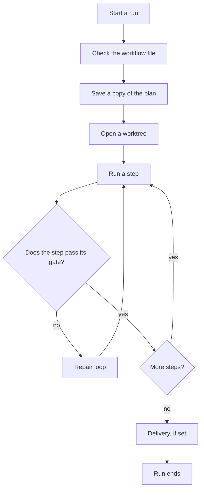

# Workflows

A workflow is a fixed sequence of steps that mivia runs in order, for a task
that must follow the same path every time - plan, implement, review, verify.

Terms used throughout:

- **Workflow**: a fixed step sequence that runs one task start to finish.
- **Ledger**: the durable record of a run. Survives crashes and restarts.
- **Gate**: a check a step must pass before the run advances.
- **Worktree**: an isolated checkout the run works in; your own files never change.

A run starts in a fresh worktree, runs its steps there, and records each
result in the ledger.

## What a workflow file contains

A workflow is a TOML file in `.mivia/workflows/`. It names the steps, their
order, and the checks between them.

| Kind | What the step does |
|------|--------------------|
| `agent` | Runs one agent task |
| `agent_gate` | An independent agent reviews the result |
| `evidence_gate` | A fixed check runs, such as a test suite |
| `human_gate` | A person must approve or reject |

A step's result feeds the next step. Transitions route from step to step:
"when this step ends this way, go to that step." A repair loop sends the run
back to an earlier step when a gate fails, bounded by a maximum round count.

## How a run goes from start to finish

The gate in the middle decides whether the run advances or goes back for
repair.

## Where the run works

A write-capable run creates a host-owned worktree at a recorded base commit.
It never writes to your checkout. If the run stops, resume it from the saved
snapshot: compiled workflow, templates, schemas, inputs, and resolved agent
digests.

## Trust: what a workflow file can and cannot do

A workflow file is untrusted repository input - anyone can edit it. It may
name an existing agent or a registered verifier profile. It cannot define or
override:

- a model provider, endpoint, credential, tool allowlist, skill permission, or agent authority;
- a shell command, URL, environment variable, or secret;
- a Git base target outside runtime policy;
- publication permission.

A reviewer must return schema-valid structured evidence. Prose is never a
routing signal; routing uses only typed, validated results.

## The ledger

The ledger holds the run's ordered, timestamped record: results, and the
evidence each gate used. It is durable, so a run survives a crash. Inspect it
from the CLI or from an agent session.

## Delivery

Delivery is the last step, and optional. Modes: `none`, `draft`, `ready`.
Publication also requires the invoking user to grant `--allow-publish`.
Without it, an eligible run finishes as `delivery_pending` and waits until
someone delivers it with the grant.

Pull-request delivery is a terminal host policy - not a workflow step and not
an agent tool.

The agent provides the PR title and a two-sentence summary. The host validates
them against the optional project policy before publishing.

## See also

- [Workflow user guide](workflows-guide.md)
- [Workflow architecture](../architecture/workflows.md)
- [Security and privacy](../security/overview.md)
