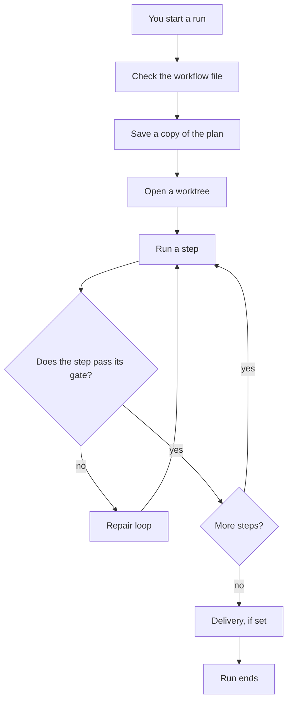

# Workflows

## Level 1: in plain words

A workflow is a fixed list of steps. mivia runs the steps in order. Use a workflow for a task that must follow the same path every time, such as "plan, build, review, and check a feature".

Four words appear throughout this guide. Here they are, in plain words:

- A workflow is a fixed list of steps that runs one task from start to finish.
- A ledger is a saved record of what a run did. It survives crashes and restarts.
- A gate is a check that a step must pass before the run moves on.
- A worktree is a separate copy of your project folder.

When you start a workflow, mivia makes a worktree. It runs the steps there. It saves each result in the ledger. Your own files never change.

## Level 2: more detail

### What a workflow file contains

A workflow is a TOML file in the `.mivia/workflows/` folder of your project. A TOML file is a text file with a simple format for settings. The file names the steps, the order they run in, and the checks between them.

Each step has one of four kinds:

| Kind | What the step does |
|------|--------------------|
| `agent` | Runs one agent task |
| `agent_gate` | An independent agent reviews the result |
| `evidence_gate` | A fixed check runs, such as a test suite |
| `human_gate` | A person must approve or reject |

A step produces a result. The next step can read that result. The workflow routes from step to step with transitions. A transition says: "when this step ends this way, go to that step".

The workflow can also declare repair loops. A repair loop sends the run back to an earlier step when a gate fails. A loop has a maximum number of rounds.

### How a run goes from start to finish

Look at the diamond in the middle. It is the gate. The gate decides whether the run moves on or goes back for repair.

### Where the run works

A write-capable run creates a host-owned worktree at a recorded base commit. A commit is a saved point in the project's history. The run never writes to your checkout. Your checkout is the copy of the project you work in. If the run stops, you can resume it from the saved snapshot. The snapshot holds the compiled workflow, templates, schemas, inputs, and resolved agent digests.

### Trust: what a workflow file can and cannot do

A workflow file is untrusted repository input. Anyone can edit it. It may name an existing agent or a registered verifier profile. It cannot define or override:

- a model provider, endpoint, credential, tool allowlist, skill permission, or agent authority;
- a shell command, URL, environment variable, or secret;
- a Git base target outside runtime policy;
- publication permission.

A reviewer must return schema-valid structured evidence. A schema is a formal description of the shape a result must have. Prose is never a routing signal. Routing decisions use only typed, validated results.

### The ledger

The ledger holds the run's record. It keeps events in order, with timestamps. It stores results and the evidence a gate used. The ledger is durable, so a run survives a crash. You can inspect the ledger from the CLI or from an agent session.

### Delivery

Delivery is the last step, and it is optional. The workflow may choose `none`, `draft`, or `ready`. Publication also requires the invoking user to grant `--allow-publish`. Without that grant, an eligible run finishes as `delivery_pending`. A `delivery_pending` run waits until someone delivers it with the grant.

Pull-request delivery is a terminal host policy. It is not a workflow step and not an agent tool. A pull request is a proposed change that someone can review and merge.

## See also

- [Workflow user guide](workflows-guide.md)
- [Workflow architecture](../architecture/workflows.md)
- [Security and privacy](../security/overview.md)
